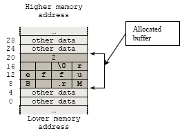
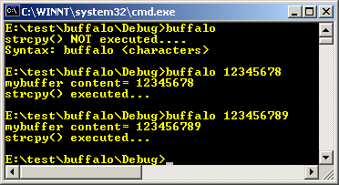
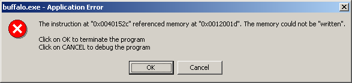

# An Introduction

This tutorial tries to investigate and proof the following three aspects of the situations that can generate buffer overflow.

1. The use of the non-type safe C/C++ language.
2. Accessing or copying a stack buffer in an insecure manner.
3. The compiler places buffers next to or near critical data structures in memory.

It is very beneficial for programmers or coders to understand the buffer overflow so that they will be aware to take appropriate actions during the applications development to avoid the an avoidable buffer overflow issue.


## THE CONSEQUENCES

Almost everyday there are vulnerabilities published and updated at security portals regarding the buffer overflow. For example you can search buffer overflow terms at Computer Emergency Response Team (CERT) web site, cert.org. Advisories, exploits and proof-of-concept (POC) codes also widely available for example at frsirt, frsirt.com and you can also try searching the buffer overflow vulnerability and exploit there. Virus and worm such as Code-red, Slammer and Witty worm that exploit the buffer overflow vulnerabilities have become the main headlines because the effect is global. As an example, the analysis of the mentioned virus and worm attacks can be found at caida.org.

Well, if you have noticed, most of the exploit dominated by buffer overflow. In this tutorial we will try to investigate why and how this problem exists. We will start from the fundamental study of the related information of the computer system that is the processor architecture, then tracing how C programs been compiled, linked and executed. Later on we will demonstrate how the vulnerable functions available in standard library can be the obvious candidates for the buffer overflow vulnerabilities if used improperly. Although both Windows and Linux will be used in the discussion, most of them are based on Linux.


## SOME DEFINITION OF THE BUFFER OVERFLOW

In general term, buffers just a block or portion of memory allocated for data storage of programs such as variables. **Stack** is another dynamic memory buffer portion used to store data implicitly normally during the run time. Another one is a **heap**, also a buffer that can be used to store program data explicitly. Here, a buffer should be a general term used to store program data during  program compilation/linking and running. In programming, buffer will  be allocated for example by declaring an array variable.  Array  is used for storing a sequence of data that is C's character and string.  In C/C++ programs, array may be declared as follows:


```c
char TestArr[ ];        // one dimensional unsized array of type char.
int TestArr2[10];       // one dimensional array with 10 elements of integer.
long TestArr3[3][4];    // two dimensional array with 12 (3 x 4) elements of long integer.
```

For procedure or function calls, array elements will be stored in a buffer of the stack statically during compile/link time.  During run time, buffer in the stack might be allocated and de-allocated dynamically for the array elements.  For the above example, when the size of an array is not verified, it is possible to write outside the allocated buffer.  Graphically an array element will be stored in the buffer as shown below by assuming every memory cell is 4 bytes in size and using the little endian:

```c
// in C, for string array, it is NULL ‘\0’ terminated…
char Name[12] = "Mr. Buffer";
int num = 2;
```

<br />
Figure 1: Illustration of how a buffer been allocated in memory.

If such an action takes place in memory addresses higher than the allocated buffer, it is called a buffer overflow. A similar problem exists when writing to a buffer in memory addresses below the allocated buffer. In this case, it is called a buffer underflow.  A buffer overflow that injects code into a running process is referred to as an exploitable buffer overflow.

A certain class of well documented strings and characters manipulation functions that may be used together with an array variables for their arguments or inputs, such as strcpy(), gets(), scanf(), sprintf(), strcat(), is naturally vulnerable to buffer overflows.  Heap also used to store data but the allocation of the heap normally done explicitly using memory management functions such as malloc(), calloc() and free().

A buffer overflow is one of the most common sources of security risk.  It is essentially caused by treating unchecked, external input to the running program as trustworthy data. The act of copying this data, using functions such as strcat() and strcpy() for example can create unanticipated results, which allows for system corruption. In the best of cases, your application will abort with a core dump, segmentation fault, or access violation. In the worst of cases, what this paper is going to investigate is an attacker can exploit the buffer overflow by injecting and executing a malicious code in the running process.  Copying unchecked input data into a stack based buffer is the most common cause of exploitable faults.

For example, if an access violation occurs in the running process, it may lead to a denial of service attack against the application, or in the worst case, allow attackers to inject executable code into your process to spawn a shell or to escalate the privilege to Administrator or root locally or remotely.  Buffer overflow can occur in a variety of ways. The following list provides a brief description of buffer overflow situations:

<table>
	<tr>
		<th>Overflow type</th>
		<th>Description</th>
	</tr>
	<tr>
		<td>Stack overflow</td>
		<td>A static buffer overflow occurs when a buffer, which has been declared on the stack normally during the function call, is written to with more data than it was allocated to hold. The less apparent versions of this error occur when unverified or untrusted user input data is copied directly to a static variable, causing potential stack corruption.  This is the most common type of buffer overflow and exploit whether local or remote type.</td>
	</tr>
	<tr>
		<td>Heap overflow</td>
		<td>Heap overflows, like stack overflows, can lead to memory and stack corruption. Because heap overflows occur in heap memory area rather than on the stack, it can be more difficult to be exploited; nevertheless, heap overflows require real programming care and are just as able to allow system risks as static buffer overflow.</td>
	</tr>
	<tr>
		<td>Array indexing errors</td>
		<td>Array indexing errors also are a source of memory overflows. Another form of unchecked index is a signed/unsigned integer mismatch where a negative number was supplied to an array index.  Simply verifying that the index is less than the size of the array is not enough if the index is a signed integer.  Some also refer this as an **integer overflow**.</td>
	</tr>
</table>


## Why Stack Based Buffer Overflow Occurs?

There are several things that need to happen for a buffer overflow to occur.  This tutorial tries to investigate and proof the following aspects of the impairments that can generate buffer overflow.

### The use of the non-type safe language

For C and C++, some well documented functions from standard library such as memory management and string manipulations used in these languages perform no array bounds checking and no type-safety checking. This situation is the most frequently happens and the array bounds must be checked by programmers through certain coding or mechanism or using the safer types of the function versions. Normally, a warnings or notes are clearly given in the documentations and it should be programmers responsibility.

### Accessing or copying a stack buffer in an insecure manner

If the application takes data from a user or an attacker and copies the data to a buffer maintained by the application with no verification for the destination buffer size, then you may overflow the buffer. In other words, the code allocates X-bytes storage but the code tries to copy more than X-bytes to the allocated buffer. This situation may be resolved by programmers. For example you have declared an array that can store up to 100 bytes, but in your program you try to copy 150 bytes without any verification and/or validation.

### The compiler places buffers next to or near critical data structures in memory

In order to provide efficiency of using scarce and expensive resources such as memory, buffers are often placed next to important data structures by compiler.  For example, in the case of a function call, that allocates a buffer for local variable on the stack, the function's return address is placed in memory near the buffer.  So, if the attacker can overflow the buffer, he can overwrite the function return address so that when the function returns, it returns to an address determined by the attacker and unfortunately it is the address where the exploit code resides.  Other interesting data structures include C++ virtual-tables, local variables, exception handler addresses and function pointers also placed in the memory around the buffer. This situation also may be resolved by compiler designers.


## SIMPLE EXAMPLE THAT SHOWS THE SIGN

Let study some real program examples that show the danger of such situations based on the C.  In the examples, we do not implement any malicious code injection but just to show that the buffer can be overflow.  Modern compilers normally provide overflow checking option during the compile/link time but during the run time it is quite difficult to check this problem without any extra protection mechanism such as using exception handling.

```c
#include <stdio.h>
#include <string.h>
#include <stdlib.h>

int main(int argc, char *argv[])
{
		// theoretically reserve 5 byte of buffer plus the
		// terminating NULL....should allocate 8 bytes = 2 double words,
		// to overflow, need more than 8 bytes...
		// so, if more than 8 characters input by user,
		// there will be access violation, segmentation fault etc.
		char mybuffer[5];
		// a prompt how to execute the program...
		if (argc < 2)
		{
				printf("strcpy() NOT executed....\n");
				printf("Syntax: %s <characters>\n", argv[0]);
				exit(0);
		}

		// copy the user input to mybuffer, without any bound checking
		// a secure version is srtcpy_s()
		strcpy(mybuffer, argv[1]);
		printf("mybuffer content= %s\n", mybuffer);
		// you may want to try strcpy_s()
		printf("strcpy() executed...\n");
		return 0;
}
```

The output, when the input is: 12345678 (8 bytes), the program run smoothly.

<br />
Figure 2: A sample of a vulnerable program output.

When the input is: 123456789 (9 bytes), the following will be displayed when compiled with Microsoft Visual C++ 6.0.  In Linux the “Segmentation fault” message will be displayed and the program terminates.

<br />
Figure 3: Error message box, an indication of a system trying to write beyond the allocated buffer.

The vulnerability exists because the mybuffer could be overflowed if the user input (argv[1]) bigger than 8 bytes. Why 8 bytes?  For 32 bit (4 bytes) system, we must fill up a double word (32 bits) memory.  Character (char) size is 1 byte, so if we request buffer with 5 bytes, the system will allocate 2 double words (8 bytes).  That is why when you input more than 8 bytes; the mybuffer will be over flowed

Similar standard functions that are technically less vulnerable, such as strncpy(), strncat(), and memcpy(), do exist. But the problem with these functions is that it is the programmer responsibility to assert the size of the buffer, not the compiler. We will discuss this thing again in the final part of this tutorial series. Before we go any further about the mechanism or process how this buffer overflow happens, let dig deeper and have the in-depth information of the related things.


## Further reading and digging

1. [IA-32 and IA-64 Intel® Architecture Software Developer's Manuals/documentation and downloads.][1]
2. [An Intel microprocessor resources and download.][2]
3. [Assembly language tutorial using NASM (Netwide).][3]
4. [The High Level Assembly (HLA) language.][4]
5. [Linux based assembly language resources.][5]

[1]: http://www.intel.com/products/processor/manuals/index.htm
[2]: http://www.x86.org/intel.doc/
[3]: http://www.drpaulcarter.com/pcasm/
[4]: http://webster.cs.ucr.edu/
[5]: http://asm.sourceforge.net/
