# The Basic of x86 Architecture

To explore the details of the buffer overflow exploits you must have a good deal of assembly and the underlying computer architecture mainly the microprocessor.  This knowledge will be used in reading the values in registers and describing what the code will do or is doing as a result of these values.  You should be proficient in understanding how various runtime data structures and the stack work, how registers work (and what their purpose is), and how to read and understand assembly.  The following sections provide a brief overview of these related concepts and knowledge and should serve well in getting to understand the buffer overflow exploit clearly.  Most of the reference will be based on Intel 32 bit processor of Linux OS.

## THE MICROPROCESSOR PROCESSOR REGISTERS (INTEL)

We’ll begin with a short review of how the basic program execution registers of the 80386 processor operates. The Intel processor contains small amounts of internal memory, known as registers. This paper will only discuss the basic program execution registers that consist of:

1. 8 general-purpose registers – 32 bits.
2. 6 segment registers – 16 bits.
3. 1 EFLAGS register – 32 bits.
4. 1 EIP, Instruction Pointer register – 32 bits.

The following figures are typical illustrations of the basic registers in Intel x86 processor. You can purchase or download the documentation at Intel.com (Pentium 4).

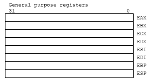<br />
Figure 1: 8 general-purpose registers – 32 bits.

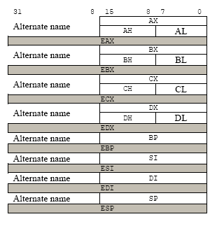<br />
Figure 2: Alternative name for 8 general-purpose registers for 8 and 16 bits parts.

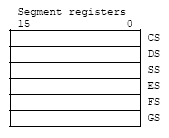<br />
Figure 3: 6 segment registers – 16 bits.

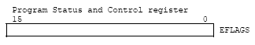<br />
Figure 4: 1 EFLAGS register – 32 bits.

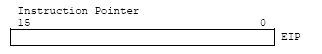<br />
Figure 5: 1 EIP, Instruction Pointer register – 32 bits.

These registers comprise a basic execution environment in which to execute a set of general-purpose instructions.  These instructions perform basic integer arithmetic on: byte (8 bits), word (16 bits), double word (32 bits) integers, handle program flow control, operate on bit and byte strings and address memory.  Registers can hold absolute values, which are used directly by the processor, memory addresses, and offsets. The general-purpose, basic program execution registers and their purposes are listed in the following table.

<table>
	<tr>
		<th>Register Name</th>
		<th>Size (in bits)</th>
		<th>Purpose</th>
	</tr>
	<tr>
		<td>AL, AH/AX/EAX</td>
		<td>8,8/16/32</td>
		<td>Main register used in arithmetic calculations. Also known as accumulator, as it holds results of arithmetic operations and function return values.</td>
	</tr>
	<tr>
		<td>BL, BH/BX/EBX</td>
		<td>8,8/16/32</td>
		<td>The Base Register. Pointer to data in the DS segment.  Used to store the base address of the program.</td>
	</tr>
	<tr>
		<td>CL, CH/CX/ECX</td>
		<td>8,8/16/32</td>
		<td>The Counter register is often used to hold a value representing the number of times a process is to be repeated. Used for loop and string operations.</td>
	</tr>
	<tr>
		<td>DL, DH/DX/EDX</td>
		<td>8,8/16/32</td>
		<td>A general purpose registers. Also used for I/O operations. Helps extend EAX to 64-bits.</td>
	</tr>
	<tr>
		<td>SI/ESI</td>
		<td>16/32</td>
		<td>Source Index register. Pointer to data in the segment pointed to by the DS register.  Used as an offset address in string and array operations. It holds the address from where to read data.</td>
	</tr>
	<tr>
		<td>DI/EDI</td>
		<td>16/32</td>
		<td>Destination Index register. Pointer to data (or destination) in the segment pointed to by the ES register.  Used as an offset address in string and array operations. It holds the implied write address of all string operations.</td>
	</tr>
	<tr>
		<td>BP/EBP</td>
		<td>16/32</td>
		<td>Base Pointer. Pointer to data on the stack (in the SS segment).  It points to the bottom of the current stack frame. It is used to reference local variables.</td>
	</tr>
	<tr>
		<td>SP/ESP</td>
		<td>16/32</td>
		<td>Stack Pointer (in the SS segment). It points to the top of the current stack frame. It is used to reference local variables.</td>
	</tr>
</table>
Table 1: The x86 processors and their usage

The lower 16 bits of the general-purpose registers map directly to the register set found in 8086 and Intel 286 processors.  These registers can be referenced with the names AX, BX, CX, DX, BP, SP, SI and DI.  Each of the lower 2 bytes of the EAX, EBX, ECX, and EDX registers can be referenced by the names AH, BH, CH and DH for high bytes and AL, BL, CL and DL for the low bytes. In the 64-bit processor, the number of general purpose registers and single instruction, multiple-data (SIMD) extension registers (MMX registers) have been extended from 8 to 16. The general purpose registers are widened to 64 bits. This sub-mode of IA-32e mode, also introduces a new opcode prefix (REX) to access the register extensions. REX prefixes are used to generate 64-bit operand sizes or to reference registers R8-R15.

## THE GENERAL-PURPOSE REGISTERS IN 64-Bit MODE

In 64-bit mode, there are 16 general purpose registers and the default operand size is 32 bits. However, general-purpose registers are able to work with either 32-bit or 64-bit operands. If a 32-bit operand size is specified: EAX, EBX, ECX, EDX, EDI, ESI, EBP, ESP, R8D - R15D are available. If a 64-bit operand size is specified: RAX, RBX, RCX, RDX, RDI, RSI, RBP, RSP, R8-R15 are available. R8D-R15D/R8-R15 represent eight new general-purpose registers. All of these registers can be accessed at the byte, word, dword, and qword level. REX prefixes are used to generate 64-bit operand sizes or to reference registers R8-R15. Registers only available in 64-bit mode (R8-R15 and XMM8-XMM15) are preserved across transitions from 64-bit mode into compatibility mode then back into 64-bit mode. However, values of R8-R15 and XMM8-XMM15 are undefined after transitions from 64-bit mode through compatibility mode to legacy or real mode and then back through compatibility mode to 64-bit mode.

## THE SEGMENT REGISTERS

The 6 segment registers hold 16-bits segment selectors.  A segment selector is special pointer that identifies a segment in memory.  To access a particular segment in memory, the segment selector for that segment must be present in the appropriate segment register.  The four segment registers CS, DS, ES and SS are the same as the segment registers found in Intel 8086 and Intel 286 processors and the FS and GS registers were introduced into the Intel 32 bit architecture.

How segment registers are used depends on the type of the memory management model that the OS or executive is using.  When using the **flat** (unsegmented) memory model, the segment registers are loaded with segment selectors that point to overlapping segments, each of which begins at address 0 of the linear address space as shown in Figure 6.  These overlapping segments then comprise the linear address space for the program.  Typically two overlapping segments are defined: one for **code** and another for **data and stacks**. The CS segment register points to the code segment and all the other segment registers point to the data and stack segment.

When using the **segmented** memory model, each segment register is ordinarily loaded with a different segment selector so that each segment register points to a different segment within the linear address space as shown in Figure 7. At any time the program can thus access up to six segments in the linear address space.  To access a segment not pointed to by one of the segment registers, a program must first load the segment selector for the segment to be accessed into a segment register.

Each of the segment register is associated with one of three types of storage: **code**, **data** or **stack** (will be explained in detail later).  For example the CS register contains the segment selector for the code segment, where the instructions being executed are stored.  The processor fetches instructions from the code segment, using a logical address that consists of the segment selector in the CS register and the content of the EIP register.  The EIP register contains the offset within the code segment of the next instruction to be executed.  Instead, it is loaded implicitly by instructions or internal processor operation that change program control such as procedure or function call and interrupt handling.  The DS, ES, FS and GS registers point to four data segments.  By default, the CPU expects to access most variables in the data segment. The availability of the 4 data segments permit efficient and secure access to different types of data structures.  For example, 4 separate data segments might be created:

1. For data structures of the current module.
2. For data exported from a higher level module.
3. For dynamically created data structure such as stack.
4. For data shared with another program.

To access additional data segments the application program must load segment selectors for these segments into the DS, ES, FS and GS registers as needed.

The SS register contains the segment selector for a stack segment, where the procedure or function stack is stored for the program, task or handler currently being executed.  All the stack operation use the SS register to find the stack segment.  Unlike the CS register, SS register can be loaded explicitly, which permit application programs to set up multiple stacks and switch among them.

<table>
	<tr>
		<th>Segment Register</th>
		<th>Size (bits)</th>
		<th colspan="2">Purpose</th>
	</tr>
	<tr>
		<td>CS</td>
		<td>16</td>
		<td>Code segment register. Base location of code section (.text section). Used for fetching instructions.</td>
		<td rowspan="4">These registers are used to break up a program into parts. As it executes, the segment registers are assigned the base values of each segment. From here, offset values are used to access each command in the program.</td>
	</tr>
	<tr>
		<td>DS</td>
		<td>16</td>
		<td>Data segment register. Default location for variables (.data section). Used for data accesses.</td>
	</tr>
	<tr>
		<td>ES</td>
		<td>16</td>
		<td>Extra segment register. Used during string operations.</td>
	</tr>
	<tr>
		<td>SS</td>
		<td>16</td>
		<td>Stack segment register. Base location of the stack segment. Used when implicitly using SP or ESP or when explicitly using BP, EBP.</td>
	</tr>
	<tr>
		<td>FS</td>
		<td>16</td>
		<td colspan="2">Extra segment register.</td>
	</tr>
	<tr>
		<td>GS</td>
		<td>16</td>
		<td colspan="2">Extra segment register.</td>
	</tr>
</table>
Table 2: The x86 segment registers and their usage

For the most part, assembly language programmers need not concern themselves with the extra registers added to the 80386/486/Pentium processors.  However, the knowledge of the 32 bit extensions and the extra segment registers are quite useful in assembly programming.

Modern operating system and applications use the unsegmented or flat memory model where all the segment registers are loaded with the same segment selector so that all memory references a program makes are to a single linear-address space.  The flat memory model on the x86 uses only **near pointers** (32 bits), while **far pointers** (48 bits) were needed with a segmented memory model in order to specify the **segment** and **offset** within the segment. The not so detail how to map the segmented memory to the physical memory address will be explained later.

## MEMORY ORGANIZATION

Internally processors have memory called **registers** but the memory that the processor addresses on its bus is called **physical memory**.  This physical memory is actually what you installed on the computer system normally called **Random Access Memory** (RAM), but inside the processor we will deal with the **address space** that will be used for addressing the RAM.  Logically the address space is organized as a sequence of 8-bit bytes.  Each byte is assigned a unique address, called a **physical address**.  The physical address space of the processor ranges from zero to the maximum of 2<sup>32</sup>– 1 (4 GB) or 2<sup>36</sup>-1 (64GB) if physical address extension mechanism is used.  Operating systems that employ the processor will use processor’s memory management facilities (Memory Management Unit – MMU) to access the actual memory (RAM or page memory/swap).  These facilities provide features such as **segmentation** and **paging**, which allow memory to be managed efficiently and reliably.  When using the processor’s memory management facilities, programs do not directly address physical memory.  Instead they access memory using any of three memory model: **flat**, **segmented** or **real-address** mode.

## FLAT MEMORY MODEL

In this model, memory appears to the program as a single, continuous address space, called a **linear address space**.  A program’s code, data and stack are all contain in this address space.  The linear address space is byte addressable, with addresses running contiguously from 0 – 2<sup>32</sup> -1 (Intel 32 bits processor).  An address for any byte in the linear address space is called a linear address.

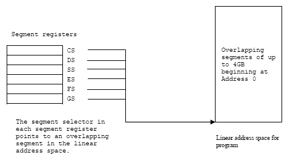<br />
Figure 6:  The use of segment registers for flat memory model.

## SEGMENTED MEMORY MODEL

In this model, memory appears to a program as a group of **independent address spaces** called segments.  When using this model, code, data and stacks are typically contain in separate segments.  To address a byte in a segment, a program must issue a **logical address** (often referred to as a **far pointer**), which consists of a **segment selector** and an **offset**.  The **segment selector** identifies the **segment** to be accessed and the **offset** identifies a **byte** in the address space of the segment. The program running on the Intel 32 bits processor can address up to 16,383 (2<sup>14</sup> -1) segments of different sizes and types and each segment can be as large as 2<sup>32</sup> bytes.

Internally, all the segments that are defined for a system are mapped into the processor’s linear address space.  To access a memory location, the processor translates each logical address into a linear address.  This translation is transparent to the application/program.  The main reason for using a segmented memory is to increase the reliability of programs and systems.  For example, placing a program’s stack in a separate segment, prevent the stack from growing into the code or a data space and overwriting them.  Placing the OS’s or executive’s code, data and stack in separate segments also protect them from application/program and vice versa.

With the flat or the segmented memory model, the linear address space is mapped into the processor’s physical address space either **directly** or through **paging**.  When using the direct mapping (paging disabled), each linear address has a one-to-one correspondence with a physical address, means that linear addresses are sent out on processor’s address line without translation.  When using the 32 bit architecture’s paging mechanism (paging enabled), the linear address space is divided into pages, which are mapped into **virtual memory**.  The pages of virtual memory are then mapped as needed into physical memory (RAM).  When an OS or executive using paging, the paging mechanism is transparent to an application programs, means that all the application/program sees is the linear address space.

## THE MECHANISM

Segmentation allows programmers to partition their programs into modules that operate independently of one another. Segments allow two **processes** to easily share data.  It also allows you to extend the addressability of a processor. In the case of the 8086, segmentation let the extension of the maximum addressable memory from 64K (2<sup>16</sup>) to one megabyte. The 8086 was a 16 bit processor, with 16 bit registers and 16 bit addresses. This limits the processor to addressing 64K chunks of memory.  Intel’s 1976 implementation of segmentation still in use today. The memory looks like a linear array of bytes and a single index (address) selects some particular byte from that array. This type of addressing called linear or flat addressing. By the way, segmented addressing uses two components to specify a memory location:

1. A segment value and
2. An offset within that segment.

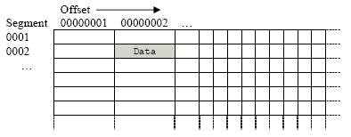<br />
Figure 7:  Segmented addressing depicted as a 2 dimensional array.

By referring figure 7, the memory location (shaded cell) can be addressed as 0002:00000001, all in hexadecimal. Ideally, the segment and offset values are independent of one another. The best way to describe segmented addressing is with a two-dimensional array. The segment provides one of the indices into the array; the offset provides the other (see Figure 7). 80286 and later operating in **protected mode**, the CPU can prevent one routine from accidentally modifying the variables in a different segment.  A full segmented address contains a segment component and an offset component.  Segmented addresses normally written as:

```
segment:offset
```

On the 8086 through the 80286, these two values are 16 bit constants. On the 80386 and later, the offset can be a 16 bit constant or a 32 bit constant.  The size of the offset limits the maximum size of a segment. On the 8086 with 16 bit offsets, a segment may be no longer than 64K; it could be smaller (and most segments are), but never larger. The 80386 and later processors allow 32 bit offsets with segments as large as four (2<sup>32</sup>) gigabytes.  The segment portion is 16 bits on all 80x86 processors. This lets a single program have up to 65,536 different segments in the program. Most programs have less than 16 segments (or thereabouts) so this isn’t a practical limitation.

Despite the fact that the 80x86 family uses segmented addressing, the actual (physical) memory connected to the CPU is still a linear array of bytes. There is a function that converts the segment value to a physical memory address. The processor then adds the offset to this physical address to obtain the actual address of the data in memory. Here, addresses will be referred as **segmented addresses** or **logical addresses**. The actual linear address that appears on the address bus is the **physical address**.

On the 8086, 8088, 80186, and 80188 (and other processors operating in **real mode**), the function that maps a segment to a physical address is very simple. The CPU multiplies the segment value by sixteen (10h) and adds the offset portion. For example, consider the segmented address2: 1000:1F00. To convert this to a physical address you multiply the segment value (1000h) by sixteen. Multiplying by the radix is very easy; just appending a zero to the end of the number. Appending a zero to 1000h produces 10000h. Add 1F00h to this to obtain 11F00h. So 11F00h is the physical address that corresponds to the segmented address 1000:1F00 (Figure 9).

Note that your applications cannot directly modify the segment descriptor table (the lookup table). The protected mode operating system (UNIX, Linux, Windows, OS/2, etc.) handles that operation.  It is the operating systems determine where to place your programs into.

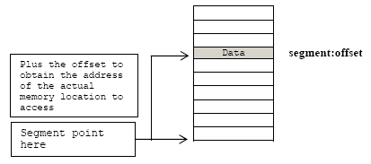<br />
Figure 8:  Segmented addressing in physical memory.

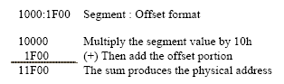<br />
Figure 9:  Converting the logical address to physical address.

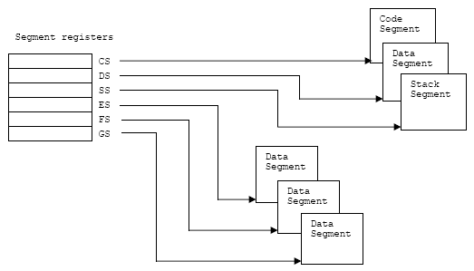<br />
Figure 10:  The use of segment registers in segmented memory model.

## REAL ADDRESS MODE MEMORY MODEL

This model used for the Intel 8086 processor.  This memory model supported in the Intel 32 bits architecture for compatibility with existing programs written to run on the Intel 8086 processor.  The real-address mode uses specific implementation of the segmented memory in which the linear address space for the program and the OS or executive consists of an array of segment of up to 64KB (2<sup>16</sup>) in size each.  The maximum size of the linear address space in real-address mode is 2<sup>20</sup> bytes.

## THE EFLAGS

The 32 bits EFLAGS register contains a group of **status flags**, a **control flags** and a group of **system flags**.  Six of which (the status flags) are most important to us is listed in Table 3.

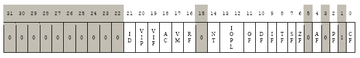<br />
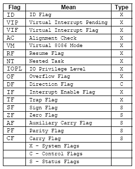<br />
Figure 11:  The EFLAGS registers.

The following table is the list of the status flags of the EFLAGS and their purposes.

<table>
	<tr>
		<th>Flag</th>
		<th>Bit</th>
		<th>Purpose</th>
	</tr>
	<tr>
		<td>CF</td>
		<td>0</td>
		<td>Carry flag. Set if an arithmetic operation generate a carry or a borrow out of the most significant bit of the result, cleared otherwise. This flag indicate an overflow condition for unsigned integer arithmetic.  It is also used in multiple-precision arithmetic.</td>
	</tr>
	<tr>
		<td>PF</td>
		<td>2</td>
		<td>Parity flag. Set if the least-significant byte of the result contains an even number of 1 bit, cleared otherwise.</td>
	</tr>
	<tr>
		<td>AF</td>
		<td>4</td>
		<td>Adjust flag. Set if an arithmetic operation generates a carry or a borrow out of bit 3 of the result, cleared otherwise.  This flag is used in Binary-Coded-Decimal (BCD) arithmetic.</td>
	</tr>
	<tr>
		<td>ZF</td>
		<td>6</td>
		<td>Zero flag. Set if the result is zero, cleared otherwise.</td>
	</tr>
	<tr>
		<td>SF</td>
		<td>7</td>
		<td>Sign flag. Set equal to the most-significant bit of the result, which is the sign bit of a signed integer.  0 indicates a positive value, 1 indicates a negative value.</td>
	</tr>
	<tr>
		<td>OF</td>
		<td>11</td>
		<td>Overflow flag. Set if the integer result is too large a positive number or too small a negative number, excluding the sign bit, to fit in the destination operand, cleared otherwise.  This flag indicates an overflow condition for signed-integer that is two’s complement arithmetic.</td>
	</tr>
</table>
Table 3: The status flags of the EFLAGS register.

## INSTRUCTION POINTER REGISTER - EIP

EIP register contains the offset in the current code segment for the next instruction to be executed.  It is advanced from one instruction boundary to the next one in straight line code or it is moved ahead or backward by a number of instructions when executing JMP, JCC, CALL, RET and IRET instructions.

EIP cannot be accessed directly by software.  It is controlled implicitly by control-transfer instructions such as JMP, JCC, CALL, RET and IRET, interrupts and exceptions.  The only way to read the EIP register is to execute the CALL instruction and then read the value of the return instruction pointer from the function stack.  This is because when the CALL instruction executed, the EIP content of the next address immediately after the CALL, is saved on the stack as return address of the function.  Then, the EIP can be loaded indirectly by modifying the value of a return instruction pointer on the function stack and executing a return, RET/IRET instruction.

<table>
	<tr>
		<th>Register</th>
		<th>size (bits)</th>
		<th>Purpose</th>
	</tr>
	<tr>
		<td>IP/EIP</td>
		<td>16/32</td>
		<td>The instruction pointer holds the address of the next instruction to be executed.</td>
	</tr>
</table>
Table 4: The EIP register

## CONTROL REGISTERS

The 32 bits control registers (CR0, CR1, CR2, CR3, and CR4) determine operating mode of the processor and the characteristics of the currently executing task.

<table>
	<tr>
		<th>Control Register</th>
		<th>Description</th>
	</tr>
	<tr>
		<td>CR0</td>
		<td>Contains system control flags that control operating mode and states of the processor.</td>
	</tr>
	<tr>
		<td>CR1</td>
		<td>Reserved.</td>
	</tr>
	<tr>
		<td>CR2</td>
		<td>Contains the page-fault linear address (the linear address that caused a page fault).</td>
	</tr>
	<tr>
		<td>CR3</td>
		<td> Contains the physical address of the base of the page directory and two flags (PCD and PWT). This register is also known as the page-directory base register (PDBR). Only the 20 most-significant bits of the page-directory base address are specified; the lower 12 bits of the address are assumed to be 0. When using the physical address extension, the CR3 register contains the base address of the page-directory-pointer table.</td>
	</tr>
	<tr>
		<td>CR4</td>
		<td> Contains a group of flags that enable several architectural extensions.  In protected mode, the move-to-or-from-control-registers forms of the MOV instruction allow the control registers to be read (at any privilege level) or loaded (at privilege level 0 only). This restriction means that application programs (running at privilege levels 1, 2, or 3) are prevented from loading the control registers; however, application programs can read these registers.</td>
	</tr>
</table>
Table 5: x86 control registers

There are other registers in the Intel’s x86 processors such as Floating Point Unit (FPU), MMX, SSE and SSE2 and system are not explained here because not so relevant.  For more information please refer to the processor’s documentation and you can download it at Intel.com.

## LITTLE ENDIAN vs BIG ENDIAN

The Intel processor accesses memory and stores it in Little Endian order instead of Big Endian used by other processor such as Motorola 68x series.  Little Endian means that the least significant byte of any multibyte data field is stored at the lowest memory address, which is also the address of the larger field and the high-order byte stored at the highest address that means the little end or the first byte comes first.  For example, a 4 byte int and 3 bytes of char are written as shown below:

```
int:
Byte3 Byte2 Byte1 Byte0

char:
Byte6 Byte5 Byte4
```

Will be arranged in memory as follows:

```
Base Address+0 → Byte0
Base Address+1 → Byte1
Base Address+2 → Byte2
Base Address+3 → Byte3
Base Address+4 → Byte4
Base Address+5 → Byte5
Base Address+6 → Byte6
```

And graphically:

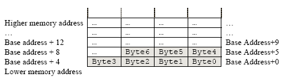<br />
Figure 12: Little endian vs big endian.

As another example, the following assembly instruction copies the value 1 into the EDX register:

<table>
	<tr>
		<th>Assembly</th>
		<th>Hexadecimal</th>
	</tr>
	<tr>
		<td>MOV EDX, 1</td>
		<td>BA 01 00 00 00</td>
	</tr>
</table>

In hexadecimal, 1 would be represented as 00000001h (in 4 bytes format). However, since the Intel processor uses Little Endian order, it is stored and accessed as (lowest address) 01 00 00 00 (highest address).  The BA above represents the MOV EDX, <immediate> instruction in machine code on the Intel x86 processor.  Simply said the 0x1234 is stored backwards as 0x4321 in Little Endian and 0x1234 in Big Endian considering the nibbles and stored backwards as0x3412 in Little Endian and 0x1234 in Big Endian considering a byte (8 bits). Change accordingly for 2 bytes, 4 bytes etc.

## Further reading and digging

1. [An Intel microprocessor resources and download.][2]
2. [IA-32 and IA-64 Intel® Architecture Software Developer's Manuals/documentation and downloads.][1]
3. [Assembly language tutorial using NASM (Netwide).][3]
4. [The High Level Assembly (HLA) language.][4]
5. [Linux based assembly language resources.][5]

[1]: http://www.intel.com/products/processor/manuals/index.htm
[2]: http://www.x86.org/intel.doc/
[3]: http://www.drpaulcarter.com/pcasm/
[4]: http://webster.cs.ucr.edu/
[5]: http://asm.sourceforge.net/
