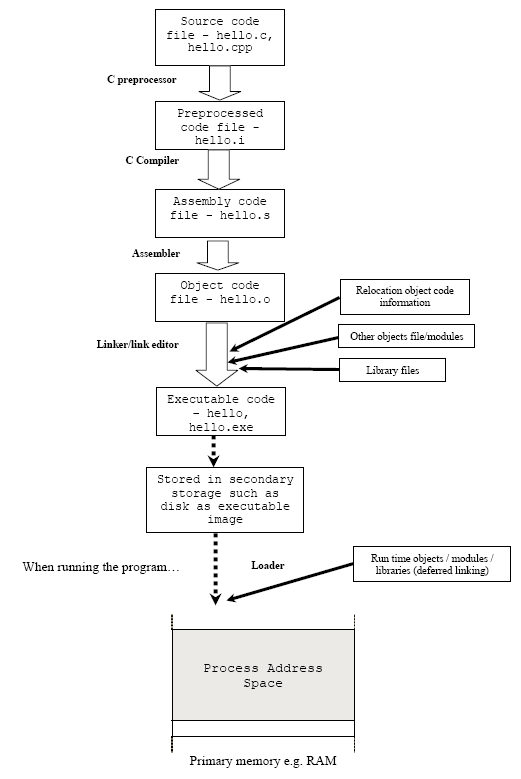

# Assembly Language

Some knowledge of assembly is necessary in order to understand the operation of the buffer overflow exploits. There are essentially three kinds of languages:

## Kind of languages

### Machine Language

This is what the computer actually sees and deals with. Every command the computer sees is given as a number or sequence of numbers.  It is in binary, normally presented in hex to simplify and be more readable.

```
83 ec 08 -> sub $0x8,%esp
83 e4 f0 -> and $0xfffffff0,%esp
b8 00 00 00 00 -> mov $0x0,%eax
83 c0 0f -> add $0xf,%eax
```

### Assembly Language

This is the same as machine language, except the command numbers have been replaced by letter sequences which are more readable and easier to memorize.

AT&T:

```asm
push   %ebp
sub    $0x8,%esp
movb   $0x41,0xffffffff(%ebp)
```

Intel:

```asm
push ebp
mov  ebp, esp
sub  esp, 0C0h
```

HLA (High Level Assembly):

```asm
program HelloWorld;
#include( "stdlib.hhf" )
begin HelloWorld;
stdout.put( "Hello, World of Assembly Language", nl );
end HelloWorld;
```

### High-Level Language

High-level languages are there to make programming easier. Assembly language requires you to work with the machine itself. High-level languages allow you to describe the program in a more natural language. A single command in a high-level language usually is equivalent to several commands in an assembly language.  Readability is the best.

C/C++:

```c
#include <stdio.h>

int main()
{
  char name[20];
  …
  return 0;
}
```

## Assembly Language

Assembly is a symbolic language that is assembled into machine language by an assembler. In other words, assembly is a mnemonic statement that corresponds directly to processor-specific instructions. Each type of processor has its own instruction set and thus its own assembly language. Assembly deals directly with the registers of the processor and memory locations.  There are some general rules that are typically true for most assembly languages are listed below:

- Source can be memory, register or constant.
- Destination can be memory or non-segment register.
- Only one of source and destination can be memory.
- Source and destination must be same size.

Opcodes are the actual instructions that a program performs. Each opcode is represented by one line of code, which contains the opcode and the operands that are used by the opcode. The number of operands varies depending on the opcode. The entire suite of opcodes available to a processor is called an instruction set. Depending on the processor, OS, and disassembler used, the operands may be in reverse order. For example, on Windows:

```asm
MOV dst, src
```

Is equivalent to:

```asm
MOV %src, %dst # on Linux.
```

Windows uses Intel assembly whereas Linux uses AT&T assembly.  Another one you may find is Mac OS (PowerPC) that is Motorola processor instruction set.  High Level Assembly (HLA) also quite popular among programmers.  This paper will use both Windows and AT&T assembly.  Whatever assembly used, there are several common categories of instructions based on their usages as listed in the following Table.

<table>
    <tr>
        <th>Instruction Category</th>
        <th>Meaning</th>
        <th>Example</th>
    </tr>
    <tr>
        <td>Data Transfer</td>
        <td>move from source to destination</td>
        <td>mov, lea, les, push, pop, pushf, popf</td>
    </tr>
    <tr>
        <td>Arithmetic</td>
        <td>arithmetic on integers</td>
        <td>add, adc, sub, sbb, mul, imul, div, idiv, cmp, neg, inc, dec, xadd, cmpxchg</td>
    </tr>
    <tr>
        <td>Floating point</td>
        <td>arithmetic on floating point</td>
        <td>fadd, fsub, fmul, div, cmp</td>
    </tr>
    <tr>
        <td>Logical, Shift, Rotate and Bit</td>
        <td>bitwise logic operations</td>
        <td>and, or, xor, not, shl/sal, shr, sar, shld and  shrd,  ror, rol, rcr and rcl</td>
    </tr>
    <tr>
        <td>Control transfer</td>
        <td>conditional and unconditional jumps, procedure calls</td>
        <td> jmp, jcc, call, ret, int, into, bound</td>
    </tr>
    <tr>
        <td>String</td>
        <td>move, compare, input and output</td>
        <td>movs, lods, stos, scas, cmps, outs, rep, repz, repe, repnz, repne, ins</td>
    </tr>
    <tr>
        <td>I/O</td>
        <td>For input and output</td>
        <td>in, out</td>
    </tr>
    <tr>
        <td>Conversion</td>
        <td>Provide assembly data types conversion</td>
        <td>movzx, movsx, cbw, cwd, cwde, cdq, bswap, xlat</td>
    </tr>
    <tr>
        <td>Miscellaneous</td>
        <td>manipulate individual flags, provide special processor services, or handle privileged mode operations</td>
        <td>clc, stc, cmc, cld, std, cl, sti</td>
    </tr>
</table>
Table 1: Assembly instruction set categories.

The following is C source code portion and the assembly equivalent example using Linux/Intel.

<table>
    <tr>
        <th>C code’s portion</th>
        <th>Label</th>
        <th>Mnemonic</th>
        <th>Operands</th>
        <th>Comment</th>
    </tr>
    <tr>
        <td rowspan="3">if (a > b)</td>
        <td rowspan="3"></td>
        <td>movl</td>
        <td>a, %eax</td>
        <td></td>
    </tr>
    <tr>
        <td>cmpl</td>
        <td>b, %eax</td>
        <td>#compare, a – b</td>
    </tr>
    <tr>
        <td>jle</td>
        <td>L1</td>
        <td>#jump to L1 if a <= b</td>
    </tr>
    <tr>
        <td></td>
        <td></td>
        <td></td>
        <td></td>
        <td></td>
    </tr>
    <tr>
        <td rowspan="3">&nbsp;&nbsp;c = a;</td>
        <td rowspan="3"></td>
        <td>movl</td>
        <td>a, %eax</td>
        <td>#a > b branch</td>
    </tr>
    <tr>
        <td>movl</td>
        <td>%eax, c</td>
        <td></td>
    </tr>
    <tr>
        <td>jmp</td>
        <td>L2</td>
        <td>#finish, jump to L2</td>
    </tr>
    <tr>
        <td></td>
        <td>L1:</td>
        <td></td>
        <td></td>
        <td></td>
    </tr>
    <tr>
        <td rowspan="2">else<br />&nbsp;&nbsp;c = b;</td>
        <td></td>
        <td>movl</td>
        <td>b, %eax</td>
        <td></td>
    </tr>
    <tr>
        <td></td>
        <td>movl</td>
        <td>%eax, c</td>
        <td></td>
    </tr>
    <tr>
        <td></td>
        <td>L2:</td>
        <td></td>
        <td></td>
        <td>#Finish</td>
    </tr>
</table>
Figure 1: C and assembly codes.

Compilers available for assembly languages include Macro Assembler (MASM), GNU’s Assembler (GAS wiki, GAS manual), Borland’s TASM, Netwide (NASM) and GoASM. For HLA it is available from Webster at HLA.

## Compiler, Assembler, Linker AND LOADER

Normally the C’s program building process involves four stages and utilizes different tools such as a preprocessor, compiler, assembler, and linker.  At the end there should be a single executable image that ready to be loaded by loader as a running program.  Below are the stages that happen in order regardless of the operating system/compiler and graphically illustrated in Figure 2.

1. **Preprocessing** is the first pass of any C compilation. It processes include-files, conditional compilation instructions and macros.
2. **Compilation** is the second pass. It takes the output of the preprocessor, and the source code, and generates assembler source code.
3. **Assembly** is the third stage of compilation. It takes the assembly source code and produces an assembly listing with offsets. The assembler output is stored in an object file.
4. **Linking** is the final stage of compilation. It takes one or more object files or libraries as input and combines them to produce a single (usually executable) file. In doing so, it resolves references to external symbols, assigns final addresses to procedures/functions and variables, and revises code and data to reflect new addresses (a process called relocation).
5. **Loading** the executable image for program running.

Bear in mind that if you use the Integrated Development Environment (IDE) type compilers, these processes quite transparent.  Now we are going to examine more detail about the process that happens before and after the linking stage. For any given input file, the file name suffix (file extension) determines what kind of compilation is done and the example for gcc is listed in Table 2.

<table>
    <tr>
        <th>File Extension</th>
        <th>Description</th>
    </tr>
    <tr>
        <td>file_name.c</td>
        <td>C source code which must be preprocessed.</td>
    </tr>
    <tr>
        <td>file_name.i</td>
        <td>C source code which should not be preprocessed.</td>
    </tr>
    <tr>
        <td>file_name.ii</td>
        <td>C++ source code which should not be preprocessed.</td>
    </tr>
    <tr>
        <td>file_name.h</td>
        <td>C header file (not to be compiled or linked).</td>
    </tr>
    <tr>
        <td>
            file_name.cc<br />
            file_name.cp<br />
            file_name.cxx<br />
            file_name.cpp<br />
            file_name.c++<br />
            file_name.C
        </td>
        <td>C++ source code which must be preprocessed.  For file_name.cxx, the xx must both be literally character x and file_name.C, is capital c.</td>
    </tr>
    <tr>
        <td>file_name.s</td>
        <td>Assembler code.</td>
    </tr>
    <tr>
        <td>file_name.S</td>
        <td>Assembler code which must be preprocessed.</td>
    </tr>
    <tr>
        <td>file_name.o</td>
        <td>By default, the object file name for a source file is made by replacing the extension .c, .i, .s etc with .o</td>
    </tr>
</table>
Table 2: File suffix.

The following Figure shows the steps involved in the process of building the C program starting from the compilation until the loading of the executable image into the memory for program running.

<br />
Figure 2: C program building process.

## OBJECT FILES AND EXECUTABLE

After the source code has been assembled, it will produce an object files and then linked, producing an executable files. An object and executable come in several formats such as ELF (Executable and Linking Format) and COFF (Common Object-File Format). For example, ELF is used on Linux systems, while COFF is used on Windows systems.  Other object file formats that you may find sometime somewhere is listed in the following Table.

<table>
    <tr>
        <th>Object File Format</th>
        <th>Description</th>
    </tr>
    <tr>
        <td>a.out</td>
        <td>The a.out format is the original file format for Unix. It consists of three sections: text, data, and bss, which are for program code, initialized data, and uninitialized data, respectively. This format is so simple that it doesn't have any reserved place for debugging information. The only debugging format for a.out is stabs, which is encoded as a set of normal symbols with distinctive attributes.</td>
    </tr>
    <tr>
        <td>COFF</td>
        <td>The COFF (Common Object File Format) format was introduced with System V Release 3 (SVR3) Unix. COFF files may have multiple sections, each prefixed by a header. The number of sections is limited. The COFF specification includes support for debugging but the debugging information was limited.</td>
    </tr>
    <tr>
        <td>ECOFF</td>
        <td>A variant of COFF. ECOFF is an Extended COFF originally introduced for Mips and Alpha workstations.</td>
    </tr>
    <tr>
        <td>XCOFF</td>
        <td>The IBM RS/6000 running AIX uses an object file format called XCOFF (e**X**tended COFF). The COFF sections, symbols, and line numbers are used, but debugging symbols are dbx-style stabs whose strings are located in the .debug section (rather than the string table). The default name for an XCOFF executable file is a.out.</td>
    </tr>
    <tr>
        <td>PE</td>
        <td>Windows 9x and NT use the PE (Portable Executable) format for their executables. PE is basically COFF with additional headers.</td>
    </tr>
    <tr>
        <td>ELF</td>
        <td>The ELF (Executable and Linking Format) format came with System V Release 4 (SVR4) Unix.  ELF is similar to COFF in being organized into a number of sections, but it removes many of COFF's limitations.  ELF used on most modern Unix systems, including GNU/Linux, Solaris and Irix. Also used on many embedded systems.</td>
    </tr>
    <tr>
        <td>SOM/ESOM</td>
        <td>SOM (System Object Module) and ESOM (Extended SOM) is HP's object file and debug format (not to be confused with IBM's SOM, which is a cross-language Application Binary Interface - ABI).</td>
    </tr>
</table>
Table 3:  Object file formats.

When we examine the content of these object files there are areas called sections.  Depend on the settings of the compilation and linking stages, sections can hold:

1. Executable code.
2. Data.
3. Dynamic linking information.
4. Debugging data.
5. Symbol tables.
6. Relocation information.
7. Comments.
8. String tables, and
9. Notes.

Some sections are loaded into the process image and some provide information needed in the building of a process image while still others are used only in linking object files. There are several sections that are common to all executable formats (may be named differently, depending on the compiler/linker) as listed below:

<table>
    <tr>
        <th>Section</th>
        <th>Description</th>
    </tr>
    <tr>
        <td>.text</td>
        <td>This section contains the executable instruction codes and is shared among every process running the same binary. This section usually has READ and EXECUTE permissions only. This section is the one most affected by optimization.</td>
    </tr>
    <tr>
        <td>.bss</td>
        <td>BSS stands for ‘**Block Started by Symbol**’. It holds un-initialized global and static variables. Since the BSS only holds variables that don't have any values yet, it doesn't actually need to store the image of these variables. The **size** that BSS will require at runtime is recorded in the object file, but the BSS (unlike the data section) doesn't take up any actual space in the object file.</td>
    </tr>
    <tr>
        <td>.data</td>
        <td>Contains the initialized global and static variables and their values. It is usually the largest part of the executable. It usually has READ/WRITE permissions.</td>
    </tr>
    <tr>
        <td>.rdata</td>
        <td>Also known as .rodata (read-only data) section. This contains constants and string literals.</td>
    </tr>
    <tr>
        <td>.reloc</td>
        <td>Stores the information required for relocating the image while loading.</td>
    </tr>
    <tr>
        <td>Symbol table</td>
        <td>A symbol is basically a name and an address. Symbol table holds information needed to locate and relocate a program’s symbolic definitions and references. A symbol table index is a subscript into this array. Index 0 both designates the first entry in the table and serves as the undefined symbol index. The symbol table contains an array of symbol entries.</td>
    </tr>
    <tr>
        <td>Relocation records</td>
        <td>Relocation is the process of connecting symbolic references with symbolic definitions. For example, when a program calls a function, the associated call instruction must transfer control to the proper destination address at execution. Relocatable files must have relocation entries’ which are necessary because they contain information that describes how to modify their section contents, thus allowing executable and shared object files to hold the right information for a process's program image. Simply said relocation records are information used by the linker to adjust section contents.</td>
    </tr>
</table>
Table 4:  Segments in executable file.

The following is an example of the object file content dumped using readelf program (how to use the command was discussed in GCC & G++ 1 and GCC & G++ 2).  Other program can be used is objdump.  For Windows, dumpbin utility (coming with Visual C++ compiler) program can be used for the same purpose.

```c
/* testprog1.c */
#include <stdio.h>
static void display(int i, int *ptr);

int main(void)
{
    int x = 5;
    int *xptr = &x;
    printf("In main() program:\n");
    printf("x value is %d and is stored at address %p.\n", x, &x);
    printf("xptr pointer points to address %p which holds a value of %d.\n", xptr, *xptr);
    display(x, xptr);
    return 0;
}

void display(int y, int *yptr)
{
    char var[7] = "ABCDEF";
    printf("In display() function:\n");
    printf("y value is %d and is stored at address %p.\n", y, &y);
    printf("yptr pointer points to address %p which holds a value of %d.\n", yptr, *yptr);
}
```

```bash
[bodo@bakawali test]$ gcc -c testprog1.c
[bodo@bakawali test]$ readelf -a testprog1.o
```

```asm
ELF Header:
    Magic:   7f 45 4c 46 01 01 01 00 00 00 00 00 00 00 00 00
    Class:                                 ELF32
    Data:                                  2's complement, little endian
    Version:                               1 (current)
    OS/ABI:            UNIX - System V
    ABI Version:       0
    Type:              REL (Relocatable file)
    Machine:           Intel 80386
    Version:           0x1
    Entry point address:      0x0
    Start of program headers: 0 (bytes into file)
    Start of section headers: 672 (bytes into file)
    Flags:                    0x0
    Size of this header:      52 (bytes)
    Size of program headers:  0 (bytes)
    Number of program headers:      0
    Size of section headers:        40 (bytes)
    Number of section headers:      11
    Section header string table index:     8

Section Headers:
    [Nr] Name                Type          Addr     Off        Size     ES Flg Lk Inf Al
    [ 0]                     NULL          00000000 000000 000000 00      0   0  0
    [ 1] .text               PROGBITS      00000000 000034 0000de 00  AX  0   0  4
    [ 2] .rel.text           REL           00000000 00052c 000068 08      9   1  4
    [ 3] .data               PROGBIT       00000000 000114 000000 00  WA  0   0  4
    [ 4] .bss                NOBIT         00000000 000114 000000 00  WA  0   0  4
    [ 5] .rodata             PROGBITS      00000000 000114 00010a 00      A   0  0  4
    [ 6] .note.GNU-stack     PROGBITS      00000000 00021e 000000 00      0   0  1
    [ 7] .comment            PROGBITS      00000000 00021e 000031 00      0   0  1
    [ 8] .shstrtab           STRTAB        00000000 00024f 000051 00      0   0  1
    [ 9] .symtab             SYMTAB        00000000 000458 0000b0 10      10  9  4
    [10] .strtab             STRTAB        00000000 000508 000021 00      0   0  1
Key to Flags:
    W (write), A (alloc), X (execute), M (merge), S (strings)
    I (info), L (link order), G (group), x (unknown)
    O (extra OS processing required) o (OS specific), p (processor specific)

There are no program headers in this file.

Relocation section '.rel.text' at offset 0x52c contains 13 entries:
 Offset       Info                Type   Sym.Value  Sym. Name
0000002d  00000501 R_386_32       00000000   .rodata
00000032  00000a02 R_386_PC32     00000000   printf
00000044  00000501 R_386_32       00000000   .rodata
00000049  00000a02 R_386_PC32     00000000   printf
0000005c  00000501 R_386_32       00000000   .rodata
00000061  00000a02 R_386_PC32     00000000   printf
0000008c  00000501 R_386_32       00000000   .rodata
0000009c  00000501 R_386_32       00000000   .rodata
000000a1  00000a02 R_386_PC32     00000000   printf
000000b3  00000501 R_386_32       00000000   .rodata
000000b8  00000a02 R_386_PC32     00000000   printf
000000cb  00000501 R_386_32       00000000   .rodata
000000d0  00000a02 R_386_PC32     00000000   printf

There are no unwind sections in this file.

Symbol table '.symtab' contains 11 entries:
    Num:    Value     Size Type    Bind        Vis   Ndx Name
      0: 00000000     0 NOTYPE  LOCAL  DEFAULT  UND
      1: 00000000     0 FILE    LOCAL  DEFAULT  ABS testprog1.c
      2: 00000000     0 SECTION LOCAL  DEFAULT    1
      3: 00000000     0 SECTION LOCAL  DEFAULT    3
      4: 00000000     0 SECTION LOCAL  DEFAULT    4
      5: 00000000     0 SECTION LOCAL  DEFAULT    5
      6: 00000080     94 FUNC   LOCAL  DEFAULT    1 display
      7: 00000000     0 SECTION LOCAL  DEFAULT    6
      8: 00000000     0 SECTION LOCAL  DEFAULT    7
      9: 00000000     128 FUNC  GLOBAL DEFAULT    1 main
     10: 00000000     0 NOTYPE  GLOBAL DEFAULT  UND printf

No version information found in this file.
```

When writing a program using the assembly language it should be compatible with the sections in the assembler directives (x86) and the partial list that is interested to us is listed below:

<table>
    <tr>
        <th></th>
        <th>Section</th>
        <th>Description</th>
    </tr>
    <tr>
        <td>1</td>
        <td>Text (.section .text)</td>
        <td>Contain code (instructions).<br />Contain the _start label.</td>
    </tr>
    <tr>
        <td>2</td>
        <td>Read-Only Data (.section .rodata)</td>
        <td>Contains pre-initialized constants.</td>
    </tr>
    <tr>
        <td>3</td>
        <td>Read-Write Data (.section .data)</td>
        <td>Contains pre-initialized variables.</td>
    </tr>
    <tr>
        <td>4</td>
        <td>BSS (.section .bss)</td>
        <td>Contains un-initialized data.</td>
    </tr>
</table>
Table 5: Some sections in object file.

The assembler directives in assembly programming can be used to identify code and data sections, allocate/initialize memory and making symbols externally visible or invisible. An example of the assembly code with some of the assembler directives (Intel) is shown below:

```asm
;initializing data
    .section    .data
x:  .byte       128             ;one byte initialized to 128
y:  .long       1,1000,10000    ;3 long words

;initializing ascii data
    .ascii      "hello"         ;ascii without null character
    asciz       "hello"         ;ascii with \0

;allocating memory in bss
    .section    .bss
    .equ        BUFFSIZE 1024   ;define a constant
    .comm       z, 4, 4         ;allocate 4 bytes for x with 4-byte alignment

;making symbols externally visible
    .section    .data
    .globl      w               ;declare externally visible e.g: int w = 10
    .text
    .globl      fool            ;e.g: fool(void) {…}

fool:
    …
    leave
    return
```
Figure 3: Assembly code (Intel).

## Further reading and digging

1. [IA-32 and IA-64 Intel® Architecture Software Developer's Manuals/documentation and downloads.][1]
2. [Another Intel microprocessor resources and download.][2]
3. [Assembly language tutorial using NASM (Netwide).][3]
4. [The High Level Assembly (HLA) language.][4]
5. [Linux based assembly language resources.][5]

[1]: http://www.intel.com/products/processor/manuals/index.htm
[2]: http://www.x86.org/intel.doc/
[3]: http://www.drpaulcarter.com/pcasm/
[4]: http://webster.cs.ucr.edu/
[5]: http://asm.sourceforge.net/
