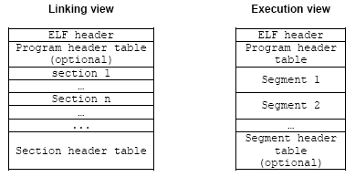

# A Compiler, Assembler, Linker & Loader

### The Relocation Records

Because the various object files will include references to each others code and/or data, these will need to be combined during the link time. For example in Figure 1, the object file that has main() includes calls to funct() and printf() functions. After linking all of the object files together, the linker uses the **relocation records** to find all of the addresses that need to be filled in.

<br />
Figure 1: The relocation record.

### The Symbol Table

Since assembling to machine code removes all traces of labels from the code, the object file format has to keep these around in a different place. It is accomplished by the **symbol table**, a list of names and their corresponding offsets in the text and data segments. A **disassembler** provides support for translating back from an object file or executable.

### Linking (Example in listing – linking 2 object files)

The linker actually enables separate compilation. As shown in Figure 2, an executable can be made up of a number of source files which can be compiled and assembled into their object files respectively, independently.

<br />
Figure 2:  Linking process of object files

### Shared Objects

In a typical system, a number of programs will be running. Each program relies on a number of functions, some of which will be standard C library functions, like printf(), malloc(), strcpy(), etc. If every program uses the standard C library, it means that each program would normally have a unique copy of this particular library present within it. Unfortunately, this result in wasted resources, degrade the efficiency and performance. Since the C library is common, it is better to have each program reference the common, one instance of that library, instead of having each program contain a copy of the library. This is implemented during the linking process where some of the objects are linked during the link time whereas some done during the run time (deferred/dynamic linking).

## Statically Linked

The term ‘statically linked’ means that the program and the particular library that it’s linked against are combined together by the linker at link time. This means that the binding between the program and the particular library is fixed and known at link time before the program run. It also means that we can't change this binding, unless we re-link the program with a new version of the library.

Programs that are linked statically are linked against archives of objects (libraries) that typically have the extension of .a. An example of such a collection of objects is the standard C library, **libc.a**. You might consider linking a program statically for example, in cases where you weren't sure whether the correct version of a library will be available at runtime, or if you were testing a new version of a library that you don't yet want to install as shared. For gcc, the –static option is used during the compilation/linking of the program.

```
gcc –static filename.c –o filename
```

The drawback of this technique is that the executable is quite big in size.

### Examples

Compile and link (for static linking).

```
[bodo@bakawali testbed5]$ gcc -g -static testbuff.c -o testbuff
/tmp/ccwh4rvU.o(.text+0x1e): In function 'Test':
/home/bodo/testbed5/testbuff.c:8: warning: the 'gets' function is dangerous and should not be used.

[bodo@bakawali testbed5]$ size -d testbuff
  text    data     bss   dec     hex     filename
380157    3368    4476  388001   5eba1   testbuff
```

Compile and link (for dynamic linking).  Note the executable size.

```
[bodo@bakawali testbed5]$ gcc -g testbuff.c -o testbuff
/tmp/ccMunGye.o(.text+0x1e): In function `Test':
/home/bodo/testbed5/testbuff.c:8: warning: the `gets' function is dangerous and should not be used.

[bodo@bakawali testbed5]$ size -d testbuff
text     data      bss  dec      hex filename
1031     264       4    1299     513 testbuff
```

## Dynamically Linked

The term ‘dynamically linked’ means that the program and the particular library it references are not combined together by the linker at link time. Instead, the linker places information into the executable that tells the loader which shared object module the code is in and which runtime linker should be used to find and bind the references. This means that the binding between the program and the shared object is done at runtime that is before the program starts, the appropriate shared objects are found and bound.

This type of program is called a partially bound executable, because it isn't fully resolved.  The linker, at link time, didn't cause all the referenced symbols in the program to be associated with specific code from the library. Instead, the linker simply said something like: “This program calls some functions within a particular shared object, so I'll just make a note of which shared object these functions are in, and continue on”.  Symbols for the shared objects are only verified for their validity to ensure that they do exist somewhere and are not yet combined into the program. The linker stores in the executable program, the locations of the external libraries where it found the missing symbols. Effectively, this defers the binding until runtime.

Programs that are linked dynamically are linked against shared objects that have the extension .so. An example of such an object is the shared object version of the **standard C library, libc.so**. The advantageous to defer some of the objects/modules during the static linking step until they are finally needed (during the run time) includes:

1. Program files (on disk) become much smaller because they need not hold all necessary text and data segments information.  It is very useful for portability.
2. Standard libraries may be upgraded or patched without every one program need to be re-linked.  This clearly requires some agreed module-naming convention that enables the dynamic linker to find the newest, installed module such as some version specification.  Furthermore the distribution of the libraries is in binary form (no source), including dynamically linked libraries (DLLs) and when you change your program you only have to recompile the file that was changed.
3. Software vendors need only provide the related libraries module required.  Additional runtime linking functions allow such programs to programmatically-link the required modules only.
4. In combination with virtual memory, dynamic linking permits two or more processes to share read-only executable modules such as standard C libraries and kernel.  Using this technique, only one copy of a module needs be resident in memory at any time, and multiple processes, each can executes this shared code (read only).  This results in a considerable memory saving, although demands an efficient swapping policy.

## How Shared Objects Are Used

To understand how a program makes use of shared objects, let's first examine the format of an executable and the steps that occur when the program starts.

### Some Detail Of The ELF Format

Executable and Linking Format is binary format, which is used in SVR4 Unix and Linux systems. It is a format for storing programs or fragments of programs on disk, created as a result of compiling and linking. ELF not only simplifies the task of making shared libraries, but also enhances dynamic loading of modules at runtime.

### ELF Sections

The Executable and Linking Format used by GNU/Linux and other operating systems, defines a number of ‘**sections**’ in an executable program. These are to provide order to the binary file and allow inspection. Important function sections include the **Global Offset Table** (GOT), which stores **addresses of system functions**, the **Procedure Linking Table** (PLT), which stores **indirect links** to the GOT, .init/.fini, for **internal initialization** and **shutdown**, .ctors/.dtors, for **constructors** and **deconstructors**. The data sections are .rodata, for read only data, .data for initialized data, and .bss for uninitialized data. The summary of partial list of the ELF sections are organized as follows (from low to high):

1. .init - Startup
2. .text - String
3. .fini - Shutdown
4. .rodata - Read Only
5. .data - Initialized Data
6. .tdata - Initialized Thread Data
7. .tbss - Uninitialized Thread Data
8. .ctors - Constructors
9. .dtors - Destructors
10. .got - Global Offset Table
11. .bss - Uninitialized Data

You can use the readelf or objdump program against the object or executable files in order to view the sections. In the following Figure, two views of an ELF file are shown: the linking view and the execution view.

<br />
Figure 3: Simplified object file format: linking view and execution view.

Keep in mind that the full format of the ELF contains many more items. As explained previously, the linking view, which is used when the program or library is linked, deals with sections within an object file. Sections contain the bulk of the object file information: data, instructions, relocation information, symbols, debugging information, etc. The execution view, which is used when the program runs, deals with segments. Segments are a way of grouping related sections.

For example, the text segment groups executable code, the data segment groups the program data, and the dynamic segment groups information relevant to dynamic loading. Each segment consists of one or more sections. A process image is created by loading and interpreting segments. The operating system logically copies a file’s segment to a virtual memory segment according to the information provided in the program header table. The OS can also use segments to create a shared memory resource. At link time, the program or library is built by merging together sections with similar attributes into segments. Typically, all the executable and read-only data sections are combined into a single text segment, while the data and BSS are combined into the data segment. These segments are normally called load segments, because they need to be loaded in memory at process creation. Other sections such as symbol information and debugging sections are merged into other, non-load segments.

## Process loading

In Linux processes loaded from a file system (using either the execve() or spawn() system calls) are in ELF format. If the file system is on a block-oriented device, the code and data are loaded into main memory. If the file system is memory mapped (e.g. ROM/Flash image), the code needn't be loaded into RAM, but may be executed in place. This approach makes all RAM available for data and stack, leaving the code in ROM or Flash. In all cases, if the same process is loaded more than once, its code will be shared. Before we can run an executable, firstly we have to load it into memory. This is done by the **loader**, which is generally part of the operating system. The loader does the following things:

1. Memory and access validation.

    Firstly, the OS system kernel reads in the program file’s header information and does the validation for type, access permissions and right, memory requirement and its ability to run its instructions. It confirms that file is an executable image and calculates memory requirements.

2. Process setup, includes:

    a. Allocates primary memory for the program's execution.

    b. Copies address space from secondary to primary memory.

    c. Copies the .text and .data sections from the executable into primary memory.

    d. Copies program arguments (e.g., command line arguments) onto the stack.

    e. Initializes registers: sets the esp to point to top of stack, clears the rest.

    f. Jumps to start routine, which: copies main()'s arguments off of the stack, and jumps to main().

Address space is memory space that contains program code, stack, and data segments or in other word, all data the program uses as it runs. The memory layout, typically consists of three segments (text, data, and stack), in simplified form is shown in Figure 4. The dynamic data segment is also referred to as the **heap**, the place dynamically allocated memory (such as from malloc() and new) comes from. Dynamically allocated memory is memory allocated at **run time** instead of **compile/link time**.  This organization enables any division of the dynamically allocated memory between the heap (explicitly) and the stack (implicitly). This explains why the stack grows downward and heap grows upward.

<br />
Figure 4: Memory layout for a process.

## The Runtime Data Structures

A process is a running program. This means that the operating system has loaded the executable file for the program into memory, has arranged it to have access to its command-line arguments and environment variables, and has started it running.  Conceptually a process has five different areas of memory allocated to it as listed in Table 1 (refer to Figure 4):

<table>
    <tr>
        <th>Area</th>
        <th>Description</th>
    </tr>
    <tr>
        <td>Code/text segment</td>
        <td>Often referred to as the text segment, this is the area in which the executable instructions reside. For example, Linux/Unix arranges things so that multiple running instances of the same program share their code if possible. Only one copy of the instructions for the same program resides in memory at any time. The portion of the executable file containing the text segment is the text section.</td>
    </tr>
    <tr>
        <td>Initialized data – data segment</td>
        <td>Statically allocated and global data that are initialized with nonzero values live in the data segment. Each process running the same program has its own data segment. The portion of the executable file containing the data segment is the data section.</td>
    </tr>
    <tr>
        <td>Uninitialized data – bss segment</td>
        <td>BSS stands for ‘**Block Started by Symbol**’. Global and statically allocated data that initialized to zero by default are kept in what is called the BSS area of the process. Each process running the same program has its own BSS area. When running, the BSS data are placed in the data segment. In the executable file, they are stored in the BSS section. For Linux/Unix the format of an executable, only variables that are initialized to a nonzero value occupy space in the executable’s disk file.</td>
    </tr>
    <tr>
        <td>Heap</td>
        <td> The heap is where dynamic memory (obtained by malloc(), calloc(), realloc() and new – C++) comes from. Everything on a heap is **anonymous**, thus you can only access parts of it through a pointer. As memory is allocated on the heap, the process’s address space grows. Although it is possible to give memory back to the system and shrink a process’s address space, this is almost never done because it will be allocated to other process again. Freed memory (free() and delete) goes back to the heap, creating what is called **holes**.  It is typical for the heap to grow upward. This means that successive items that are added to the heap are added at addresses that are numerically greater than previous items. It is also typical for the heap to start immediately after the BSS area of the data segment. The end of the heap is marked by a pointer known as the **break**. You cannot reference past the break. You can, however, move the break pointer (via brk() and sbrk() system calls) to a new position to increase the amount of heap memory available.</td>
    </tr>
    <tr>
        <td>Stack</td>
        <td> The stack segment is where local (automatic) variables are allocated. In C program, local variables are all variables declared inside the opening left curly brace of a function body including the main() or other left curly brace that aren’t defined as static. The data is popped up or pushed into the stack following the **Last In First Out** (LIFO) rule. The stack holds local variables, temporary information/data, function parameters, return address and the like. When a function is called, a stack frame (or a procedure activation record) is created and PUSHed onto the top of the stack. This stack frame contains information such as the address from which the function was called and where to jump back to when the function is finished (return address), parameters, local variables, and any other information needed by the invoked function. The order of the information may vary by system and compiler. When a function returns, the stack frame is POPped from the stack. Typically the stack grows downward, meaning that items deeper in the call chain are at numerically lower addresses and toward the heap.</td>
    </tr>
</table>
Table 1: Area of the executable image.

When a program is running, the initialized data, BSS and heap areas are usually placed into a single contiguous area called a data segment. The stack segment and code/text segment are separate from the data segment and from each other as illustrated in Figure 4.

Although it is theoretically possible for the stack and heap to grow into each other, the operating system prevents that event. The relationship among the different sections/segments is summarized in Table 2, executable program segments and their locations.

<table>
    <tr>
        <th>Executable file section (disk file)</th>
        <th>Address space segment</th>
        <th>Program memory segment</th>
    </tr>
    <tr>
        <td>.text</td>
        <td>Text</td>
        <td>Code</td>
    </tr>
    <tr>
        <td>.data</td>
        <td>Data</td>
        <td>Initialized data</td>
    </tr>
    <tr>
        <td>.bss</td>
        <td>Data</td>
        <td>BSS</td>
    </tr>
    <tr>
        <td>-</td>
        <td>Data</td>
        <td>Heap</td>
    </tr>
    <tr>
        <td>-</td>
        <td>Stack</td>
        <td>Stack</td>
    </tr>
</table>
Table 2: Sections vs segments.

## The Process

The diagram below shows the memory layout of a typical C’s process. The process load segments (corresponding to "text" and "data" in the diagram) at the process's base address. The main stack is located just below and grows downwards. Any additional threads that are created will have their own stacks, located below the main stack. Each of the stack frames is separated by a guard page to detect stack overflows among stacks frame. The heap is located above the process and grows upwards.

In the middle of the process's address space, there is a region is reserved for shared objects.  When a new process is created, the process manager first maps the two segments from the executable into memory. It then decodes the program's ELF header. If the program header indicates that the executable was linked against a shared library, the process manager will extract the name of the dynamic interpreter from the program header. The dynamic interpreter points to a shared library that contains the runtime linker code. The process manager will load this shared library in memory and will then pass control to the runtime linker code in this library.

<br />
Figure 5: Illustration of C’s process memory layout on an x86.

## The Runtime Linker and Shared Library Loading

The runtime linker is invoked when a program that was linked against a shared object is started or when a program requests that a shared object be dynamically loaded. So the resolution of the symbols is done at one of the following time:

1. **Load-time dynamic linking** – the application program is read from the disk (disk file) into memory and unresolved references are located.  The load time loader finds all necessary external symbols and alters all references to each symbol (all previously zeroed) to memory references relative to the beginning of the program.

2. **Run-time dynamic linking** – the application program is read from disk (disk file) into memory and unresolved references are left as invalid (typically zero).  The first access of an invalid, unresolved, reference results in a software trap.  The run-time dynamic linker determines why this trap occurred and seeks the necessary external symbol.  Only this symbol is loaded into memory and linked into the calling program.

The runtime linker is contained within the C runtime library. The runtime linker performs several tasks when loading a **shared library** (.so file).

The dynamic section provides information to the linker about other libraries that this library was linked against. It also gives information about the relocations that need to be applied and the external symbols that need to be resolved. The runtime linker will first load any other required shared libraries (which may themselves reference other shared libraries). It will then process the relocations for each library. Some of these relocations are local to the library, while others require the runtime linker to resolve a global symbol. In the latter case, the runtime linker will search through the list of libraries for this symbol. In ELF files, hash tables are used for the symbol lookup, so they're very fast. Once all relocations have been applied, any initialization functions that have been registered in the shared library's init section are called. This is used in some implementations of C++ to call global constructors.

### Symbol Name Resolution

When the runtime linker loads a shared library, the symbols within that library have to be resolved.  Here, the order and the scope of the symbol resolution are important. If a shared library calls a function that happens to exist by the same name in several libraries that the program has loaded, the order in which these libraries are searched for this symbol is critical. This is why the Operating System defines several options that can be used when loading libraries.

All the objects (executables and libraries) that have global scope are stored on an internal list (the global list). Any global-scope object, by default, makes available all of its symbols to any shared library that gets loaded. The global list initially contains the executable and any libraries that are loaded at the program's startup.

### Dynamic Address Translation

In the view of the memory management, modern OS with multitasking, normally implement dynamic relocation instead of static. All the program layout in the address space is virtually same. This dynamic relocation (in processor term it is called dynamic address translation) provides the illusion that:

1. Each process can use addresses starting at 0, even if other processes are running, or even if the same program is running more than one time.

2. Address spaces are protected.

3. Can fool process further into thinking it has memory that's much larger than available physical memory (virtual memory).

n dynamic relocation the address changed dynamically during every reference. Virtual address is generated by a process (also called logical address) and the physical address is the actual address in physical memory at the run-time. The address translation normally done by **Memory Management Unit** (MMU) that incorporated in the processor itself.

Virtual addresses are relative to the process. Each process believes that its virtual addresses start from 0. The process does not even know where it is located in physical memory; the code executes entirely in terms of virtual addresses.

MMU can refuse to translate virtual addresses that are outside the range of memory for the process for example by generating the segmentation faults. This provides the protection for each process. During translation, one can even move parts of the address space of a process between disk and memory as needed (normally called swapping or paging). This allows the virtual address space of the process to be much larger than the physical memory available to it.

## Further reading and digging

1. [IA-32 and IA-64 Intel® Architecture Software Developer's Manuals/documentation and downloads.][1]
2. [Another Intel microprocessor resources and download.][2]
3. [Assembly language tutorial using NASM (Netwide).][3]
4. [The High Level Assembly (HLA) language.][4]
5. [Linux based assembly language resources.][5]

[1]: http://www.intel.com/products/processor/manuals/index.htm
[2]: http://www.x86.org/intel.doc/
[3]: http://www.drpaulcarter.com/pcasm/
[4]: http://webster.cs.ucr.edu/
[5]: http://asm.sourceforge.net/
