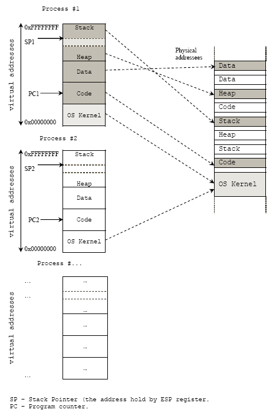
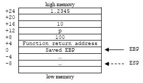
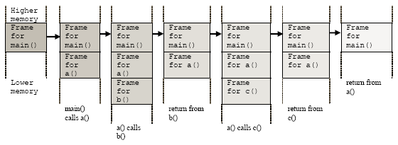

# C/C++ Function Operation

## The C Functions

Well, hopefully we have already got some big picture how programs been compiled, linked and assembled. Then loaded into the memory as a process image for programs running. Before we go any further investigating the stack it is very useful if we can learn about function because a stack is constructed when a function is called.  In high-level languages history, one of the most important techniques introduced for structuring programs (structured or procedural programming) is procedure or function. Programmers use functions to break their programs into smaller pieces of programs with specific task which can be independently developed, tested and reused.  Other terms that may be used interchangeably are routine (as called in assembly), procedure and method (as called in object oriented programming).

When a function call happens it alters the flow of control just as a jump (JMP) does in assembly language, but unlike a jump, when finished performing its task, a function returns control to the statement or instruction immediately following the call (CALL) instruction, that is the calling function (caller). When we see it from memory point of view, this high-level abstraction of function is implemented with the help of the **stack**. A stack is a portion of memory that has been allocated for function to operate. The term a **stack frame** normally used, when the content of the stack contains all the data needed by the function to operate is setup. The stack frame consists of all of the stacks’ variables used within a function, including parameters, local variables, the return address and other data that needed to accomplish the function’s task. When a function returns to the calling program, the stack will be dismantled (by caller or callee) and a new function call will create a new stack. Generally, functions’ components are listed in the following table. For function tutorial please refer to [C/C++ Functions tutorials](http://www.tenouk.com/Module4.html).

```c
global_variables;

int main(int argc, char *argv[])
{
	function_name(argument list);
	function_return_address here
}

return_type function_name(parameter list)
{
	local_variables;

	static variables;
	function’s code here
	return something_or_nothing;
}
```

Keep in mind that main() also a function but with execution point. Some description for the function components mentioned above is listed in the following Table.

<table>
	<tr>
		<th>Component</th>
		<th>Description</th>
	</tr>
	<tr>
		<td>function name</td>
		<td>A function’s name is a symbol that actually represents the address where the function’s code starts. In assembly language, the symbol is defined by typing the function’s name as a label before the function’s code.</td>
	</tr>
	<tr>
		<td>function parameters</td>
		<td>A function’s parameters are the data items that are explicitly given to the function for processing.  Some functions have many parameters, others have none and some have variable number of parameters.</td>
	</tr>
	<tr>
		<td>local variables</td>
		<td>Local variables are data storage that a function uses while processing, that is thrown away when it returns. Local variables of a function are not accessible to any other function within a program.</td>
	</tr>
	<tr>
		<td>static variables</td>
		<td>Static variables are data storage that a function uses while processing, that is not thrown away afterwards, but is reused for every time the function’s code is activated. This data is not accessible to any other part of the program.</td>
	</tr>
	<tr>
		<td>global variables</td>
		<td>Global variables are data storage that a function uses for processing which are managed outside the function.  Global variables of a function are accessible to any other function within a program.</td>
	</tr>
	<tr>
		<td>return address</td>
		<td>The return address is a memory address where the function must return to in order to proceed to the next program execution.</td>
	</tr>
	<tr>
		<td>return value</td>
		<td>The return value is the main method of transferring data back to the main program (or calling program). Most programming languages only allow a single return value for a function.</td>
	</tr>
</table>
Table 1: Terms used in function.

Stacks used during the function call in a process address space and the physical address mapping can be illustrated below.

<br />
Figure 1: Stack in process address space.

## The C Function Calling Convention

It has been said before, for every function call there will be a creation of a stack frame. It is very useful if we can study the operation of the function call and how the stack frame for function is constructed and destroyed. For function call, compilers have some convention used for calling them. A **convention** is a way of doing things that is standardized, but not a documented standard. For example, the C/C++ function calling convention tells the compiler things such as:

1. The order in which function arguments are pushed onto the stack.
2. Whether the caller function or called function (callee) responsibility to remove the arguments from the stack at the end of the call that is the stack cleanup process.
3. The name-decorating convention that the compiler uses to identify individual functions.

Examples for calling conventions are `__stdcall`, `__pascal`, `__cdecl` and `__fastcall` (for Microsoft Visual C++).  The calling convention belongs to a function's signature, thus functions with different calling convention are incompatible with each other. There is currently no standard for C/C++ naming between compiler vendors or even between different versions of a compiler for function calling scheme. That is why if you link object files compiled with other compilers may not produce the same naming scheme and thus causes unresolved externals. For Borland and Microsoft compilers you specify a specific calling convention between the return type and the function's name as shown below.

```c
void __cdecl TestFunc(float a, char b, char c);   // Borland and Microsoft
```

For the GNU GCC you use the `__attribute__` keyword by writing the function definition followed by the keyword `__attribute__` and then state the calling convention in double parentheses as shown below.

```c
void  TestFunc(float a, char b, char c)  __attribute__((cdecl));  // GNU GCC
```

As an example, Microsoft Visual C++ compiler has three function calling conventions used as listed in the following table.

<table>
	<tr>
		<th>Keyword</th>
		<th>Stack cleanup</th>
		<th>Parameter passing</th>
	</tr>
	<tr>
		<td>__cdecl</td>
		<td>caller</td>
		<td>Pushes parameters on the stack, in reverse order (right to left). Caller cleans up the stack. This is the default calling convention for C language that supports variadic functions (variable number of argument or type list such as printf()) and also C++ programs. The cdecl calling convention creates larger executables than __stdcall, because it requires each function call to include **stack cleanup** code.</td>
	</tr>
	<tr>
		<td>__stdcall</td>
		<td>callee</td>
		<td>Also known as __pascal. Pushes parameters on the stack, in reverse order (right to left). Functions that use this calling convention require a function prototype.  Callee cleans up the stack. It is standard convention used in Win32 API functions.</td>
	</tr>
	<tr>
		<td>__fastcall</td>
		<td>callee</td>
		<td>Parameters stored in registers, then pushed on stack. The __fastcall calling convention specifies that arguments to functions are to be passed in registers, when possible. Callee cleans up the stack.</td>
	</tr>
</table>
Table 2: Function call convention.

Basically, C function calls are made with the caller pushing some parameters onto the stack, calling the function and then popping the stack to clean up those pushed arguments. For `__cdecl` in assembly example:

```asm
/* example of __cdecl */
push arg1
push arg2
call function
add ebp, 12   ;stack cleanup
```

And for __stdcall example:

```asm
/* example of __stdcall */
push arg1
push arg2
call function
/* no stack cleanup, it will be done by caller */
```

##  The Linker Symbol And Name Decorations

Functions in C and C++ programs are known internally by their decorated names.  A decorated name is a string created by the compiler during compilation of the function definition or prototype.  In Microsoft Visual C++, by default, C++ uses the **function name**, **parameters**, and **return type** to create a linker name for the function.  Consider the following function header:

```c
void CALLTYPE TestFunc(void)
```

The following table shows the linker name (decorated names) examples for three calling conventions used by Microsoft Visual C++.

<table>
	<tr>
		<th>Calling convention</th>
		<th>extern "C" or .c file</th>
		<th>.cpp, .cxx</th>
		<th>Remarks</th>
	</tr>
	<tr>
		<td>__cdecl</td>
		<td>_TestFunc</td>
		<td>?TestFunc@@ZAXXZ</td>
		<td>The number of parameter does not really matter because the caller is responsible for stack setup and cleanup.</td>
	</tr>
	<tr>
		<td>__fastcall</td>
		<td>@TestFunc@N</td>
		<td>?TestFunc@@YIXXZ</td>
		<td>N – The number of bytes of parameters passed to function, 0 if void.</td>
	</tr>
	<tr>
		<td>__stdcall</td>
		<td>_TestFunc@N</td>
		<td>?TestFunc@@YGXXZ</td>
		<td>N – The number of bytes of parameters passed to function, 0 if void.</td>
	</tr>
</table>
Table 3: Decorated name.

extern "C" is used to call a C function from C++ and in another situation extern "C" forces the use of the C naming convention for non-class C++ functions.  Name decoration incorporates the parameters of a function into the final decorated function name.

<table>
	<tr>
		<th>Function declaration/prototype</th>
		<th>Decorated name</th>
	</tr>
	<tr>
		<td>void __cdecl   TestFunc(void);</td>
		<td>_TestFunc</td>
	</tr>
	<tr>
		<td>void __cdecl   TestFunc(int x);</td>
		<td>_TestFunc</td>
	</tr>
	<tr>
		<td>void __cdecl   TestFunc(int x, int y);</td>
		<td>_TestFunc</td>
	</tr>
	<tr>
		<td>void __stdcall   TestFunc(void);</td>
		<td>_TestFunc@0</td>
	</tr>
	<tr>
		<td>void __stdcall   TestFunc(int x);</td>
		<td>_TestFunc@4</td>
	</tr>
	<tr>
		<td>void __stdcall   TestFunc(int x, int y);</td>
		<td>_TestFunc@`</td>
	</tr>
	<tr>
		<td>void __fastcall   TestFunc(void);</td>
		<td>@TestFunc@0</td>
	</tr>
	<tr>
		<td>void __ fastcall   TestFunc(int x);</td>
		<td>@TestFunc@4</td>
	</tr>
	<tr>
		<td>void __ fastcall   TestFunc(int x, int y)`</td>
		<td>@TestFunc@8</td>
	</tr>
</table>
Table 4: Function prototype and its decorated name.

The decorated names are strictly a linker facility and are not visible to a C program but you can see it when you debug your program in assembly (disassembled). The following example shows the results of making a function call using the `__stdcall` calling conventions and the stack frame layout. You can replace `__stdcall` with another two calling convention in the function prototype skeleton.


```c
// function prototype
void  __stdcall TestFunc(int i, char c, short s, double f);
...

// function definition
void  TestFunc(int i, char c, short s, double f)
{ ... }
...

// function call
TestFunc(100, 'p', 10, 1.2345);
```

The result of the stack frame layout illustration for the function call using the `__stdcall`, compiled using Visual C++ is shown below.

<br />
Figure 2: Stack frame layout.

Other than using the calling conventions explicitly in the program source code, compilers normally provide options that can be used to set the calling conventions. If the compiler’s option is not set and in the program source code also not used explicitly, the default setting of the compiler will be used, normally the `__cdecl`. For `__cdecl` and `__stdcall` conventions, there are three registers involved during the function call that create the stack frame:

<table>
	<tr>
		<th>Register</th>
		<th>Description</th>
	</tr>
	<tr>
		<td>ESP – Stack Pointer</td>
		<td>The 32-bit register that implicitly used by several processor instructions such as PUSH, POP, CALL and RET. It always points to the last element, an occupied location on the stack.</td>
	</tr>
	<tr>
		<td>EBP – Base Pointer</td>
		<td>Also called **Frame Pointer**. The 32 bits register used as an offset to reference all the function parameters and local variables in the current stack frame. EBP is used explicitly.</td>
	</tr>
	<tr>
		<td>EIP – Instruction Pointer</td>
		<td>This 16 bits register holds the address of the next processor instruction to be executed and it’s saved onto the stack as part of the CALL instruction and any jump instructions can modify EIP directly.</td>
	</tr>
</table>
Table 5: Registers used in function call.

## The Processor's Stack Memory

Hopefully the previous sections have given you the big picture. Now we are going to narrow down our discussion just to a stack. To fully understand how the environment in which a buffer overflow can occur, the layout and the operation of the stack must be fully understood.  As discussed previously, stack segment contains a stack, one entry/out, LIFO structure. On the x86 architecture, stacks grow downward, meaning that newer data will be allocated at addresses less than elements pushed onto the stack earlier. This stack normally called a stack frame (or a procedure activation record in java) when there are the boundaries pointed by EBP at the bottom and ESP at the top of the stack. Each function call creates a new stack frame and “stacked down” onto the previous stack(s), each one keeps track of the call chain or sequence that is which routine called it and where to return to, once it’s done (Figure 3). Using a very simple C program skeleton, the following tries to figure out function calls and stack frames construction/destruction.

```c
#include <stdio.h>

int a();
int b();
int c();

int a()
{
	b();
	c();
	return 0;
}

int b()
{ return 0; }

int c()
{ return 0; }

int main()
{
	a();
	return 0;
}
```

By taking the stack area only, the following is what happen when the above program is run. At the end there should be equilibrium.

<br />
Figure 3: Stack frame and function call.

By referring the previous program example and Figure 3, when a program begins execution in the function main(), stack frame is created, space is allocated on the stack for all variables declared within main(). Then, when main() calls a function, a(), new stack frame is created for the variables in a() at the top of the main() stack. Any parameters passed by main() to a() are stored on the stack. If a() were to call any additional functions such as b() and c(), new stack frames would be allocated at the new top of the stack.  Notice that the order of the execution happened in the sequence.  When c(), b() and a() return, storage for their local variables are de-allocated, the stack frames are destroyed and the top of the stack returns to the previous condition. The order of the execution is in the reverse. As can be seen, the memory allocated in the stack area is used and reused during program execution. It should be clear that memory allocated in this area will contain garbage values left over from previous usage.

## Further reading and digging

1. [Visual studio/C++ .Net.][6]
2. [gcc][7]
3. [gdb][8]
4. [Assembly language tutorial using NASM (Netwide).][3]
5. [The High Level Assembly (HLA) language.][4]
6. [IA-32 and IA-64 Intel® Architecture Software Developer's Manuals/documentation and downloads.][1]
7. [Another Intel microprocessor resources and download.][2]
8. [Linux based assembly language resources.][5]

[1]: http://www.intel.com/products/processor/manuals/index.htm
[2]: http://www.x86.org/intel.doc/
[3]: http://www.drpaulcarter.com/pcasm/
[4]: http://webster.cs.ucr.edu/
[5]: http://asm.sourceforge.net/
[6]: http://msdn.microsoft.com/
[7]: http://gcc.gnu.org/
[8]: http://www.gnu.org/software/gdb/gdb.html
