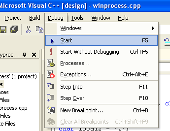
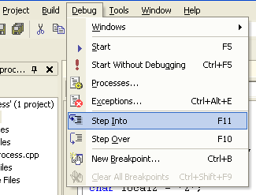
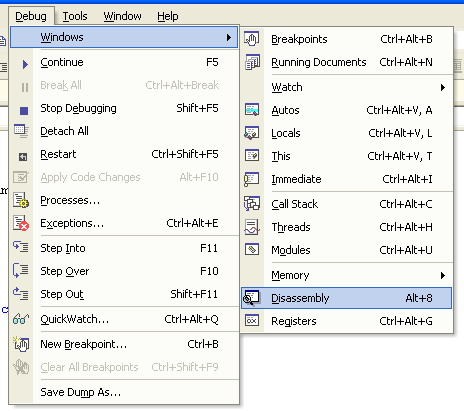
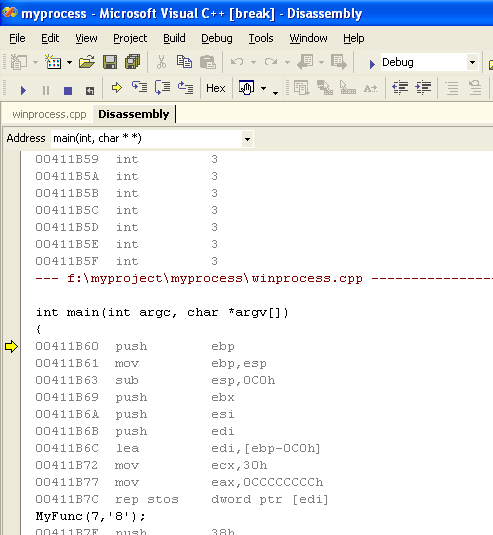
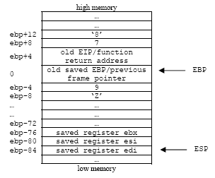

# The Function Stack

## The Processor's Stack Frame Layout

 Stack frame constructed during the function call for memory allocation implicitly.  Explicitly, memory allocation can be requested from and released to **heap** area using malloc(), calloc(), realloc(), new, free() and delete respectively. A typical layout of a stack frame is shown below although it may be organized differently in different operating systems:

- Function parameters.
- Function’s return address.
- Frame pointer.
- Exception Handler frame.
- Locally declared variables.
- Buffer.
- Callee save registers.

And the arrangement in the stack can be illustrated as shown below.

<br />
Figure 1: Typical illustration of a stack layout during the function call.

From the layout, it is clear that a buffer overflow if occurs, has the opportunity to overwrite other variables allocated at the memory address higher than the buffer that is the locally declared variables, the exception handler frame, the frame pointer, the return address, and the function parameters.  We will dig more detail about these later on.

As an example in Windows/Intel, typically, when the function call takes place, data elements are stored on the stack in the following way:


1. The function parameters are pushed on the stack before the function is called.  The parameters are pushed from right to left.
2. The function return address is placed on the stack by the x86 CALL instruction, which stores the current value of the EIP register.
3. Then, the frame pointer that is the previous value of the EBP register is placed on the stack.
4. If a function includes try/catch or any other exception handling construct such as SEH (Structured Exception Handling - Microsoft implementation), the compiler will include exception handling information on the stack.
5. Next, the locally declared variables.
6. Then the buffers are allocated for temporary data storage.
7. Finally, the callee save registers such as ESI, EDI, and EBX are stored if they are used at any point during the functions execution.  For Linux/Intel, this step comes after step no. 4.

## The Processor's Stack Operation

There are two CPU registers that are important for the functioning of the stack which hold information that is necessary when calling data residing in the memory. Their names are ESP and EBP in 32 bits system. The ESP (Extended Stack Pointer) holds the top stack address.  ESP is modifiable either directly or indirectly. Directly: by using direct operations for example (Windows/Intel):

```asm
add esp, 0Ch
```

This instruction causes the stack to shrink by 12 bytes. And

```asm
sub esp, 0Ch
```

That causes the stack to grow by 12 bytes.  (Keep in mind that it may seem confusing. In fact, the bigger the ESP value, the smaller the stack size and vice versa because the stack grows downwards in memory as it gets bigger and vice versa).

Indirectly: by adding data elements to the stack with PUSH or removing data elements from the stack with POP stack operation. For example:

```asm
push   ebp    ; Save ebp, put it on the stack
pop    ebp    ; Restore ebp, remove it from the stack
```

In addition to the stack pointer, which points to the top of the stack (lower numerical address); it is often convenient to have a stack frame pointer (FP) which holds an address that point to a fixed location within a frame.  Looking at the stack frame, local variables could be referenced by giving their offsets from ESP.  However, as data are pushed onto the stack and popped off the stack, these offsets change, so the reference of the local variables is not consistent.  Consequently, many compilers use another register, generally called Frame Pointer (FP), for referencing both local variables and parameters because their distances from FP do not change with PUSHes and POPs.  On Intel CPUs, EBP (Extended Base Pointer) is used for this purpose.  On the Motorola CPUs, any address register except A7 (the stack pointer) will do.  Because the way stack grows, actual parameters have positive offsets and local variables have negative offsets from FP as shown below.  Let examine the following simple C program.

```c
#include <stdio.h>

int MyFunc(int parameter1, char parameter2)
{
	int local1 = 9;
	char local2 = ‘Z’;
	return 0;
}

int main(int argc, char *argv[])
{
	MyFunc(7, ‘8’);
	return 0;
}
```

And the memory layout will look something like this:

<br />
Figure 2: Function call: The memory layout.

The EBP register is a static register that points to the stack bottom. The bottom of the stack is at a fixed address.  More precisely the EBP register contains the address of the stack bottom as an offset relative to the executed function.  Depending on the task of the function, the stack size is dynamically adjusted by the kernel at run time.  Each time a new function is called, the old value of EBP is the first to be pushed onto the stack and then the new value of ESP is moved to EBP. This new value of ESP held by EBP becomes the reference base to local variables that are needed to retrieve the stack section allocated for the new function call. As mentioned before, a stack grows downward to lower memory address.  This is the way the stack grows on many computers including the Intel, Motorola, SPARC and MIPS processors.  The stack pointer (ESP) last address on the stack not the next free available address after the top of the stack.

The first thing a function must do when called is to save the previous EBP (so it can be restored by copying into the EIP at function exit later).  Then it copies ESP into EBP to create the new stack frame pointer, and advances ESP to reserve space for the local variables.  This code is called the **procedure prolog**.  Upon function exit, the stack must be cleaned up again, something called the **procedure epilog**.  You may find that the Intel ENTER and LEAVE instructions and the Motorola LINK and UNLINK instructions, have been provided to do most of the procedure prolog and epilog work efficiently. As said before, two of the most important assembly language instructions used in stack operation are PUSH and POP.  PUSH adds an element at the top of the stack.  POP, in contrast, removing the last element at the top of the stack.

<br />
Figure 3: The effect of the PUSH and POP instructions.

Other instructions used in stack manipulation are listed in the following table.

<table>
	<tr>
		<th>Instruction</th>
		<th>Description</th>
	</tr>
	<tr>
		<td>PUSH</td>
		<td>Decrements the stack pointer and then stores the source operand on the top of the stack.</td>
	</tr>
	<tr>
		<td>POP</td>
		<td>Loads the value from the top of the stack to the location specified with the destination operand and then increments the stack pointer.</td>
	</tr>
	<tr>
		<td>PUSHAD</td>
		<td>Pushes the contents of the general-purpose registers onto the stack.</td>
	</tr>
	<tr>
		<td>POPAD</td>
		<td>Pops doublewords from the stack into the general-purpose registers.</td>
	</tr>
	<tr>
		<td>PUSHFD</td>
		<td>Pushes the contents of the EFLAGS register onto the stack.</td>
	</tr>
	<tr>
		<td>POPFD</td>
		<td>Pops doublewords from the stack into the EFLAGS register</td>
	</tr>
</table>
Table 1: Related assembly instructions for stack operations.

### Some Windows OS Point of View

Using Microsoft Visual C++ compiler, all function’s arguments are widened to 32 bits (4 bytes) when they are passed to function. Return values are also widened to 32 bits (4 bytes) and returned in the EAX register, except for 8-byte structures, which are returned in the EDX:EAX register pair.

Larger structures are returned in the EAX register as pointers to hidden return structures. The compiler generates procedure **prolog** and **epilog** code (explained later) to save and restore the ESI, EDI, EBX, and EBP registers.

## The Function Call and Stack Frame: Some Analysis

Let see an example how the stack frame is constructed and destroyed from the function calling convention view.  We will use the `__cdecl` convention and the steps implemented automatically by the Microsoft Visual C++ 6.0 compiler although not all of them are used in every function call such as situation when there is no parameters, no local variables etc.  Setting of the `__cdecl` is done through compiler normally by default and this program run in debug mode.

- OS: Windows 2000 server
- Compiler: Microsoft Visual C++ 6.0

The C program example:

```c
// winprocess.cpp
#include <stdio.h>

int MyFunc(int parameter1, char parameter2)
{
	int local1 = 9;
	char local2 = 'Z';
	return 0;
}

int main(int argc, char *argv[])
{
	MyFunc(7,'8');
	return 0;
}
```

The program then been debug and the following is the assembly. The steps using the debugger:

**Debug** menu → **Start** (or F5) submenu) as shown below.

<br />
Figure 4: Using Visual C++/.Net for debugging

Here we are using the **Step Into** (F11) so that we can go through the codes step by step of execution.

<br />
Figure 5: Using Visual C++/.Net for debugging: Step into.

Then viewing the disassembled code while stepping the execution (by keep pressing the F11).

<br />
Figure 6: Using Visual C++/.Net for debugging.

<br />
Figure 7: Disassembly of the C code

For Linux please refer to [Module000](http://www.tenouk.com/Module000.html) and [Module111](http://www.tenouk.com/Module111.html). The disassembly 'junk' reproduced in the following text and the comments give some explanation to the concerned assembly lines.

```
--- e:\test\testproga\winprocess.cpp  ----------------------------------
10:
11:   int main(int argc, char *argv[])
12:   {
00401060   push        ebp
00401061   mov         ebp, esp
00401063   sub         esp, 40h
00401066   push        ebx
00401067   push        esi
00401068   push        edi
00401069   lea         edi, [ebp-40h]
0040106C   mov         ecx, 10h
00401071   mov         eax, 0CCCCCCCCh
00401076   rep stos    dword ptr [edi]
13:   MyFunc(7,'8');
------------------jump to MyFunc()---------------------------------------
00401078   push        38h ;character 8 is pushed on the stack at [ebp+12]
0040107A   push        7   ;integer 7 is pushed on the stack at [ebp+8]
0040107C   call        @ILT+5(MyFunc) (0040100a);call MyFunc(), return
                                                ;address: 00401081
                                                ;is pushed on the stack
                                                ;at [ebp+4]
-----------------------------------------------------------------------
@ILT+5(?MyFunc@@YAHHD@Z):  ;function decorated name, Visual C++ .Net
0040100A   jmp         MyFunc (00401020)
-----------------------------------------------------------------------
--- e:\test\testproga\testproga.cpp  ----------------------------------
1:    //testproga.cpp
2:    #include <stdio.h>
3:
4:    int MyFunc(int parameter1, char parameter2)
5:    {
00401020   push        ebp        ;save the previous frame pointer at [ebp+0]
00401021   mov         ebp, esp   ;the esp (top of the stack) becomes new
                                  ;ebp. The esp and ebp now are pointing to the same address.
00401023   sub         esp, 48h   ;subtract 72 bytes for local variables & buffer,
                                  ;where is the esp? [ebp-72]
00401026   push        ebx        ;save, push ebx register, [ebp-76]
00401027   push        esi        ;save, push esi register, [ebp-80]
00401028   push        edi        ;save, push edi register, [ebp-84]
00401029   lea         edi, [ebp-48h]    ;using the edi register…
0040102C   mov         ecx, 12h
00401031   mov         eax, 0CCCCCCCCh
00401036   rep stos    dword ptr [edi]
6:    int local1 = 9;
00401038   mov         dword ptr [ebp-4], 9     ;move the local variable, integer 9
                                                ;by pointer at [ebp-4]
7:    char local2 = 'Z';
0040103F   mov         byte ptr [ebp-8], 5Ah    ;move local variable, character Z
                                         ;by pointer at [ebp-8], no buffer usage in this
                                         ;program so can start dismantling the stack
8:    return 0;
00401043   xor         eax, eax   ;clear eax register, no return data
9:    }
00401045   pop         edi        ;restore, pop edi register, [ebp-84]
00401046   pop         esi        ;restore, pop esi register, [ebp-80]
00401047   pop         ebx        ;restore, pop ebx register, [ebp-76]
00401048   mov         esp, ebp   ;move ebp into esp, [ebp+0]. At this moment
          ;the esp and ebp are pointing at the same address
0040104A   pop         ebp        ;then pop the saved ebp, [ebp+0] so the ebp is back
          ;pointing at the previous stack frame
0040104B   ret                    ;load the saved eip, the return address: 00401081
                                  ;into the eip and start executing the instruction,
                                  ;the address is [ebp+4]
-----------------------------back to main()--------------------------------------------
00401081   add         esp, 8     ;clear the parameters, 8 bytes for integer 7 and
                                  ;character 8 at [ebp+8] and [ebp+12]
                                  ;after this cleanup by the caller, main(), the
                                  ;MyFunc()’s stack is totally dismantled.
14:   return 0;
00401084   xor         eax, eax   ;clear eax register
15:   }
00401086   pop         edi
00401087   pop         esi
00401088   pop         ebx
00401089   add         esp, 40h
0040108C   cmp         ebp, esp
0040108E   call        __chkesp (004010b0)    ; checking the esp corruption?
00401093   mov         esp, ebp               ; dismantling the stack
00401095   pop         ebp
00401096   ret
```

1. Push parameters onto the stack, from right to left.<br />
	Parameters are pushed onto the stack, one at a time from right to left.  The calling code must keep track of how many bytes of parameters have been pushed onto the stack so that it can clean it up later.
	```
	00401078   push        38h ;character 8 is pushed on the stack at [ebp+12]
	0040107A   push        7     ;integer 7 is pushed on the stack at [ebp+8]
	```

2. Call the function.<br />
	The processor pushes contents of the EIP onto the stack, and it points to the first byte after the CALL instruction, the function’s return address.  After this finishes, the caller has lost control, and the callee is in charge.  This step does not change the EBP register, the current stack frame pointer.
	```
	0040107C   call        @ILT+5(MyFunc) (0040100a)  ;call MyFunc(), return address: 00401081, is
	                                                  ;pushed on the stack at [ebp+4]
	```

3. Save and update the EBP.<br />
	Now that we are in the new function, we need a new local stack frame pointed to by EBP, so this is done by saving the current EBP (which belong to the previous function’ frame, may include the main()) and making the top of the stack.
	```
	00401020   push    ebp       ;save the previous frame pointer at [ebp+0]
	00401021   mov     ebp, esp  ;the esp (top of the stack) becomes new ebp.
	                             ;The esp and ebp now are pointing to the same address.
	```
	Once EBP has been changed, now we can refer directly to the function’s arguments (pushed in step no 1) as [ebp + 8], [ebp +12] etc.  Note that [ebp+0] is the old base pointer (frame pointer) and [ebp+4] is the old instruction pointer (EIP), that is the function’s return address.

4. Allocate space for local variables and buffer.<br />
	Simply by decrementing the stack pointer by the amount of space required.  This is always done in four-byte chunks (32 bits system).
	```
	00401023   sub    esp, 48h ;subtract 72 bytes for local variables & buffer,
	                           ;where is the esp? [ebp-72]
	```

5. Save processor registers used for temporaries.<br />
	If this function will use any processor registers, it has to save the old values first in order not to destroy the data used by the caller or other programs.  Each register to be used is pushed onto the stack one at a time, and the compiler must remember what it did so that it can unwind it later.
	```
	00401026   push        ebx        ;save, push ebx register, [ebp-76]
	00401027   push        esi        ;save, push esi register, [ebp-80]
	00401028   push        edi        ;save, push edi register, [ebp-84]
	```

6. Push the local variables.<br />
	Now, the local variables are located on the stack between the EBP as a base and ESP register as the top of the stack.  As said before, by convention the EBP register is used as an offset for the data on the stack frame reference.  This means that [ebp-4] refers to the first local variable.
	```
	6:    int local1 = 9;
	00401038   mov   dword ptr [ebp-4], 9    ;move the local variable, integer
	                                         ; 9 by pointer at [ebp-4]
	7:    char local2 = 'Z';
	0040103F   mov   byte ptr [ebp-8], 5Ah   ;move local variable character Z by
	                                         ; pointer at [ebp-8],no buffer usage in
	                                         ; this program so can start dismantling the stack
	```

7. Perform the function’s task.<br />
	At this point, the stack frame is set up correctly, and this is illustrated in Figure 8.  All parameters and locals reference are offsets from the EBP register.  In our program there is no operation for the function.  So can start dismantling the function’s stack.
	<br />
	Figure 8: Stack frame setup.

8. Restore saved registers.
	After the function’s operation is finished, for each register saved onto the stack upon entry, it must be restored from the stack in reverse order.  If the save and restore phases don’t match exactly, stack will be corrupted.
	```
	00401045   pop     edi     ;restore, pop edi register, [ebp-84]
	00401046   pop     esi     ;restore, pop esi register, [ebp-80]
	00401047   pop     ebx     ;restore, pop ebx register, [ebp-76]
	```

9. Restore the old base pointer.
	The first thing this function did upon entry was save the caller’s EBP base pointer, and by restoring  it now (popping the top item from the stack), we effectively discard the entire local stack frame and put the caller’s frame back as in the previous state.
	```
	00401048   mov     esp, ebp ;move ebp into esp, [ebp+0]. At this moment
	                       ;the esp and ebp are pointing at the same address
	0040104A   pop     ebp      ;then pop the saved ebp, [ebp+0] so the ebp is
	                            ;back pointing at the previous stack frame
	```

10. Return from the function.
	This is the last step of the called function, and the RET instruction pops the old saved EIP (return address) from the stack and jumps to that location.  This gives control back to the caller.  Only the stack pointer (EBP) and instruction pointers (EIP) are modified by a subroutine return.
	```
	0040104B   ret   ;load the saved eip, the return address: 00401081
	                 ;into the eip and start executing the instruction, the address is [ebp+4]
	```

11. Clean up pushed parameters.
	In the `__cdecl` convention, the caller must clean up the parameters pushed onto the stack, and this is done either by popping the stack into the don’t care registers for the function’s parameters or by adding the parameter-block size to the stack pointer directly.
	```
	00401081   add      esp, 8 ;clear the parameters, 8 bytes for integer
	                           ; 7 and character 8 at [ebp+8] and [ebp+12]
	                           ; after this cleanup by the caller, main(),
	                           ; the MyFunc()’s stack is totally dismantled.
	```

You can see that from assembly point of view also, when using the stack, it must be symmetrical in the byte count of what is pushed and what is popped. There must be equilibrium before and after the stack construction for functions as discussed before. Obviously, if the stack is not balanced on exit from a function, program execution begins at the wrong address which will almost exclusively crash the program. In most instances, if you push a given data size onto the stack, make sure you must pop the same data size.
