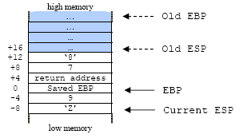
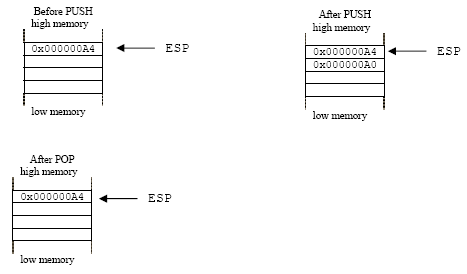

# The Function Stack

## The Processor's Stack Frame Layout

 Stack frame constructed during the function call for memory allocation implicitly.  Explicitly, memory allocation can be requested from and released to **heap** area using malloc(), calloc(), realloc(), new, free() and delete respectively. A typical layout of a stack frame is shown below although it may be organized differently in different operating systems:

- Function parameters.
- Function’s return address.
- Frame pointer.
- Exception Handler frame.
- Locally declared variables.
- Buffer.
- Callee save registers.

And the arrangement in the stack can be illustrated as shown below.

<br />
Figure 1: Typical illustration of a stack layout during the function call.

From the layout, it is clear that a buffer overflow if occurs, has the opportunity to overwrite other variables allocated at the memory address higher than the buffer that is the locally declared variables, the exception handler frame, the frame pointer, the return address, and the function parameters.  We will dig more detail about these later on.

As an example in Windows/Intel, typically, when the function call takes place, data elements are stored on the stack in the following way:


1. The function parameters are pushed on the stack before the function is called.  The parameters are pushed from right to left.
2. The function return address is placed on the stack by the x86 CALL instruction, which stores the current value of the EIP register.
3. Then, the frame pointer that is the previous value of the EBP register is placed on the stack.
4. If a function includes try/catch or any other exception handling construct such as SEH (Structured Exception Handling - Microsoft implementation), the compiler will include exception handling information on the stack.
5. Next, the locally declared variables.
6. Then the buffers are allocated for temporary data storage.
7. Finally, the callee save registers such as ESI, EDI, and EBX are stored if they are used at any point during the functions execution.  For Linux/Intel, this step comes after step no. 4.

## The Processor's Stack Operation

There are two CPU registers that are important for the functioning of the stack which hold information that is necessary when calling data residing in the memory. Their names are ESP and EBP in 32 bits system. The ESP (Extended Stack Pointer) holds the top stack address.  ESP is modifiable either directly or indirectly. Directly: by using direct operations for example (Windows/Intel):

```asm
add esp, 0Ch
```

This instruction causes the stack to shrink by 12 bytes. And

```asm
sub esp, 0Ch
```

That causes the stack to grow by 12 bytes.  (Keep in mind that it may seem confusing. In fact, the bigger the ESP value, the smaller the stack size and vice versa because the stack grows downwards in memory as it gets bigger and vice versa).

Indirectly: by adding data elements to the stack with PUSH or removing data elements from the stack with POP stack operation. For example:

```asm
push   ebp    ; Save ebp, put it on the stack
pop    ebp    ; Restore ebp, remove it from the stack
```

In addition to the stack pointer, which points to the top of the stack (lower numerical address); it is often convenient to have a stack frame pointer (FP) which holds an address that point to a fixed location within a frame.  Looking at the stack frame, local variables could be referenced by giving their offsets from ESP.  However, as data are pushed onto the stack and popped off the stack, these offsets change, so the reference of the local variables is not consistent.  Consequently, many compilers use another register, generally called Frame Pointer (FP), for referencing both local variables and parameters because their distances from FP do not change with PUSHes and POPs.  On Intel CPUs, EBP (Extended Base Pointer) is used for this purpose.  On the Motorola CPUs, any address register except A7 (the stack pointer) will do.  Because the way stack grows, actual parameters have positive offsets and local variables have negative offsets from FP as shown below.  Let examine the following simple C program.

```c
#include <stdio.h>

int MyFunc(int parameter1, char parameter2)
{
	int local1 = 9;
	char local2 = ‘Z’;
	return 0;
}

int main(int argc, char *argv[])
{
	MyFunc(7, ‘8’);
	return 0;
}
```

And the memory layout will look something like this:

<br />
Figure 2: Function call: The memory layout.

The EBP register is a static register that points to the stack bottom. The bottom of the stack is at a fixed address.  More precisely the EBP register contains the address of the stack bottom as an offset relative to the executed function.  Depending on the task of the function, the stack size is dynamically adjusted by the kernel at run time.  Each time a new function is called, the old value of EBP is the first to be pushed onto the stack and then the new value of ESP is moved to EBP. This new value of ESP held by EBP becomes the reference base to local variables that are needed to retrieve the stack section allocated for the new function call. As mentioned before, a stack grows downward to lower memory address.  This is the way the stack grows on many computers including the Intel, Motorola, SPARC and MIPS processors.  The stack pointer (ESP) last address on the stack not the next free available address after the top of the stack.

The first thing a function must do when called is to save the previous EBP (so it can be restored by copying into the EIP at function exit later).  Then it copies ESP into EBP to create the new stack frame pointer, and advances ESP to reserve space for the local variables.  This code is called the **procedure prolog**.  Upon function exit, the stack must be cleaned up again, something called the **procedure epilog**.  You may find that the Intel ENTER and LEAVE instructions and the Motorola LINK and UNLINK instructions, have been provided to do most of the procedure prolog and epilog work efficiently. As said before, two of the most important assembly language instructions used in stack operation are PUSH and POP.  PUSH adds an element at the top of the stack.  POP, in contrast, removing the last element at the top of the stack.

<br />
Figure 3: The effect of the PUSH and POP instructions.

Other instructions used in stack manipulation are listed in the following table.

<table>
	<tr>
		<th>Instruction</th>
		<th>Description</th>
	</tr>
	<tr>
		<td>PUSH</td>
		<td>Decrements the stack pointer and then stores the source operand on the top of the stack.</td>
	</tr>
	<tr>
		<td>POP</td>
		<td>Loads the value from the top of the stack to the location specified with the destination operand and then increments the stack pointer.</td>
	</tr>
	<tr>
		<td>PUSHAD</td>
		<td>Pushes the contents of the general-purpose registers onto the stack.</td>
	</tr>
	<tr>
		<td>POPAD</td>
		<td>Pops doublewords from the stack into the general-purpose registers.</td>
	</tr>
	<tr>
		<td>PUSHFD</td>
		<td>Pushes the contents of the EFLAGS register onto the stack.</td>
	</tr>
	<tr>
		<td>POPFD</td>
		<td>Pops doublewords from the stack into the EFLAGS register</td>
	</tr>
</table>
Table 1: Related assembly instructions for stack operations.
