# The Stack Operation

## Processor's Stack: Tracing The Action

Let re-examine the steps involved when a function call is invoked, construct and then dismantle the stack in graphically manner using **gcc** and **gdb**. The platform used is Linux Fedora (Core 3)/Intel and our previous conclusion regarding the function call and stack can be summarized as follows:

1. Push parameters on the stack.
2. Call function (push the function return address).
3. (Inside function) Set up stack frame for local variable and buffer storage.
4. Before function returns, adjust stack frame to deallocate local variable storage and buffer.
5. Return (pop the return address) and adjust stack to remove function parameters.

C program used in this example is shown below.  The main() is caller and the TestFunc() is callee and the function call convention used is __cdelc.

```c
#include <stdio.h>

int TestFunc(int parameter1, int parameter2, char parameter3)
{
	int y = 3, z = 4;
	char buff[7] = "ABCDEF";

	// function's task code here
	return 0;
}

int main(int argc, char *argv[ ])
{
	TestFunc(1, 2, 'A');
	return 0;
}
```

By gdb’ing the executable, the assembly language is given below. The comments are not part of the gdb result, added in the purpose to explain the assembly line of codes.

```
[root@bakawali test]# gdb testprog5
GNU gdb Red Hat Linux (6.1post-1.20040607.41rh)
Copyright 2004 Free Software Foundation, Inc.
GDB is free software, covered by the GNU General Public License, and you are
welcome to change it and/or distribute copies of it under certain conditions.
Type "show copying" to see the conditions.
There is absolutely no warranty for GDB.  Type "show warranty" for details.
This GDB was configured as "i386-redhat-linux-gnu"...Using host libthread_db library "/lib/tls/libthread_db.so.1".

(gdb) break main
Breakpoint 1 at 0x8048388: file testprog5.c, line 14.
(gdb) disass main
Dump of assembler code for function main:
0x0804836c <main+0>:    push   %ebp                    ;main stack frame
0x0804836d <main+1>:    mov    %esp, %ebp
0x0804836f <main+3>:    sub    $0x8, %esp
0x08048372 <main+6>:    and    $0xfffffff0, %esp
0x08048375 <main+9>:    mov    $0x0, %eax
0x0804837a <main+14>:   add    $0xf, %eax
0x0804837d <main+17>:   add    $0xf, %eax
0x08048380 <main+20>:   shr    $0x4, %eax
0x08048383 <main+23>:   shl    $0x4, %eax
0x08048386 <main+26>:   sub    %eax, %esp
0x08048388 <main+28>:   movb   $0x41, 0xffffffff(%ebp)  ;prepare the byte of ‘A’
0x0804838c <main+32>:   movsbl 0xffffffff(%ebp), %eax   ;put into eax
0x08048390 <main+36>:   push   %eax             ;push the third parameter, ‘A’ prepared in eax onto the stack, [ebp+16]
0x08048391 <main+37>:   push   $0x2             ;push the second parameter, 2 onto the stack, [ebp+12]
0x08048393 <main+39>:   push   $0x1             ;push the first parameter, 1 onto the stack, [ebp+8]
-------------------------------------------------------------------------------------------------------------------------------------------
0x08048395 <main+41>:   call   0x8048334 <TestFunc>    ;function call. Push the return
								 				 	   ;address [0x0804839a] onto the stack, [ebp+4]
------------------------------------------------------------------------------------------------------------------------------------------
0x0804839a <main+46>:   add    $0xc, %esp       ;cleanup the 3 parameters pushed on the
				 				 				;stack at [ebp+8], [ebp+12] and [ebp+16] total up 12 bytes
0x0804839d <main+49>:   mov    $0x0, %eax
0x080483a2 <main+54>:   leave
0x080483a3 <main+55>:   ret
End of assembler dump.

--------------------------------------------------------The TestFunc()--------------------------------------------------------------------
(gdb) break TestFunc
Breakpoint 2 at 0x8048342: file testprog5.c, line 5.
(gdb) disass TestFunc
Dump of assembler code for function TestFunc:
0x08048334 <TestFunc+0>:        push   %ebp            ;push the previous stack frame pointer onto the stack, [ebp+0]
0x08048335 <TestFunc+1>:        mov    %esp, %ebp      ;copy the ebp into esp, now the ebp
													   ;and esp are pointing at the same
													   ;address, creating new stack frame [ebp+0]
0x08048337 <TestFunc+3>:        push   %edi                    ;save/push edi register, [ebp-4]
0x08048338 <TestFunc+4>:        push   %esi                    ;save/push esi register, [ebp-8]
0x08048339 <TestFunc+5>:        sub    $0x20, %esp             ;subtract esp by 32 bytes for local
			;variable and buffer if any, go to [ebp-40]
0x0804833c <TestFunc+8>:        mov    0x10(%ebp), %eax        ;move by pointer, [ebp+16] into the eax, [ebp+16]à ‘A’?
0x0804833f <TestFunc+11>:       mov    %al, 0xfffffff7(%ebp)   ;move by pointer, byte of al into [ebp-9]
0x08048342 <TestFunc+14>:       movl   $0x3, 0xfffffff0(%ebp)  ;move by pointer, 3 into [ebp-16]
0x08048349 <TestFunc+21>:       movl   $0x4, 0xffffffec(%ebp)  ;move by pointer, 4 into [ebp-20]
0x08048350 <TestFunc+28>:       lea    0xffffffd8(%ebp), %edi  ;load address [ebp-40] into edi
0x08048353 <TestFunc+31>:       mov    $0x8048484, %esi        ;move string into esi
0x08048358 <TestFunc+36>:       cld                                 ;clear direction flag\
0x08048359 <TestFunc+37>:       mov    $0x7, %ecx                   ;move 7 into ecx as counter for the array
0x0804835e <TestFunc+42>:       repz movsb %ds:(%esi), %es:(%edi)   ;start copy by pointer from esi to edi register
0x08048360 <TestFunc+44>:       mov    $0x0, %eax                   ;move return value into eax, 0 in this case, no return value
0x08048365 <TestFunc+49>:       add    $0x20, %esp                  ;add 32 bytes to esp, back to [ebp-8]
0x08048368 <TestFunc+52>:       pop    %esi                         ;restore the esi, [ebp-4]
0x08048369 <TestFunc+53>:       pop    %edi                         ;restore the edi, [ebp+0]
0x0804836a <TestFunc+54>:       leave                  ;restoring the ebp to the previous stack frame, [ebp+4]
0x0804836b <TestFunc+55>:       ret                    ;transfer control back to calling function
													   ;using the saved return address at [ebp+8]
End of assembler dump.
```

The convention used here is that the callee is allowed to mess up the values of the EAX, ECX and EDX registers before returning. So, if the caller wants to preserve the values of EAX, ECX and EDX, the caller must explicitly save them on the stack before making the function call. On the other hand, the callee must restore the values of the EBX, ESI and EDI registers. If the callee makes changes to these registers, the callee must also save the affected registers on the stack and restore the original values before returning later.

Return values of 4 bytes or less are stored in the EAX register. If a return value with more than 4 bytes is needed, then the caller passes an extra first argument to the callee. This extra argument is address of the location where the return value should be stored.  As an example, for C function call:

```
x = TestFunc(a, b, c);
```

Is transformed into the call something like this:

```
TestFunc(&x, a, b, c);
```

Note that this only happens for function calls that return more than 4 bytes. In our example, the caller is the main() function and is about to call a function TestFunc(), the callee. Before the function call, main() is using the ESP and EBP registers for its own stack frame. Firstly, main() pushes the contents of the registers EAX, ECX and EDX onto the stack if any (not shown in the illustration). This is an optional step and is taken only if the contents of these three registers need to be preserved.

### STEP 1
Push the parameters on the stack from right to left.

```
TestFunc(1, 2, 'A');

0x08048388 <main+28>:   movb   $0x41, 0xffffffff(%ebp) ;prepare the byte of ‘A’
0x0804838c <main+32>:   movsbl 0xffffffff(%ebp), %eax  ;put into eax
0x08048390 <main+36>:   push   %eax                    ;push the third parameter, ‘A’ prepared
                                                       ;in eax onto the stack, [ebp+16]
0x08048391 <main+37>:   push   $0x2                    ;push the second parameter, 2 onto
                                                       ;the stack, [ebp+12]
0x08048393 <main+39>:   push   $0x1                    ;push the first parameter, 1 onto
                                                       ;the stack, [ebp+8]
```

Before:

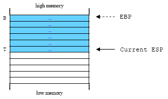<br />

After:

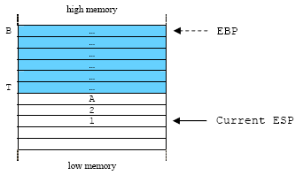<br />
Figure 1: Pushing the parameters on the stack from right to left.

### STEP 2
Call the TestFunc(), push the function return address, the address immediately after the CALL instruction onto the stack.

```
0x08048395 <main+41>:   call   0x8048334 <TestFunc>    ;function call.
                                                       ;Push the return address [0x0804839a]
                                                       ;onto the stack, [ebp+4]
```
This instruction calls the function TestFunc(), whose the beginning is located at address 0x8048334.

When the CALL instruction is executed, the contents of the EIP register is pushed onto the stack. The EIP register contains the offset of the instruction immediately following the CALL instruction for later use as a function’s return address. Since the EIP register is pointing to the next instruction in main(), the effect is that the return address is now at the top of the stack. After the CALL instruction, the next execution cycle begins at the label named TestFunc.

Before:

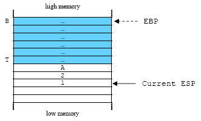<br />

After:

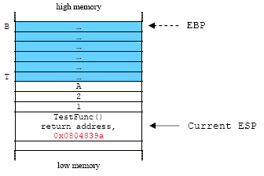<br />
Figure 2: Push the function return address onto the stack.

### STEP 3
Set up the stack frame, save registers, allocates storage for local variables and the buffer.

When in the function TestFunc(), the callee, gets control of the program, it must do 3 things: set up its own stack frame, save the contents of the registers EBX, ESI and EDI as needed and allocate space for local storage (local variables and buffer). This is called **function prolog** and the example for TestFunc() is shown below:

```
0x08048334 <TestFunc+0>:        push   %ebp         ;push the previous stack frame
                                                    ;pointer onto the stack, [ebp+0]
0x08048335 <TestFunc+1>:        mov    %esp, %ebp   ;copy the ebp into esp, now the ebp and esp
                                                    ;are pointing at the same address,
                                                    ;creating new stack frame [ebp+0]
0x08048337 <TestFunc+3>:        push   %edi         ;save/push edi register, [ebp-4]
0x08048338 <TestFunc+4>:        push   %esi         ;save/push esi register, [ebp-8]
0x08048339 <TestFunc+5>:        sub    $0x20, %esp  ;subtract esp by 32 bytes for local
                                                    ;variable and buffer if any, go to [ebp-40]
```

The EBP register is currently pointing at the location in main()'s stack frame. This value must be preserved. So, EBP is pushed onto the stack. Then the content of ESP is transferred to EBP. This allows the function’s arguments to be referenced as an offset from EBP and frees up the stack register, ESP to do other things.

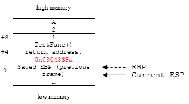<br />
Figure 3: Pushing the EBP onto the stack, saving the previous stack frame.

Thus, just about all C functions will begin with the following two instructions in assembly:

```
0x08048334 <TestFunc+0>:        push   %ebp
0x08048335 <TestFunc+1>:        mov    %esp, %ebp
```

From within the function, parameters are accessed positive offsets from the base pointer (EBP) and local variables are accessed as negative offsets from the base pointer. The following example shows the general function prolog code that might appear in a 32-bit Windows/Intel:

```
push        ebp                ; Save ebp, the previous frame
mov         ebp, esp           ; Set the new stack frame pointer
sub         esp, localbytes    ; Allocate space for locals
push        <registers>        ; Optionally, save registers if any
```

e.g.

```
00411A30  push        ebp         ; Save ebp
00411A31  mov         ebp, esp    ; Set the new stack frame pointer
00411A33  sub         esp, 0C0h   ; Allocate space for locals
00411A39  push        ebx         ; optionally, save register if any
00411A3A  push        esi         ; save register if any
00411A3B  push        edi         ; save register if any
```

The localbytes variable represents the number of bytes needed on the stack for local variables, and the <registers> variable is a placeholder that represents the list of registers to be saved on the stack if any. After pushing the registers, you can place any other appropriate data on the stack. In Linux/Intel the order of the last two instructions are interchanged as shown in the following code:

```
push        %ebp                ; Save ebp
mov         %ebp, %esp          ; Set stack frame pointer
push        <registers>         ; optionally, save registers if any
sub         localbytes, %esp    ; Allocate space for locals
```

e.g.

```
push   %ebp          ;push the previous stack frame pointer onto the stack, [ebp+0]
mov    %esp, %ebp    ;copy the ebp into esp, now the ebp and esp are pointing at the same
                     ;address, creating new stack frame [ebp+0]
push   %edi          ;save/push edi register, [ebp-4]
push   %esi          ;save/push esi register, [ebp-8]
sub    $0x20, %esp   ;subtracts esp by 32 bytes for local variable and
                     ;buffer if any, go to [ebp-40]
```

In our program example, it looks that the contents of the ESI and EDI registers have been preserved means the TestFunc() will use these registers. That is why these registers were pushed onto the stack.

```
0x08048337 <TestFunc+3>:    push   %edi   ;save/push edi register, [ebp-4]
0x08048338 <TestFunc+4>:    push   %esi   ;save/push esi register, [ebp-8]
```

Then, TestFunc() must allocate space for its local variables. It must also allocate space for any temporary storage (buffer) it might need. For example, some C statements in TestFunc() might have expressions to complete the function’s task. During the expressions/statements operation, there may be an intermediate values that must be stored somewhere. These locations are usually called buffer, because they can be reused for the next expressions, data allocated and deallocated dynamically. In this program example 32 (0x20) bytes has been subtracted from the stack pointer, the esp for the local variables:

```
0x08048339 <TestFunc+5>:    sub    $0x20, %esp     ;subtract esp by 32 bytes for local
                                                   ;variable and buffer if any, go to [ebp-40]
```

Then the local variables pushed onto the stack. Keep in mind that the TestFunc() does nothing so there is no buffer for function’s operation. The operation seems like dummy here.

```
0x0804833c <TestFunc+8>:    mov    0x10(%ebp), %eax       ;move by pointer, [ebp+16] into the
                                                          ;eax, [ebp+16]à‘A’?
0x0804833f <TestFunc+11>:   mov    %al, 0xfffffff7(%ebp)  ;move by pointer, byte of
                                                          ;al into [ebp-9]
0x08048342 <TestFunc+14>:   movl   $0x3, 0xfffffff0(%ebp) ;move by pointer, 3 into [ebp-16]
0x08048349 <TestFunc+21>:   movl   $0x4, 0xffffffec(%ebp) ;move by pointer, 4 into [ebp-20]
0x08048350 <TestFunc+28>:   lea    0xffffffd8(%ebp), %edi ;load address [ebp-40] into edi
0x08048353 <TestFunc+31>:   mov    $0x8048484, %esi       ;move string into esi
0x08048358 <TestFunc+36>:   cld                           ;clear direction flag
0x08048359 <TestFunc+37>:   mov    $0x7, %ecx             ;move 7 into ecx as counter for the array
0x0804835e <TestFunc+42>:   repz movsb %ds:(%esi), %es:(%edi)  ;start copy by pointer from
                                                               ;esi to edi register
```

The body of the function TestFunc() can now be executed. This might involve pushing onto and popping things off the stack. So, the stack pointer ESP might go up and down, but the EBP register remains fixed. This is convenient because it means we can always refer to the first function argument as [EBP + 8] regardless of how much pushing and popping is done in the function. Execution of the function TestFunc() might also involve other function calls and even recursive calls to TestFunc(). However, as long as the EBP register is restored upon return from these calls, references to the arguments, local variables and buffer can continue to be made as offsets from EBP. The procedure prolog is quite consistent among different assembly language/compilers because they may use same convention for function call.

Before:

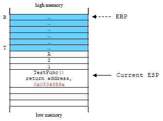<br />

After:

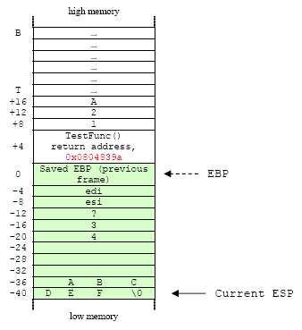<br />
Figure 4: Set up the stack frame, save registers, allocates storage for local variables and the buffer and processing happens.

The stack always grows down (from high to low memory addresses). To access local variables, calculate a **negative offset** from ebp by subtracting the appropriate value from ebp and parameters with positive offset from ebp starting from [ebp+8].

If any, before returning control to the caller, the callee TestFunc() must first make arrangements for the return value to be stored in the EAX register. We already discussed how function calls with return values store the values. In our program example 0 was moved to the EAX because there is no return value.

```
0x08048360 <TestFunc+44>:    mov    $0x0, %eax   ;move return value into eax,
                                                 ;0 in this case, no return value
```

### STEP 4
Dismantling the stack frame (deallocate storage of the local variables and buffer).

This step called **function epilog**. The following is the Linux/Intel for our program example that uses the __cdelc function call convention, where the stack cleanup done by the caller. Before that, pre-dismantling is done by callee:

```
0x08048365 <TestFunc+49>:   add    $0x20, %esp     ;add 32 bytes to esp, back to [ebp-8]
0x08048368 <TestFunc+52>:   pop    %esi            ;restore the esi, [ebp-4]
0x08048369 <TestFunc+53>:   pop    %edi            ;restore the edi, [ebp+0]
```

32 bytes is added to the esp, then the esp now pointing at the [ebp-8] so that the local variables and buffer are destroyed.  Then esi ([ebp-4]) and edi ([ebp-8]) are popped off the stack. The esp and ebp now pointing at the previous saved ebp [ebp+0].

The function epilog is not consistent among different assembly language/compilers and one of the reasons is the different function calling convention used as discussed before. The following is function epilog code example (Windows/Intel) that uses the __cdecl, where the stack cleanup is done by the caller:

```
...
pop         <registers>   ; Restore registers
mov         esp, ebp      ; Restore stack pointer
pop         ebp           ; Restore ebp
ret                       ; Return from function
-------------------Back to the calling function------------
add         esp, <localbytes>     ; cleanup the parameters
...
```

e.g.

```
...
00411A6A  pop         edi
00411A6B  pop         esi
00411A6C  pop         ebx
00411A6D  mov         esp, ebp
00411A6F  pop         ebp
00411A70  ret
---------------------Back to the calling function------------
00411AB9  add         esp, 8
...
```

Before:

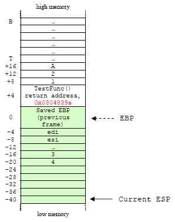<br />

After:

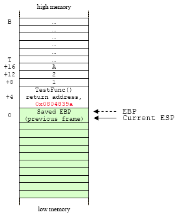<br />
Figure 5: Dismantling the stack frame and restore the previous one.

### STEP 5

Return from function call, go to the next instruction immediately after the CALL instruction.

```
0x0804836a <TestFunc+54>:    leave    ;restoring the ebp to the previous stack frame, [ebp+4]
0x0804836b <TestFunc+55>:    ret      ;transfer control back to calling function using
                                      ;the saved return address at [ebp+8]
```

The old frame pointer, B (the saved previous EBP), is then popped off the stack frame. In effect, this moves the EBP back to the bottom of the previous caller stack frame (B) and the esp now pointing at the return address. Then the return address is popped off and loaded into the EIP.  The control now transferred to the main(). The following codes in main() show that 12 bytes has been subtracted from the esp.

```
0x0804839a <main+46>:   add    $0xc, %esp    ;cleanup the 3 parameters pushed on the stack
                                             ;at [ebp+8], [ebp+12] and [ebp+16]
                                             ;total up is 12 bytes = 0xc
```

This makes the three parameters off the stack (4 bytes x 3 = 12 bytes) and the esp now pointing to the top of the previous stack frame (T). At this moment the TestFunc() stack frame has been dismantled and the state of the stack frame has been restored to the previous stack frame as in step 1.

Before:

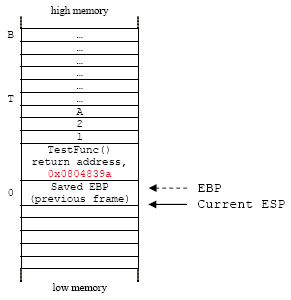<br />

After:

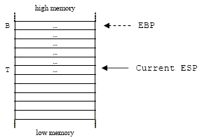<br />
Figure 6: Return from function call, the stack has been destroyed.

The main purpose of this section is to demonstrate the construction and destruction of the stack frame during the function call.

## The GCC And The Allocated Buffer

Keep in mind that in our real examples, there are areas in the stack’s buffer are not used for storing our data. These areas normally known as junks or dummy.  For example, in our program’s function, we have declared:

```c
int y = 3, z = 4;
char buff[7] = "ABCDEF";
```

From the source code we only need 4 slots of the 32 bits (4 x 16 bytes). But when we disassemble the program:

```
0x08048339 <TestFunc+5>:     sub    $0x20, %esp ;subtract esp by 32 bytes for local variable
                                                ;and buffer if any, go to [ebp-40]
```

The buffer allocated is 32 bytes (0x20), more than enough to store our local variables, the array and any temporary storage if needed. Then, what actually happened here?  Let investigate this chunk by running the following program example.

```c
/*testvul.c*/
int main(int argc, char *argv[ ])
{
	char buffer[100];
	strcpy(buffer, argv[1]);
	return 0;
}
```

Try 100 and then increments by 4 bytes.

```
[bodo@bakawali testbed16]$ gcc -o testvul testvul.c
[bodo@bakawali testbed16]$ ./testvul `perl -e 'print "A"x100'`
[bodo@bakawali testbed16]$ ./testvul `perl -e 'print "A"x104'`
[bodo@bakawali testbed16]$ ./testvul `perl -e 'print "A"x108'`
[bodo@bakawali testbed16]$ ./testvul `perl -e 'print "A"x112'`
[bodo@bakawali testbed16]$ ./testvul `perl -e 'print "A"x116'`
[bodo@bakawali testbed16]$ ./testvul `perl -e 'print "A"x120'`
[bodo@bakawali testbed16]$ ./testvul `perl -e 'print "A"x124'`
Segmentation fault
[bodo@bakawali testbed16]$
```

The normal stack, byte wise should be like this:

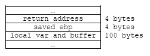<br />
Figure 7.

So, why the vulnerable program got 'Segmentation fault' when we input data more than 124 bytes instead of 104 bytes? As mentioned before, memory can only be addressed in the word size (4 bytes).  So we may think that the vulnerable program gets 'Segmentation fault' when we put 104 bytes (26 words) data. There also were some changes after gcc 2.96 version. If using gcc 2.95 version and lower, the vulnerable program will get 'Segmentation fault' when we put 104 bytes data.  The main change is that stack is aligned by 16 bytes after gcc 2.96. So when main() function is called, 16 bytes allocated for a local variable. The following table shows the size of n in the buffer[n] as in the previous program example and the real memory allocation and you can test it using the gdb.

<table>
	<tr>
		<th>n</th>
		<th>The real allocated memory size</th>
	</tr>
	<tr>
		<td>1 - 8</td>
		<td>8 bytes</td>
	</tr>
	<tr>
		<td>12 - 16</td>
		<td>24 bytes</td>
	</tr>
	<tr>
		<td>17 - 32</td>
		<td>40 bytes</td>
	</tr>
	<tr>
		<td>33 - 48</td>
		<td>56 bytes</td>
	</tr>
	<tr>
		<td>49 - 64</td>
		<td>72 bytes</td>
	</tr>
	<tr>
		<td>65 - 80</td>
		<td>88 bytes</td>
	</tr>
	<tr>
		<td>81 - 96</td>
		<td>104 bytes</td>
	</tr>
	<tr>
		<td>97 - 112</td>
		<td>120 bytes</td>
	</tr>
	<tr>
		<td>113 - 128</td>
		<td>136 bytes</td>
	</tr>
	<tr>
		<td>129 - 144</td>
		<td>152 bytes</td>
	</tr>
	<tr>
		<td>145 - 160</td>
		<td>168 bytes</td>
	</tr>
	<tr>
		<td>161 - 176</td>
		<td>184 bytes</td>
	</tr>
	<tr>
		<td>177 - 192</td>
		<td>200 bytes</td>
	</tr>
	<tr>
		<td>193 - 208</td>
		<td>216 bytes</td>
	</tr>
	<tr>
		<td>209 - 224</td>
		<td>232 bytes</td>
	</tr>
	<tr>
		<td>225 - 240</td>
		<td>248 bytes</td>
	</tr>
	<tr>
		<td>241 - 256</td>
		<td>264 bytes</td>
	</tr>
	<tr>
		<td>...</td>
		<td>...</td>
	</tr>
</table>

Table 1

As we can see, there is a change in the real memory size when 16 bytes are added to n.

```
16+16(=32)+16(=48)+16(=64)+16(=80)+16(=96)+16(=112).......
24     40      56      72      88     104      120
    16  +  16  +   16   +  16  +  16   +   16.......
```

Another issue is there are some inconsistencies when n are between 1 and 16.  Let's have another example.

```
/*testvul2.c*/
int main(int argc, char *argv[ ])
{
        char buffer[12];
        strcpy(buffer, argv[1]);
        return 0;
}
```

Then gdb the executable.

```
[bodo@bakawali testbed16]$ gcc -g -o testvul2 testvul2.c
[bodo@bakawali testbed16]$ gdb -q testvul2
Using host libthread_db library "/lib/tls/libthread_db.so.1".
(gdb) disass main
Dump of assembler code for function main:
0x08048368 <main+0>:    push   %ebp
0x08048369 <main+1>:    mov    %esp, %ebp
0x0804836b <main+3>:    sub    $0x18, %esp
0x0804836e <main+6>:    and    $0xfffffff0, %esp
0x08048371 <main+9>:    mov    $0x0, %eax
0x08048376 <main+14>:   add    $0xf, %eax
0x08048379 <main+17>:   add    $0xf, %eax
0x0804837c <main+20>:   shr    $0x4, %eax
```

In the case of gcc 2.96 and lower version, we will get the following result.

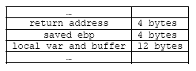<br />
Figure 8.

But gcc 2.96 and above, we will get something like the following.

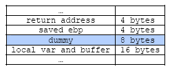<br />
Figure 9.

We can see that there are 8 bytes dummy. If you remember from the previous sections, this 8 bytes dummy as if allocated for %esi and %edi registers. Furthermore during the function’s operation another allocation may be done making the stack’s size change a lot and for mixed data types declared, for example int and char, the may have some alignment. Remember also, the buffer must be 4-bytes wise for 32 bit platform. This means that most of the time we cannot accurately determine the exact size and the location of the data in the buffer. That is why the intelligent guessing method used widely in order to overflow the buffer. In our case the general stack form is following and hence we know how to get the return address:

```
buffer - (dummy) - ebp(4) - ret(4)
```

So, to get the return address, firstly we get $ebp and then plus 4.  For example if the $ebp is 0xbfffef08. We add 4 to 0xbfffef08 and then we get the return address 0xbfffef0c. Actually, this 'alignment' can be adjusted using [GCC's stack boundary adjustment option](http://www.tenouk.com/Bufferoverflowc/bufferoverflowvulexploitdemo31.html): `-mpreferred-stack-boundary=num`.

However, we have to remember that the return address through using gdb may not accurate. So, when we attack the vulnerable program and if the return address is not correct, we have to add or subtract some bytes. From the previous example we can use the gdb to directly verify the buffer size.

## Further reading and digging

1. [IA-32 and IA-64 Intel® Architecture Software Developer's Manuals/documentation and downloads.][1]
2. [Another Intel microprocessor resources and download.][2]
3. [Assembly language tutorial using NASM (Netwide).][3]
4. [The High Level Assembly (HLA) language.][4]
5. [Linux based assembly language resources.][5]
6. [Visual studio/C++ .Net.][6]
7. [gcc][7]
8. [gdb][8]

[1]: http://www.intel.com/products/processor/manuals/index.htm
[2]: http://www.x86.org/intel.doc/
[3]: http://www.drpaulcarter.com/pcasm/
[4]: http://webster.cs.ucr.edu/
[5]: http://asm.sourceforge.net/
[6]: http://msdn.microsoft.com/
[7]: http://gcc.gnu.org/
[8]: http://www.gnu.org/software/gdb/gdb.html
