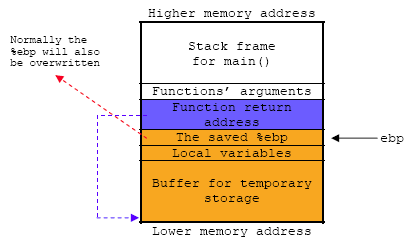

# A Stack Based Buffer Overflow

## Testing Buffer Overflow Code

In the following program example, we are going to investigate how the stack based buffer overflow happen.  We will use standard C gets() vulnerable function (read from standard input and store in the buffer without bound checking) and the overflow will happen in Test() function. The buffer for Test() function only can hold maximum 3 characters plus NULL, so that 4 and more characters should overflow its buffer and we will try to demonstrate overwriting the saved ebp and the Test()’s return address. The test is done on Linux Fedora Core 3.

```c
/* test buffer program */
#include <unistd.h>

void Test()
{
	char buff[4];
	printf("Some input: ");
	gets(buff);
	puts(buff);
}

int main(int argc, char *argv[ ])
{
	Test();
	return 0;
}
```

## Buffer Overflow Program Executions

Then we run the program with input of 3, 5, 8 and 12 characters.

```
[bodo@bakawali testbed5]$ ./testbuff
Some input: AAA
AAA
[bodo@bakawali testbed5]$ ./testbuff
Some input: AAAAA
AAAAA
Segmentation fault
[bodo@bakawali testbed5]$ ./testbuff
Some input: AAAAAAAA
AAAAAAAA
Segmentation fault
[bodo@bakawali testbed5]$ ./testbuff
Some input: AAAAAAAAAAAA
AAAAAAAAAAAA
Segmentation fault
```

Obviously, input with 3 characters will be fine, but more than 3 characters (5, 8 and 12 characters in this case) will generate segmentation fault and the program terminates to avoid other bad consequences. Well, there are two functions which use the buff buffer. Then, which function's buffer (gets() or puts()) that generate the segmentation fault or which one has been over flown? It is left for you to find the answer.

## Debugging The Buffer Overflow Program

Let debug the program using gdb to see what actually happened here.

```
[bodo@bakawali testbed5]$ gdb testbuff
GNU gdb Red Hat Linux (6.1post-1.20040607.43rh)
Copyright 2004 Free Software Foundation, Inc.
GDB is free software, covered by the GNU General Public License, and you are
welcome to change it and/or distribute copies of it under certain conditions.
Type "show copying" to see the conditions.
There is absolutely no warranty for GDB.  Type "show warranty" for details.
This GDB was configured as "i386-redhat-linux-gnu"...Using host libthread_db library "/lib/tls/libthread_db.so.1".

(gdb) break main
Breakpoint 1 at 0x8048422: file testbuff.c, line 14.
(gdb) disass main
Dump of assembler code for function main:
0x08048406 <main+0>:    push   %ebp
0x08048407 <main+1>:    mov    %esp, %ebp
0x08048409 <main+3>:    sub    $0x8, %esp
0x0804840c <main+6>:    and    $0xfffffff0, %esp
0x0804840f <main+9>:    mov    $0x0, %eax
0x08048414 <main+14>:   add    $0xf, %eax
0x08048417 <main+17>:   add    $0xf, %eax
0x0804841a <main+20>:   shr    $0x4, %eax
0x0804841d <main+23>:   shl    $0x4, %eax
0x08048420 <main+26>:   sub    %eax, %esp
0x08048422 <main+28>:   call   0x80483d0 <Test>
0x08048427 <main+33>:   mov    $0x0, %eax
0x0804842c <main+38>:   leave
0x0804842d <main+39>:   ret
End of assembler dump.
(gdb) disass Test
Dump of assembler code for function Test:
0x080483d0 <Test+0>:    push   %ebp
0x080483d1 <Test+1>:    mov    %esp, %ebp
0x080483d3 <Test+3>:    sub    $0x8, %esp
0x080483d6 <Test+6>:    sub    $0xc, %esp
0x080483d9 <Test+9>:    push   $0x8048510
0x080483de <Test+14>:   call   0x8048318 <_init+88>
0x080483e3 <Test+19>:   add    $0x10, %esp             ;_init stack clean up
0x080483e6 <Test+22>:   sub    $0xc, %esp
0x080483e9 <Test+25>:   lea    0xfffffffc(%ebp), %eax  ;load effective address
                                                       ;pointer [ebp-4] into eax
0x080483ec <Test+28>:   push   %eax                    ;push the pointer onto the stack
0x080483ed <Test+29>:   call   0x80482e8 <_init+40>
0x080483f2 <Test+34>:   add    $0x10, %esp             ;_init stack clean up
0x080483f5 <Test+37>:   sub    $0xc, %esp
0x080483f8 <Test+40>:   lea    0xfffffffc(%ebp), %eax
0x080483fb <Test+43>:   push   %eax
0x080483fc <Test+44>:   call   0x80482f8 <_init+56>
0x08048401 <Test+49>:   add    $0x10, %esp             ;_init stack clean up
0x08048404 <Test+52>:   leave
0x08048405 <Test+53>:   ret
End of assembler dump.
```

By disassembling the program, although we only declare an array with 4 elements (4 bytes), we can see that 20 bytes (0x8 + 0xc) has been allocated for local variable and buffer for Test() function. Let dig in more detail.

```
[bodo@bakawali testbed5]$ gdb -q testbuff
Using host libthread_db library "/lib/tls/libthread_db.so.1".
(gdb) break main
Breakpoint 1 at 0x8048422: file testbuff.c, line 14.
(gdb) r
Starting program: /home/bodo/testbed5/testbuff

Breakpoint 1, main (argc=1, argv=0xbfea3064) at testbuff.c:14
14      Test();
(gdb) s
Test () at testbuff.c:7
7       printf("Some input: ");
(gdb)
8       gets(buff);
(gdb)
Some input: AAA
9       puts(buff);
(gdb) x/x $esp
0xbfea2fb0:     0x00000000
(gdb) x/x $ebp
0xbfea2fb8:     0xbfea2fd8
(gdb) x/x $ebp-4
0xbfea2fb4:     0x00414141
(gdb) x/s 0xbfea2fb4
0xbfea2fb4:      "AAA"
(gdb)
```

The stack frame illustration for this program is shown below. The buff[4] is stored in the local variable buffer area of Test() function’s stack frame. Keep in mind that we don’t have function’s argument here. The hexadecimal for character ‘A’ is 41 (mark with the red color).

<br />
Figure 1: Stack construction during the function call.

If the input is three characters of "AAA", the buff[4] array is filled up properly with three characters + NULL.

<br />
Figure 2: Filling up the buffer in the stack with the 'A' character.

When we input five characters, "AAAAA", some area of the saved %ebp will be overwritten as shown below, making the saved %ebp that holds the main() stack frame pointer not valid anymore. When restoring this stack frame pointer later, it will point at the wrong or undefined stack frame.

```
(gdb) r
The program being debugged has been started already.
Start it from the beginning? (y or n) y
Starting program: /home/bodo/testbed5/testbuff

Breakpoint 1, main (argc=1, argv=0xbff2d6a4) at testbuff.c:14
14      Test();
(gdb) s
Test () at testbuff.c:7
7       printf("Some input: ");
(gdb)
8       gets(buff);
(gdb)
Some input: AAAAA
9       puts(buff);
(gdb) x/x $ebp
0xbff2d5f8:     0xbff20041
(gdb) x/x $ebp-4
0xbff2d5f4:     0x41414141
(gdb) x/x $ebp-8
0xbff2d5f0:     0x00000000
(gdb) x/s 0xbff2d5f8
0xbff2d5f8:      "A"
(gdb) x/s 0xbff2d5f4
0xbff2d5f4:      "AAAAA"
(gdb)
```

<br />
Figure 3: Some portion of the buffer around the ebp has been overwritten.

Let input more data, 8 characters: AAAAAAAA.

```
(gdb) r
The program being debugged has been started already.
Start it from the beginning? (y or n) y
Starting program: /home/bodo/testbed5/testbuff

Breakpoint 1, main (argc=1, argv=0xbfed9484) at testbuff.c:14
14      Test();
(gdb) s
Test () at testbuff.c:7
7       printf("Some input: ");
(gdb)
8       gets(buff);
(gdb)
Some input: AAAAAAAA
9       puts(buff);
(gdb) x/x $ebp
0xbfed93d8:     0x41414141
(gdb) x/x $ebp-4
0xbfed93d4:     0x41414141
(gdb) x/x $ebp-8
0xbfed93d0:     0x00000000
(gdb) x/x $ebp+4
0xbfed93dc:     0x08048400
(gdb) x/s 0xbfed93d8
0xbfed93d8:      "AAAA"
(gdb) x/s 0xbfed93d4
0xbfed93d4:      "AAAAAAAA"
(gdb) x/x $esp
0xbfed93d0:     0x00000000
(gdb) x/x $esp+4
0xbfed93d4:     0x41414141
(gdb) x/x $esp+8
0xbfed93d8:     0x41414141
(gdb) x/x $esp+12
0xbfed93dc:     0x08048400
(gdb)
```

<br />
Figure 4: More buffer area has been overwritten with 'A'.

With 8 characters input, we have completely overwritten the ebp (the saved frame pointer) with 0x41414141 and partially the return address. From the gdb:

- The original saved %ebp = 0xbfea2fd8
- The overwritten %ebp = 0x41414141
- The original return address = 0x08048427
- The overwritten return address = 0x08048400

Next, input more data, 12 characters: AAAAAAAAAAAA.

```
(gdb) r
The program being debugged has been started already.
Start it from the beginning? (y or n) y
Starting program: /home/bodo/testbed5/testbuff

Breakpoint 1, main (argc=1, argv=0xbff43764) at testbuff.c:14
14      Test();
(gdb) s
Test () at testbuff.c:7
7       printf("Some input: ");
(gdb)
8       gets(buff);
(gdb)
Some input: AAAAAAAAAAAA
9       puts(buff);
(gdb) x/x $ebp
0xbff436b8:     0x41414141
(gdb) x/x $ebp-4
0xbff436b4:     0x41414141
(gdb) x/x $ebp-8
0xbff436b0:     0x00000000
(gdb) x/x $ebp+4
0xbff436bc:     0x41414141
(gdb) x/x $ebp+8
0xbff436c0:     0x00000000
(gdb) x/x 0xbff436b8
0xbff436b8:     0x41414141
(gdb) x/s 0xbff436b8
0xbff436b8:      "AAAAAAAA"
(gdb) x/s 0xbff436b4
0xbff436b4:      'A' <repeats 12 times>
(gdb) x/s 0xbff436bc
0xbff436bc:      "AAAA"
(gdb)
```

<br />
Figure 5: Critical buffer area has been overwritten, over flown nicely with 'A'.

Well, when we input even more data, in this case "AAAAAAAAAAAA", 12 ‘A’ characters (12 bytes); the function’s return address also be overwritten as well!  When this return address restored (popped off the stack and loaded into the %eip) the flow of execution will continue at the invalid address 0x41414141, generating the Segmentation fault.  The save %ebp and the function’s return address are corrupted. In the real exploit the return address will be overwritten with the meaningful address that the attackers desired such as pointing back to the stack area that already stored with malicious codes or to the system libraries or other vulnerable applications/programs available in the system.

In this example, we have tested our program just using an array with four elements that just filled up the local variable area of the stack frame and then we successfully overwrite up to the return address of the function. Then, where are we going to store our exploit codes?  Specific for this example, when tested using array with 5 or 6 elements, by disassembling the program, the input needed to generate the segmentation fault is 24 characters (23 + NULL). In this case the buffer in the function’s stack frame is used for the gets() and puts() operations for temporary storage, together with the local variable area.  This provides us an area to inject our exploit codes. The layout of the stack frame suppose to be as shown below:

<br />
Figure 6: The layout of the stack frame for injecting malicious codes.

The idea here if we want to do the simple exploit, we can fill up starting from the Buffer area up to Local variables, The saved %ebp and the function return address.

The typical basic buffer overflow exploits will try to overwrite the return address with the address that point back to the buffer where the malicious codes have been injected there as illustrated below.

Before:

<br />
Figure 7: Before code injection - the layout of the stack frame for injecting malicious codes.

After:

<br />
Figure 8: After code injection - the return address pointing back to our injected code.

The typical layout that uses the exploit method that overflow the buffer on the stack by injecting the malicious code into the same program’s buffer area of the stack is shown below.

<br />
Figure 9: Over flow the buffer, injecting the code and pointing back to the code.

As a conclusion, the general form of buffer overflow attack actually tries to achieve the following two goals:

1. Injecting the attack codes (hard coded the input in programs, user input from command line or network strings/input redirection via socket – remote exploits or other advanced methods).
2. Change the execution path of the running process to execute the attack code (by overwriting the return address).

It is important to note that these two goals are mutually dependent on each other. By injecting attack code without the ability to execute it is not necessarily vulnerability.

## The Stack Based Buffer Overflow Exploit Variant

After knowing the basic how the stack based buffer overflow operates, let investigate the variants used for the exploit.

First situation is as explained in the previous examples.  This exploit normally uses the applications/programs that having the buffer overflow vulnerabilities. An exploit can trick a function or subroutine to put more data into its buffer than there is space available. This surplus of data will be stored beyond the fixed size buffer (that has been declared in the program through array etc), including the memory location that has the return address stored. By overwriting the return address, which holds the address of the memory location of the code to be executed when the function task is completed, the exploit has the ability to control which code to be executed when the subroutine finished. This type of buffer overflow exploit has been protected in many ways.

The second situation in exploiting buffer overflow involves just overwriting the function’s return address. However, rather than overwriting it with the address of code in the buffer, it overwrites it with the address of a function or other objects that is already present in the running application such as shared glibc libraries that having buffer overflow vulnerabilities. Previously, before any buffer overflow protection implemented, these functions are already loaded into memory of the system at **fixed addresses**. This type of attack does not depend on executing code on the stack area but does depend on executing the existing and legitimate codes. This exploit normally combined with other type of vulnerabilities such as format strings and Unicode which act as malicious inputs.

Same as the basic stack overflow, the attacker must know the approximate address of the buffer on the stack and in practice it is quite easy to be obtained.  For example, each system running totally similar version Linux OS basically has the similar applications, binaries, and libraries. As a result of these similarities, the sought-after address is very similar or identical for many of the OS. A person who is writing an exploit only has to examine his own system to determine the address that will be similar on all other such systems. This is not unique for example, to Red Hat Linux. This type of exploit also has been protected in several ways.

Windows OS also has the same problem but every version of the Windows OS such as Windows 2000 Server and Windows Xp Pro versions have different addresses of the functions that present in the application. These functions normally are Win32 functions. Keep in mind that the same version of the Windows OS but with different Service Pack (SP) or patches may also will have different locations of these functions and libraries. Although every version of the Windows OS has different addresses of the Win32 functions, fortunately these addresses can be found in the standard Windows OS documentation or by using third party program such as [PE Browser](http://www.smidgeonsoft.prohosting.com/software.html) utility for the respective Windows OS versions.

An example for this exploit is **return-to-libc**. It is a computer security attack usually starting with a buffer overflow, in which the return address on the stack is replaced by the address of another function of the shared libraries such as printf() family (using the format string vulnerabilities) in the program. This allows attackers to call existing vulnerable functions without injecting malicious code into programs, and can still be a security hole in environments protected by concepts such as a **non-executable stack**.

For advanced and newer exploits, they used to overwrite other addresses such as:

- Function pointers.
- GOT pointers (.got) of the program’s ELF.
- DTORS section (.dtors) of the program’s ELF.

Unfortunately for hackers, this type of buffer overflow exploits also has been protected in many ways. For example in Red Hat Enterprise Linux v.3, update 3, a patch program, ExecShield (warning: the link is a pdf document) randomizes the addresses of the following components of a program:

- Locations of shared libraries.
- The stack itself.
- The start of the programs heap.

So the addresses cannot be guessed anymore making it nearly impossible to find the exact address needed for these exploits; the address is now different for every machine as well as being different each time a program starts.


## Further reading and digging

1. [Visual studio/C++ .Net.][6]
2. [IA-32 and IA-64 Intel® Architecture Software Developer's Manuals/documentation and downloads.][1]
3. [Another Intel microprocessor resources and download.][2]
4. [gcc][7]
5. [gdb][8]
6. [Assembly language tutorial using NASM (Netwide).][3]
7. [The High Level Assembly (HLA) language.][4]
8. [Linux based assembly language resources.][5]

[1]: http://www.intel.com/products/processor/manuals/index.htm
[2]: http://www.x86.org/intel.doc/
[3]: http://www.drpaulcarter.com/pcasm/
[4]: http://webster.cs.ucr.edu/
[5]: http://asm.sourceforge.net/
[6]: http://msdn.microsoft.com/
[7]: http://gcc.gnu.org/
[8]: http://www.gnu.org/software/gdb/gdb.html
